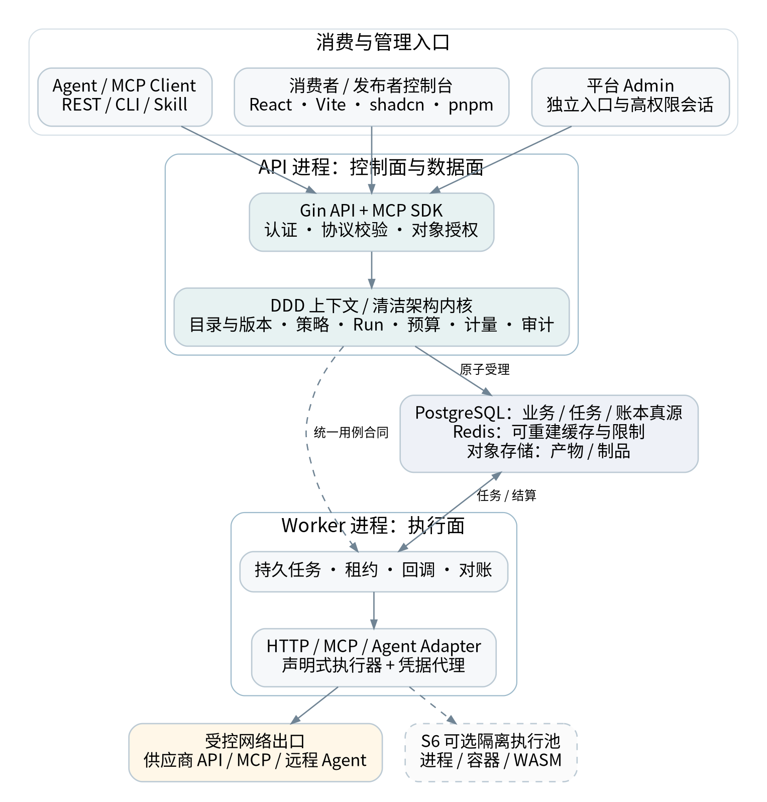
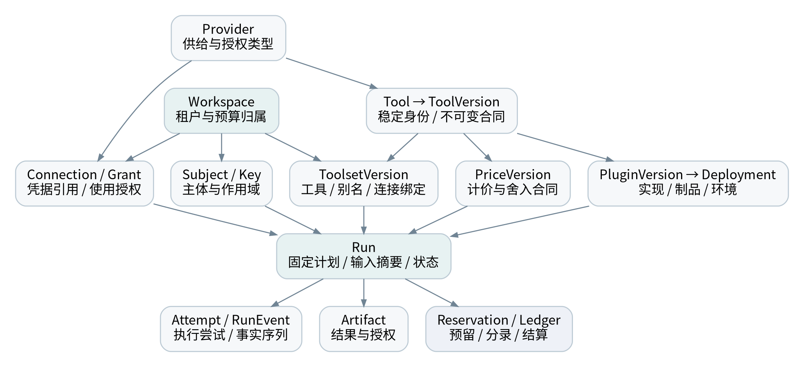
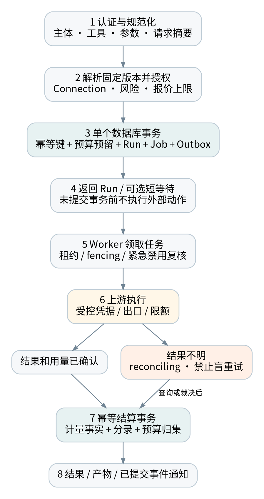
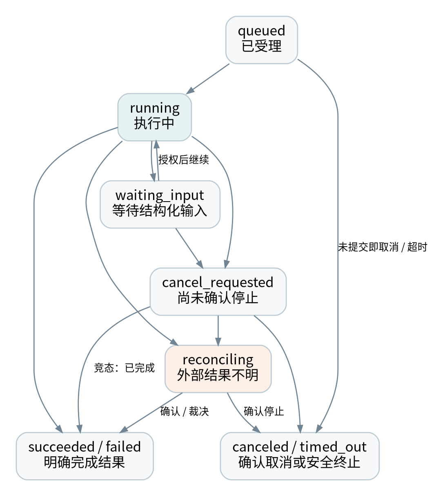

> Mender 工作副本 · 2026-09-08 从设计包 v1.1 更名整理。原设计日期为 2026-09-04；正文保留原设计建议、历史核验和待评审状态，不代表当前功能或验收结果。当前实现见[初始化报告](../engineering/initialization-report.md)，更名规则见[更名记录](../decisions/0001-project-name.md)。

# A00 阅读说明与决策摘要

## 文档定位

本文件是 Mender 的产品与系统设计基线，面向产品负责人、技术负责人、前后端工程师、测试和运维人员。目标是把“微内核＋插件化＋动态运行时”的方向转化为可评审的模块边界、数据合同、执行机制和验收标准。项目名称已由用户确定为 Mender；域名与协议命名空间另行确认。

版本为 1.1，编制与公开资料核验日期为 2026-09-04，状态为“待团队评审的实施基线”。文中“必须”表示建议纳入本项目验收的约束；“候选目标”需要经 S0 技术验证和 S5 实测确认；标有来源编号的协议与产品事实来自公开文档，其余架构、阈值和排期均为本方案建议，不是 Monid 内部实现的事实。

本版将用户确定的 pnpm、DDD、清洁架构和依赖倒置落实到结构、任务与门禁；八个上下文及 ADR-020 原子事务例外仍需团队评审。未提供既有工程源代码，因此没有实施代码迁移。

本交付包不包含已经运行的生产系统，也不把样例合同视为完整 SDK 或可直接部署的服务。团队评审后，应把正式决议、版本锁文件和测试证据纳入仓库。没有进行 Monid 登录后测试、付费调用、源代码审计或容量测试。

## 已确定约束与待确认的实施决策

| 决策主题 | 建议基线 | 首次确认点 |
| --- | --- | --- |
| 产品定位 | Agent 能力集成、治理与分发；MCP 是主要入口，不是唯一业务模型 | G0 |
| 首发来源 | HTTP API、远程 MCP Tools、远程 Agent API | G0 |
| 服务架构 | 模块化单体 API＋独立 Worker，同库原子事务 | G0 |
| 插件机制 | 声明式优先，禁止把 Go 原生 .so 作为主扩展机制 | G0 |
| 动态能力 | 先做配置、版本和路由动态化，再引入隔离代码运行时 | G0 |
| 资金与安全 | 预留后执行、幂等结算、未知结果先对账；权限不可被插件绕过 | G0 |
| 前端组织 | React SPA；pnpm workspace；消费者／发布者与 Admin 分入口 | pnpm 已由用户确定，细节 G1 |
| 领域治理 | DDD：统一语言、限界上下文、聚合及数据所有权 | 方法已确定，边界 G0 |
| 架构依赖 | 清洁架构＋依赖倒置；消费方端口与显式装配 | 原则已确定，规则 G1 |
| 上线节奏 | 20 周、6 阶段受控商业 Beta；隔离运行时作为 S6 另行准入 | G0 |

## 已核验的外部基线

Monid 的公开文档围绕 discover、inspect、run 组织工具消费，并提供 MCP、Skill、CLI 与 HTTP API 入口；定价包含按调用与按结果两类。对标应聚焦发现、授权、执行和费用闭环，而不是只复制工具卡片和余额组件。[S01][S02]

当前 MCP 官方规范入口指向 2026-07-28。该版采用无状态协议核心；官方 Go SDK 的兼容矩阵将 v1.7.0 及以上列为支持该版本。实际接入仍需固定 SDK 补丁版本、核验安全更新并测试目标客户端，不能把“SDK 支持”当作“所有客户端互通”。[S03][S08][S09]

用户提供的四张截图仅用于理解 Monid 消费者侧导航、上手流程、工具浏览、Key 和 Usage 页面。截图中的 Workspace、余额和列表状态并不能证明对方采用微服务、某种账本或某类运行时。截图未展示的平台运营后台由本方案独立设计。

## 阅读顺序与交付关系

本版新增《DDD 与工程治理规范》（G00–G10），作为工程依赖和包管理的专项基线。产品与负责人先读 A01、A02、A17；后端先读 A03–A13；前端先读 A12、A14；测试与运维先读 A15、A16。实施计划使用 Bxx 章节编号，工作台账中的每个任务引用 Axx／Bxx、需求 FR／NFR 和测试 Txx，避免设计、排期和验收相互脱节。

# A01 产品边界、用户与需求

## 1.1 产品闭环

首发产品帮助 Agent 开发者把已有能力接入平台，绑定安全的授权连接，选择固定工具集或按需发现入口，执行并追踪任务，再查看真实用量和费用。最小成功路径为：建立 Workspace → 接入或选择一个工具 → 创建授权连接 → 发布 Toolset → 客户端调用 → 查看 Run 与费用。

消费者不应理解插件运行时才能完成上述路径。运行时是平台供应和执行能力的组成部分，不应成为首页的主要心智负担。界面与 API 要共同回答“这是什么能力、能否访问、会做什么、最多花多少、当前执行到哪里”。

## 1.2 用户角色与权限边界

| 角色 | 核心工作 | 不默认拥有的权限 |
| --- | --- | --- |
| Workspace Owner | 管理成员、连接、工具集、预算和付费关系 | 平台全局管理、读取其他租户 |
| Workspace Admin／Developer | 在授权范围内配置和使用能力 | 获取全部原始凭据、直接改余额 |
| Service Account | 代表项目或 Agent 进行机器调用 | 交互式后台管理、任意连接使用权 |
| Publisher | 创建能力草稿、测试、提交版本、查看自有质量数据 | 自审发布、访问消费者请求内容 |
| Platform Operator | 审核供应商、处理事故、对账、控制发布 | 无理由长期读取全租户内容 |
| Auditor／Support | 按职责查看审计或临时协助用户 | 永久超级管理员、绕过资金流程 |

平台管理员与 Workspace 管理员不是同一角色的不同名称。普通连接的“拥有者”和“可使用者”分开建模；连接属于某个 Workspace，并可以只授权特定服务身份或 Toolset。

## 1.3 供给、凭据和收费分开建模

工具可以使用平台供应商账号、消费者自己的 API Key，或消费者通过 OAuth 授权的第三方账号。数据库分别记录 credential_owner、cost_bearer 和 platform_charge_policy。BYOK 不天然等于平台免费；用户授权连接也不天然意味着平台有权访问该账号中的全部资源。

首发支持一种结算币种和明确的费用精度，不做跨币种自动兑换。真实充值、退款和供应商分发必须在支付地区、合同权限和财务责任确认后开放。未确认前仅开放测试额度或不代付的受限模式，不能把模拟入账称作真实支付完成。

## 1.4 范围分层

| 层级 | 本期承诺 | 明确后置 |
| --- | --- | --- |
| P0 基础闭环 | 租户、授权、目录、版本、Run、预算、计量、审计、三类来源与两类 MCP 分发 | 任意代码托管、跨云调度 |
| P1 商业准备 | 选定支付适配、邀请制发布者、CLI／Skill、质量运营 | 自动供应商分账、多币种、多地区税务自动化 |
| P2 平台扩展 | 有明确客户需求后进入 S6 | 公共任意插件市场、通用工作流引擎、复杂多 Agent 编排 |

P1 不表示可以绕过资金或安全要求。若本期开放真实收费，支付验签、幂等入账和退款对账即成为该上线范围内的强制验收条件。

## 1.5 产品指标与验收口径

建议记录首次成功调用耗时、接入流程完成率、任务级成功率、每个成功任务的总成本、7／30 日持续使用情况。平台可用性和上游任务成功率分别统计；业务主动拒绝、预算不足、上游故障应单列原因，不能通过调整分母掩盖用户体验。

统计“工具数量”时分别报告 Provider、Tool、ToolVersion、Deployment 和可调用绑定数。目录上线数量不是验收目标；首批建议选择 3–5 个可验证供应商、20–40 个真实工具，以及覆盖搜索、数据读取、受控写入和异步 Agent 的任务集。该数量是试点规模建议，不是市场事实。

## 1.6 需求登记

完整需求与测试映射见执行台账“需求验收”工作表。P0 需求没有测试证据不得验收；涉及 S6 的运行时需求不计入 20 周基线。

| 编号／阶段 | 能力与范围 | 验收关联 |
| --- | --- | --- |
| FR-001 · S1 | Workspace 与成员：隔离创建、切换与成员授权；服务身份单独建模 | P0；A10；T01;T02 |
| FR-002 · S1 | 访问凭据：创建、范围限制、到期、轮换、撤销；明文仅显示一次 | P0；A10；T03 |
| FR-003 · S1 | 能力目录：按可见性过滤搜索，区分 Provider／Tool／Version | P0；A04；T04 |
| FR-004 · S2 | 工具版本：合同不可变、Schema 摘要、弃用及发布记录 | P0；A04；T05 |
| FR-005 · S2 | HTTP 导入：OpenAPI 支持子集生成草稿；不自动发布全部操作 | P0；A06；T06 |
| FR-006 · S3 | 授权连接：BYOK 与 OAuth Connection 生命周期及使用授权 | P0；A10；T07;T08 |
| FR-007 · S2 | 统一 Run：同步等待与异步查询共享持久 Run、Attempt 和事件 | P0；A05；T09;T10 |
| FR-008 · S2 | 安全重试：幂等键、请求摘要、上游结果不明时禁止盲重试 | P0；A05；T11;T12 |
| FR-009 · S3 | Toolset：固定工具集、版本锁定、入口授权与环境绑定 | P0；A07；T13 |
| FR-010 · S3 | 动态发现：搜索、检查、启动任务；对真实目标再次授权 | P0；A07；T14 |
| FR-011 · S3 | MCP 上游：有声明的版本／能力矩阵；不支持项明确拒绝 | P0；A07；T15;T16 |
| FR-012 · S3 | 远程 Agent：提交、轮询、取消、产物；不默认托管任意 Agent 代码 | P0；A08；T17 |
| FR-013 · S2 | 预算与预留：单次、Key、Toolset、Workspace 多层预算原子预留 | P0；A11；T18;T19 |
| FR-014 · S2 | 计量与账本：价格快照、事实计量、幂等结算与余额重建 | P0；A11；T20;T21 |
| FR-015 · S4 | 发布管理：声明式插件校验、测试、审核、灰度、撤回 | P0；A09；T22;T23 |
| FR-016 · S4 | 审批与风控：高风险动作绑定主体、版本、参数摘要与额度审批 | P0；A10；T24 |
| FR-017 · S2 | Run Explorer：状态、事件、脱敏结果、费用及安全重试入口 | P0；A14；T25 |
| FR-018 · S4 | 平台 Admin：供应商、工作区、审核、异常、对账及审计 | P0；A14；T26 |
| FR-019 · S4 | 支付与退款：供应商确认后实现签名回调、入账、退款与对账 | P1；A11；T27 |
| FR-020 · S3 | 通知与 Webhook：回调鉴别、去重、重放保护、失败重投 | P0；A12；T28 |
| FR-021 · S4 | CLI／Skill：由同一 API 提供发现与调用，不复制安全逻辑 | P1；A07；T29 |
| FR-022 · S3 | 资源与产物：对象级授权、短时 URL、大结果存储与过期 | P0；A13；T30 |
| FR-023 · S4 | 发布者工作台：自助草稿、版本、测试及质量视图；初期邀请制 | P1；A14；T31 |
| FR-024 · S6 | 隔离运行时：经准入后支持进程／容器／WASM，不计入首发承诺 | P2；A09；T32 |
| NFR-001 · S5 | 租户与搜索隔离：所有 API、缓存、队列、存储的跨租户负向测试通过 | P0；A10；T02;T04;T30 |
| NFR-002 · S5 | 凭据与出口安全：令牌不透传、日志无秘密、SSRF 与越权测试通过 | P0；A10；T08;T33 |
| NFR-003 · S5 | 一致性与恢复：重复投递、进程崩溃、延迟回调不重复扣费 | P0；A05；T10;T11;T20 |
| NFR-004 · S5 | 性能目标：按约定 mock 负载验证受理与网关附加延迟 | P0；A16；T34 |
| NFR-005 · S5 | 灾备目标：候选 RPO≤5 分钟、RTO≤60 分钟，须实测确认 | P0；A15；T35 |
| NFR-006 · S5 | 可观测与审计：Run／Attempt／Trace 关联，资金事实不依赖普通日志 | P0；A15；T36 |
| NFR-007 · S5 | 可访问性：关键操作键盘可达、错误可读、弹层聚焦正确 | P0；A14；T37 |
| NFR-008 · S5 | 版本与回滚：旧 Run 固定版本；数据库兼容滚动升级与回退 | P0；A17；T23;T38 |
| NFR-009 · S5 | 安全上线：高危缺陷清零、账本差异清零、回滚与停机开关演练 | P0；A16；T39 |
| NFR-010 · S3 | 协议取消边界：MCP 同步请求取消与显式异步 Run 生命周期正确区分 | P0；A07；T40 |
| NFR-011 · S1 | pnpm 工程一致性：唯一前端包管理器；单一工作区锁；固定工具链；CI 冻结安装 | P0；A14;G06；T41 |
| NFR-012 · S1 | DDD 所有权：上下文、聚合、不变量及表／事件归属明确；禁止跨域深导入与写表 | P0；A03;G01;G02;G03；T43;T45 |
| NFR-013 · S1 | 清洁架构与依赖倒置：领域／用例不依赖框架和具体适配器；消费方端口与显式装配 | P0；A03;G04；T42;T46 |
| NFR-014 · S1 | 前端领域边界：纯业务规则不依赖 React、路由、Query、HTTP 或生成 DTO；跨模块仅公开入口 | P0；A14;G06；T44;T46 |
| NFR-015 · S2 | 受控一致性例外：Run／预留／任务同库原子受理由专用协调端口完成，不泄露 SQL 事务到内层 | P0；A05;G05；T47;T48 |
| NFR-016 · S5 | 架构持续验收：架构规则为阻断式 CI；负向 fixture、例外到期与 PR 责任人均可追踪 | P0；A16;G07;G08；T41;T42;T43;T44;T48 |

# A02 总体架构与部署边界

## 2.1 三个独立维度

来源适配器回答“能力通过什么接口接入”，运行时回答“能力在哪里、以何种隔离等级执行”，分发通道回答“消费者通过什么协议使用”。三者分别扩展，不能用一个 plugin_type 字段同时表示 HTTP、Agent、WASM 和 MCP。

| 维度 | 首发类型 | 后续扩展 |
| --- | --- | --- |
| 来源适配器 | HTTP、远程 MCP、Remote Agent API | A2A 适配、企业专有协议 |
| 执行方式 | 可信内置执行器、远程代理、Worker 持久任务 | 本机 RPC、OCI 容器、受限 WASM |
| 分发通道 | REST、固定 Toolset MCP、动态元工具 MCP | CLI、Skill、专用 SDK |

远程 Agent 可以经 HTTP 接入、在供应商环境执行、最后分发为 MCP Tool；新增 WASM 只应增加一种执行实现，不应改写 Catalog 和账本模型。

## 2.2 逻辑架构



控制面负责成员、目录、连接、配置、发布与运营。数据面负责认证、协议规范化、工具解析、策略判断和执行受理。执行面负责上游调用、长任务、回调归并和受控运行时。三者是逻辑边界，不意味着首日部署三个复杂微服务系统。

## 2.3 首发进程拓扑

api 进程承载 Console API、Admin API、对外 REST 与 MCP handler。worker 进程承载执行队列、轮询、Webhook 后处理、计量和对账任务。二者调用同一套领域模块，使用同一个 PostgreSQL 业务数据库，但可以采用不同数据库角色和网络权限。

所有真正的外部副作用由 Worker 执行。API 不开一条与 Worker 并行的“快速直接调用”路径，避免同一 Run 被两边执行。同步体验通过“持久受理后短等待结果”实现；等待超时返回现有 Run，而不是创建第二次任务。

开发环境可用一个 API、一个 Worker 和容器化依赖。预发布与受控生产建议至少能够分别重启 API／Worker，并演练数据库恢复；副本数和托管方式由 S0 环境确认及 S5 压测决定。隔离运行时的节点与主 API 权限分离，不能把 Docker socket 暴露给公开请求处理进程。

## 2.4 数据与基础设施职责

| 组件 | 保存或执行什么 | 不应承担什么 |
| --- | --- | --- |
| PostgreSQL | 业务对象、版本、Run、队列、幂等、预算、分录与审计索引 | 无界原始大文件存储 |
| Redis | 可重建缓存、速率限制、短期协调与通知 | 余额、唯一结算事实、唯一撤销真源 |
| 对象存储 | 结果文件、较大输入输出、制品、测试证据 | 只凭路径即可访问的公开数据仓库 |
| 可观测后端 | 指标、脱敏日志和 Trace | 唯一资金凭证、可靠业务消息队列 |
| 秘密管理服务 | 主密钥、密钥加密和受控凭据使用 | 向所有插件广播全局秘密 |

首发不同时引入 Kafka、NATS、多个任务队列、工作流引擎和向量数据库。采用 SQL 队列与 Outbox 保留替换边界，只有观测到容量、延迟或业务需求后才拆分。

## 2.5 信任边界

浏览器和 Agent 请求不可信；工具描述、输入、上游输出、Webhook、插件制品同样不可信。经验证的调用主体进入不可变 CallContext。Connection 的真实秘密只由凭据代理按策略使用。供应商不获得消费者的数据库权限，插件不获得全局钱包操作接口。

公网流量终止于受控入口；MCP／REST 认证后仍需对象级授权。企业私网连接属于单独网络信任域，不能通过放宽整个公共执行池的 SSRF 规则实现。

# A03 微内核、模块与接口

## 3.1 微内核的定义

内核保留身份、解析、策略、执行秩序和事实记录。它不是万能的 PluginManager，也不应把所有业务都藏进一个“内核包”。微内核在本项目中体现为少量稳定端口、可替换适配器和不可绕过的安全／资金决策。

| 内核端口 | 输入／输出 | 必须满足的不变量 |
| --- | --- | --- |
| Resolver | ToolRef＋Toolset → 固定 ExecutionPlan | 一次 Run 绑定确定版本、部署、价格和连接 |
| Authorizer | CallContext＋Target＋Arguments → Decision | 默认拒绝；外层元工具不替代目标授权 |
| CredentialBroker | ConnectionRef＋短期授权 → 受控上游访问 | 不把平台令牌透传，不向插件暴露全局秘密 |
| BudgetService | 预算范围＋上限 → Reservation | 与 Run／任务受理原子提交 |
| RunCoordinator | Start／Cancel／Resume → Run | 幂等、状态单调、可恢复 |
| Executor | 固定 ExecutionPlan → 执行事实 | 不自行修改余额或主体身份 |
| MeteringService | 事实用量＋价格快照 → 费用明细 | 事实、价格和结算分离 |
| AuditSink | 主体＋动作＋对象＋结果 → 审计记录 | 敏感写操作不可无记录完成 |

CallContext 至少包含 subject_id、subject_type、workspace_id、actor_chain、scopes、request_id、trace_id、auth_revision、deadline。它由可信中间件构造，不能直接反序列化自用户请求，也不以可变的 Gin Context 作为领域层参数。

## 3.2 限界上下文与所有权

工程采用“先按限界上下文拆分，再在上下文内部按清洁架构分层”，不再同时维护全局 domain／application 与 modules 两套平行目录。DDD 是统一语言、边界、模型及协作规则，不只是给文件夹更名。[S30]

| 上下文 | 主要所有权 | 禁止混淆 |
| --- | --- | --- |
| identity | Workspace、成员、服务身份、API Key | 租户管理员不等于平台管理员 |
| catalog | Tool、ToolVersion、能力查询投影 | Provider 主记录归 supply；PriceVersion 归 commerce |
| connections | Connection、授权状态、秘密引用 | 秘密代理不交出平台全局密钥 |
| distribution | Toolset、分发快照、入口绑定 | 引用工具版本，不持有他域聚合 |
| execution | Run、Attempt、任务和产物元数据 | 不自行修改预留与账本 |
| commerce | 价格、预算、钱包、预留、计量与结算 | 不是一个通用余额 CRUD 服务 |
| supply | Provider、插件制品、Deployment、发布 | 供应商 SDK 与运行时不进入内层 |
| governance | 策略、审批、审计与架构例外 | 决策与审计不能被普通插件覆盖 |

这是首发候选 Context Map，不是八个微服务或八个数据库。对象图 A04 继续表示业务关联，不能用连线推导可直接 import 或跨上下文写表。每个上下文独占其写模型和迁移；共享读模型必须有明确所有者和可见性合同，详见 G02。

## 3.3 清洁架构、端口与工程组织

```text
backend/
  cmd/{api,worker}/                 # 启动入口
  internal/bootstrap/              # 显式装配
  internal/contexts/<context>/
    domain/                        # 聚合、值对象与规则
    application/{command,query,ports}/
    adapters/inbound/              # Gin、MCP、Worker
    adapters/outbound/             # 数据库、网络、SDK
    public/                        # 稳定发布合同
  internal/processes/admission/    # 原子受理协调
  internal/platform/               # 外层基础设施
  internal/sharedkernel/           # 极小稳定基础类型
  migrations/                      # 全局有序、域归属明确
  tests/architecture/              # 依赖图与负向 fixture
```

源码依赖方向为 adapters → application → domain。domain 不依赖 application、public DTO、框架、数据库或他域模型；application 只依赖本域 domain 和消费方定义的端口。public 是纯发布合同，不 import 本域内部实体。跨域适配器可以读取对方 public 并映射成本地合同；bootstrap 是明确的装配例外，不承担业务判断。[S31]

依赖倒置不是“应用服务通过构造函数拿到一个具体 SQLRepository”。正确做法是应用用例声明实际需要的小接口，外层实现，装配根注入。聚合仓储端口本项目默认位于 application/ports；确有领域算法需要的抽象才放 domain，不能让 domain 反向 import application。[S32]

实体方法维护单一聚合的不变量；应用层处理用例顺序、授权调用和事务作用域；适配器处理协议与存储。HTTP DTO、生成客户端类型、ORM 模型、sql.Tx、gin.Context、供应商 SDK 类型均不能作为内层合同。详细依赖矩阵、异常流程及反例见 G03–G05。

跨 execution 与 commerce 的 Run／预留／任务原子性保留，但必须通过 admission 的专用事务端口和事务作用域服务装配完成，不允许协调器绕过上下文所有者直接改表。该例外由 ADR-020 记录，不能据此允许所有跨上下文事务。

## 3.4 统一执行计划

ExecutionPlan 是一次受理后的不可变快照，包含 ToolVersion ID、Schema hash、PluginVersion ID、Deployment revision、Connection ID／凭据版本引用、价格版本、策略决议摘要、参数摘要、预算上限、允许的出口和执行限额。原始秘密不在快照中；凭据轮换通过 Broker 在授权边界内选择有效版本，并留下审计。

旧 Run 固定工具和实现版本，但不能绕过新的紧急安全禁令。普通发布变更不改变旧 Run；安全禁用、凭据撤销和租户冻结可阻断尚未开始或后续阶段的执行，并记录明确原因。已在外部发生的副作用只能请求取消或补偿，不能声称被回滚。

## 3.5 事件与钩子

业务事件使用 Outbox 保证提交后可投递，消费者使用 Inbox 或唯一业务键去重。插件可以提供业务适配钩子，但没有“跳过鉴权”“直接修改钱包”“覆盖审计主体”等扩展点。日志钩子故障不能吞掉资金事实；计量数据缺失时进入待对账，而不是猜测费用。

# A04 领域模型、版本与目录

## 4.1 核心对象关系



| 对象 | 稳定身份与主要字段 | 关键关系 |
| --- | --- | --- |
| Provider | provider_id、名称、所有者、供给模式、状态 | 提供多个 Tool 与 Connection 类型 |
| Tool | tool_id、namespace、slug、可见性、风险分类 | 有多个不可变 ToolVersion |
| ToolVersion | version、Schema、合同摘要、能力标记、发布时间 | 绑定实现与价格规则 |
| Connection | workspace_id、provider_id、owner、grant、状态 | 引用加密凭据；授权特定调用者 |
| Deployment | plugin_version、环境、端点、资源／网络策略、revision | 同一实现可有多个环境实例 |
| ToolsetVersion | 工具绑定、别名、连接选择规则、预算与发布摘要 | 形成一个稳定分发快照 |
| Run | 调用主体、父根任务、版本快照、状态、费用状态 | 拥有多个 Attempt／Event／Artifact |
| PriceVersion | 计价单位、基础费、上限、舍入与适用时间 | 每次 Run 固定引用 |

## 4.2 四类版本不能混用

ToolVersion 描述用户可见的输入输出和行为合同；PluginVersion 描述执行实现；Deployment revision 描述端点与运行配置；PriceVersion 描述价格。它们可以独立变化，但每次 Run 必须保存所用版本和摘要。

发布后的 Schema、风险标记和价格规则不原地覆盖。新增必填字段、改变单位或增加副作用属于合同变化；发布流程生成新版本，并提示工具集拥有者确认。上游自动发现到变化只生成候选草稿，不自动把变化推给生产消费者。

首发可使用语义化版本作为人类标识，但真正的不可变性以版本 ID 和内容 hash 保证。同一个版本号不允许重新上传不同内容。Toolset 在发布时解析并锁定实际版本，不在每次执行时悄悄追踪 latest。

## 4.3 公开与私有目录

Provider／Tool 的 ownership_scope 为 platform 或 workspace，私有对象必须有 owner_workspace_id。平台公开目录通过受控查询提供只读可见性，不通过把全部记录的 workspace_id 留空来规避租户策略。

发现阶段执行权限过滤，覆盖搜索结果、分类计数、自动补全、推荐与缓存。缓存键至少包含 workspace、主体可见性摘要、授权 revision、筛选条件和目录 revision。公开元信息与用户连接状态分层缓存，不把私有账号信息写入公共 Catalog 缓存。

## 4.4 工具发现与排序

首发采用可解释的文本搜索、分类和标签过滤，排序综合任务词匹配、是否已授权、可调用状态、质量标签和价格信息。不把语义向量数据库列为必需项，也不根据付费排名隐藏高风险或更高费用。

工具详情展示输入输出合同、示例、风险、副作用、幂等性、费用上限条件、超时、异步方式、授权要求和版本记录。上游的只读或幂等 annotations 只作为输入证据，由平台审核后形成自己的执行策略。[S07]

## 4.5 生命周期与删除

Tool 状态为 draft、active、deprecated、disabled、archived；版本发布状态另行管理。Connection 状态为 pending、active、expired、revoked、error。Deployment 有 provisioning、healthy、degraded、draining、disabled 等运行状态，不能拿工具上架状态替代健康检查。

历史 Run 和分录引用的版本只归档，不物理删除；个人数据删除按保留策略脱敏或清除载荷，同时保留必要的非敏感财务与审计引用。删除连接会撤销未来使用权，但不伪造已执行请求的历史。

## 4.6 聚合与不变量

ToolVersion 独立不可变，Tool 只保存必要版本引用。Run 负责状态归并，Attempt 的租约与观测可独立持久化。Wallet、Budget、Reservation 和 Settlement 由 commerce 的受控事务协调，不合并为巨型聚合。

跨聚合使用 ID／快照；状态变更通过 Publish、RequestCancel、Reserve、Settle 等业务方法维护不变量，不提供任意 SetStatus 或改余额入口。查询可以使用只读投影。完整聚合设计和反例见 G03。

# A05 执行状态、事务与可靠性

## 5.1 统一受理时序



请求先完成认证、工具解析、参数验证、授权和报价上限判定，再进入数据库事务。事务内占用幂等键，锁定适用预算／账户，创建 Reservation、Run、ExecutionJob 与 Outbox。只有事务提交后，外部调用才有资格开始。

Worker 领取任务后复核紧急禁用和凭据授权，创建 Attempt 并执行上游操作。结果写入 RunEvent 和 MeterEvent，再通过结算事务形成分录与预算归集。对外通知来自已提交的 Outbox，而不是把消息发送成功当成数据库提交成功。

## 5.2 状态机



| execution_state | 含义 | 允许的后续动作 |
| --- | --- | --- |
| queued | 已持久受理，未执行上游 | 执行、取消、因政策变更拒绝 |
| running | 当前 Attempt 在执行或已提交远程任务 | 成功、失败、等待输入、请求取消、转对账 |
| waiting_input | 已有结构化输入请求 | 受授权地补充输入、取消或到期处理 |
| cancel_requested | 已接受取消意图，尚无上游确认 | canceled、已完成结果、reconciling |
| reconciling | 外部结果／费用不明确，停止新副作用 | 查询、对账、人工裁决，不自动重试提交 |
| succeeded／failed | 有明确完成结果；失败原因单独记录 | 读取、申诉、按政策补偿或新 Run |
| canceled／timed_out | 已确认取消或本地安全终止／未提交即超时 | 读取历史；迟到费用仍走独立对账 |

external_outcome 单独记录 unknown、pending、succeeded、failed 或 canceled。运行窗口到期且上游结果不明时进入 reconciling，不直接展示“已取消且不会收费”。人工关闭未知任务需要明确原因、责任人与证据，结算可继续处于待对账。

billing_state 与 execution_state 独立，至少包含 not_billable、reserved、pending_reconcile、settled、released、partially_refunded、refunded。不能用“任务失败”自动推出“零费用”。

## 5.3 租约、fencing 与重试

ExecutionJob 包含 available_at、lease_owner、lease_until、lease_generation、attempt_count、max_attempts 和 priority。领取任务使用短事务，更新租约后立即提交，不在上游网络请求期间保持数据库行锁。SQL SKIP LOCKED 适合队列式消费，但不提供通用一致视图或恰好一次语义。[S20]

Worker 完成写入必须携带 lease_generation；旧 Worker 的过期结果不能覆盖新状态。该机制只限制数据库写入，不能阻止已经发出的外部请求继续执行，因此非幂等任务租约过期时不能简单由另一个 Worker 重新提交。

只读、可可靠幂等的请求可以指数退避并加随机抖动，遵守 Retry-After 和供应商限额。外部写操作优先传递供应商支持的幂等键；无幂等且结果不明时先查询，不能确认则进入 reconciling。人工“重试”创建有关联的新 Run，并再次授权、报价和预留。

## 5.4 幂等合同

幂等键作用域包含 workspace、主体、操作种类和调用入口的逻辑操作标识。请求摘要覆盖实际工具版本、参数规范化结果、连接／工具集绑定、环境和用户指定的费用上限。JSON 规范化不能丢失大整数精度；不允许用普通浮点反序列化后生成摘要。

同键同摘要返回已有 Run；同键不同摘要返回 IDEMPOTENCY_CONFLICT。重放时再次验证当前访问权限，防止被撤销用户通过旧键读取敏感结果。HTTP request_id／Trace ID 不是天然幂等键；重试必须复用同一个逻辑操作键。

候选保留策略为：终态幂等映射至少保留 7 日，活动任务一直保留到结束；高风险业务按上游合同延长。清理旧映射前应防止业务重放窗口仍然有效，不能以存储 TTL 替代业务幂等设计。

## 5.5 同步等待、取消与恢复

REST 默认异步受理并返回 Run；调用者可要求短等待，候选上限 5 秒。等待仅影响响应体验，断线不撤销已经明确接受的异步任务。MCP 同步与异步入口有独立取消合同，见 A07，不能套用这一条覆盖所有协议请求。

后台轮询与 Webhook 可以同时存在。两者都转为带上游事件标识的事实，再按状态版本归并；重复、乱序和迟到事件不得把终态回退到 running。可能发生费用修正的迟到事件通过新增财务事实与调整分录处理，不修改原账单历史。

## 5.6 背压与故障降级

每 Workspace、Provider、Connection 和运行时有并发及速率限制。排队时间超过工具可接受窗口则在提交上游前拒绝或超时；不能无限增加 goroutine 来吸收流量。长任务和短查询分队列等级，防止少量昂贵任务挤占所有执行槽位。

数据库不可用时拒绝新执行受理，不能退化为“先调用再补账”。Redis 故障时可保留受控目录读取；需要全局速率、撤销或去重保证且没有可靠替代的数据面操作应失败关闭。普通观测系统故障允许有界缓冲，资金事件和必要审计仍必须可靠持久化。

## 5.7 清洁架构下的受理事务

admission 应用层使用 AdmissionUnitOfWork 和事务作用域端口，不接收 sql.Tx、pgx.Tx 或通用数据库句柄。出站事务适配器打开 PostgreSQL 事务；bootstrap 注入的工厂在同一事务上构造 execution／commerce 自有仓储和服务；每个上下文只更新自己的表，受理结果和 Outbox 同时提交。

外部工具调用、OAuth 网络刷新和远程消息发布不得放入该事务。返回成功前必须确认提交；任意写入失败完整回滚。T47 对预留、Run、任务与 Outbox 的每个写入点注入失败。此为为了原子受理保留的明确架构耦合，不伪称上下文可以无成本拆库；拆分时按 G05 重新设计协调与补偿。

# A06 API as Tool 详细设计

## 6.1 导入方式与支持边界

首发提供 OpenAPI 文件导入、经出口策略允许的 URL 导入和手工 HTTP 配置。建议以 OpenAPI 3.0／3.1 的已测试子集为接入范围，并固定 3.1.1 作为样例合同参考；不声称自动支持规范中的所有 callback、link、安全组合或内容类型。[S14]

导入过程只生成草稿：解析 → 诊断 → 选择 operation → 参数映射 → 授权绑定 → 风险与计价 → 合同测试 → 提交发布。默认不把描述中的全部写操作发布为可调用工具。

| 能力 | 首发建议 | 不支持时的行为 |
| --- | --- | --- |
| 参数 | path、query、受控 header、JSON body | 返回字段级诊断，不静默丢弃 |
| 内容类型 | JSON；受控表单按供应商需要加入 | 文件／多段上传单独验证，不自动转换 |
| Schema | 常用对象、数组、枚举与受支持组合 | 保留原始描述并提示需手工适配 |
| 安全 | API Key、Bearer、经平台配置的 OAuth | 复杂签名交给可信专用适配器 |
| 分页 | 明确页数／结果数上限的分页策略 | 不支持无限追页或自动扫描所有数据 |
| 引用 | 本地可验证引用 | 外部引用默认禁用；显式允许后仍受 SSRF 与配额约束 |

候选导入限制：描述文件 5 MiB、Schema 深度 64、节点数 20,000。限制应可配置并用测试验证；其目的在于避免解析和生成过程资源耗尽，不是协议规定值。

## 6.2 ToolSpec 与映射

ToolSpec 包含输入 Schema、输出 Schema、operation_id、服务器端点引用、参数映射、认证配置引用、风险分类、幂等声明、超时、最大结果数和计量提取规则。用户参数只能流向显式声明的位置，不允许任意覆盖 base_url、Host、Authorization、代理地址或回调目标。

转换首发只提供 JSON Pointer 提取、类型校验、受控字符串模板和明确的集合映射。不开放任意 JavaScript、Python 或无限循环表达式。如果后续引入表达式引擎，应有成本／步数限制、禁止文件与网络访问，并单独做安全评审。

## 6.3 请求与响应策略

请求执行前再次解析受控端点并验证出口策略。所有重定向重新检查，保留正确的 TLS 主机校验，不能使用跳过证书验证的方式解决供应商接入问题。压缩响应应限制解压后体积，避免小请求触发无限大结果。

结果先按内容类型和大小验证，再做 Schema 校验、敏感字段清理、计量提取和 Artifact 分流。不能从面向模型的截断结果计算收费数量；计量使用可信的上游事实或执行器实际处理数量，原始依据保存在受控证据中。

## 6.4 错误归一与测试

适配器区分参数错误、授权失效、限流、上游业务拒绝、上游不可用、超时、输出合同变化和费用结果不明。保留脱敏的 provider_request_id 便于对账，但不把原始认证头、堆栈或供应商完整响应原样暴露给用户。

每个发布版本至少有一个正常 fixture、一个无结果 fixture、一个鉴权失败 fixture、一个限额或超时 fixture；有副作用的工具还必须提供幂等、查询或“不安全重试”的明确合同。自动健康探测只执行经过允许的无副作用操作，不能定时发送真实邮件或创建真实订单。

# A07 MCP 接入、分发与兼容

## 7.1 协议基线

当前 2026-07-28 Streamable HTTP 以单个 POST 入口处理请求，取消了协议级会话和独立 GET 流；请求可以返回 JSON 或与请求关联的 SSE。它还要求请求元数据头与实际 body 一致。旧协议行为仍需按对应版本单独实现与测试。[S04]

使用官方 Go SDK 承担编解码与协议状态，不在 Gin 内手写另一套 JSON-RPC／MCP 解析。官方发行说明指出，新版 HTTP 支持与 Stateless 配置相关；S0 必须固定 SDK 版本并验证配置，而不是依赖默认值猜测。[S08][S09]

| 兼容层 | 本项目建议承诺 | 验证方式 |
| --- | --- | --- |
| 2026-07-28 | 固定 SDK 支持下的 Tools 主路径 | 官方合同＋自有头部／取消测试 |
| 2025-11-25 | 经明确配置的旧版兼容路径 | 初始化、会话与旧传输用例 |
| 更早版本 | 只对真实需求和实测结果开放 | 独立兼容清单，不默认全开 |
| 可选能力／扩展 | 未实现不宣告；依赖时明确拒绝 | MRTR、Tasks、资源等分别登记 |

内部 Run 不能依赖某代 MCP Session ID 才能恢复。业务任务状态、连接身份和授权上下文保存在平台实体中，SDK transport 对象只是协议层生命周期的一部分。

## 7.2 固定 Toolset 分发

入口形如 /mcp/{toolset_id}。Toolset 绑定一个 Workspace，调用者仍必须具有该入口和每个目标能力的访问权。工具别名在 Toolset 范围内唯一，建议采用 provider__operation 的稳定命名；别名变化属于工具集版本变化。

固定工具集发布前检查全部工具版本、连接选择规则、风险、费用上限和协议能力。生产 Toolset 锁定版本，更新先发布草稿差异并经确认。工具列表缓存必须包含租户可见性与授权 revision，不能复用公开缓存泄露私有工具。

同步工具只用于经过验证的短操作，描述必须标明超时与副作用。原本异步的能力以清晰的 __start 名称或明确的异步合同暴露，同时提供 run_get／run_cancel。不能在客户端以为得到最终业务结果时悄悄返回不明含义的 job_id。

## 7.3 动态发现分发

建议首发元工具为 catalog_search、catalog_inspect、run_start、run_get、run_cancel；需要交互输入时再开放 run_resume。这些名称是 Mender 自定义的 Tool，不是新增 MCP 标准方法。

catalog_search 返回可访问工具与简要风险／价格；catalog_inspect 返回精确合同、版本和费用条件；run_start 接收 tool_ref、arguments、connection_ref、idempotency_key、max_charge。执行时验证目标 ToolVersion 和 Connection 的真实权限，不能因为用户能调用 run_start 就允许任何工具。

发现结果中的描述、上游 instructions 与返回内容均为不可信数据。它们不能授予工具更多权限，也不能修改系统审批和预算。平台遵循 MCP Tools 的合同和结果语义；业务执行失败与协议格式错误分开表达。[S07]

## 7.4 同步取消与持久异步任务

同步 tools/call 的请求取消要映射为关联 Run 的取消意图，停止尚未提交的工作，并尽力取消已提交上游。不能在收到取消后继续向已关闭的协议流发送结果。2026-07-28 对 SSE 断开的取消规则应在此路径严格验证。[S04]

run_start 是显式的持久任务启动操作，成功受理的合同就是“任务已创建，后续查询 Run”。启动提交与响应丢失的竞态由幂等键解决；连接断开不能假装撤回已完成的任务创建。需要终止该任务时调用 run_cancel。前端与 SDK 必须清楚区分“停止等待结果”与“取消持久任务”。

应用控制台的 /runs/{id}/events 可以设计带游标的可恢复 SSE；这属于平台自有事件 API。不要把该机制误当作新版 MCP 流支持 Last-Event-ID 恢复；两种流使用不同 handler 和代理配置。

## 7.5 远程 MCP 上游

上游发现结果转为候选 ToolVersion，经审核后对外发布。平台为消费者扮演 Server，为上游扮演 Client，权限和凭据分别验证。命名冲突、Schema 变化、内容类型和所需交互能力必须显式处理。

上游要求平台尚未实现的交互时返回 TOOL_INTERACTION_UNSUPPORTED，并在目录标识限制。不得丢弃输入请求或采样请求后继续执行，也不宣称“透明兼容所有 MCP Server”。旧版上游需要会话时，连接池按 Workspace、Connection、上游和协议版本隔离，不跨租户共享授权会话。

远程 MCP 授权按其资源元数据和授权规范接入。平台 OAuth access token、平台 API Key 与供应商 token 三者不混用；禁止不符合规范的 token passthrough。[S05][S06]

# A08 Agent as Tool 详细设计

## 8.1 首发边界

首发包装已有的远程 Agent API，不要求实现自己的模型推理框架。远程 Agent 提供 Submit、GetStatus、Cancel 和结果读取；平台把它归一到 Run、Event 和 Artifact。供应商返回已受理不等于任务完成。

A2A 是可选的标准协议适配方向，其公开规范包含任务、消息、产物和多轮交互。应把它作为一种具体 Agent Adapter 实现，不能把普通远程 Agent API 一律命名为 A2A。[S13]

## 8.2 归一化合同

| 方法／结果 | 平台需要的信息 | 特殊约束 |
| --- | --- | --- |
| Submit | 幂等标识、输入、允许的费用／时间、回调配置 | 必须识别“未提交”和“已提交但响应未知” |
| GetStatus | 上游任务 ID、当前状态、进度、累计用量 | 查询不能产生新的业务副作用 |
| Cancel | 接受取消或已经终止的明确确认 | accepted 不等于 canceled |
| Resume | 已登记的输入请求 ID、结构化回答 | 验证用户身份、参数与输入请求版本 |
| Artifact | MIME、大小、摘要、访问或拉取方式 | 拉取地址受出口限制，不盲信外部 URL |

首发允许上游完全不支持 Resume；此时遇到交互请求应停止并清楚提示限制。不要构造虚假的自动回答，尤其不能自动确认外部付款、消息发送或权限扩大。

## 8.3 上下文与委托权限

远程 Agent 的会话或 context_id 必须绑定 Workspace 与 Connection；用户不得引用其他租户的上下文。父子 Run 使用 root_run_id 与 parent_run_id 表示真实调用关系，禁止仅凭模型传来的字符串建立跨租户父子链。

如果后续允许 Agent 回调 Mender 工具，平台签发短时委托凭据，限定 root Run、工具集、有效期、步骤数和预算子分配。子任务消费从根预算分配，不再次全额冻结同一笔额度；计费叶子和编排附加费有独立业务键，防止父子重复扣费。

对于在供应商内部不透明执行的 Agent，平台无法凭空观测其每一步或保证内嵌成本。只有供应商提供可靠的费用上限与计量合同，才能承诺严格预算；否则应限制为固定报价或明确风险的受控试点。

## 8.4 任务边界与防循环

候选平台内部上限为嵌套深度 3、总步骤 20、单根 Run 的并发子任务 5，具体按试点调整。检查应在服务端，且在每次委托调用前原子消耗配额，不能只写在 Agent 提示词中。重复 Agent 调用或工具递归需记录来源链并能人工终止。

# A09 插件协议、动态配置与运行时

## 9.1 插件分层

| 层级 | 用途与隔离 | 引入时机 |
| --- | --- | --- |
| 内置 Go 模块 | 可信内核与通用适配器，随主程序构建 | S1–S2 |
| 声明式插件 | 受限 HTTP 映射、认证配置、Schema 与计量规则 | S2–S4 主线 |
| 本机 RPC 插件 | 复杂签名或多语言适配；仍需 OS 限权 | S6 按需 |
| OCI 容器 | 复杂 Agent／MCP 托管，独立执行池 | S6 按需 |
| WASM | 受限纯计算和映射，宿主接口最小化 | S6 按需 |

Go 原生 plugin 的官方说明包含平台限制、构建一致性要求和不能关闭已加载插件等限制，因此本项目不把 .so 作为主扩展机制。[S10]

HashiCorp go-plugin 可作为本机子进程 RPC 方案参考，但其文档明确限制在本地可靠网络语境，不应当作分布式执行调度协议。跨节点执行使用单独定义的运行服务接口、工作负载身份和网络认证。[S11]

## 9.2 PluginManifest

清单采用项目自定义 apiVersion，包含 plugin_id、version、kind、kernel_abi、配置 Schema、工具合同引用、制品摘要、权限声明、执行限额和 UI Schema。清单里的权限是请求，不是已经获准的授权；部署时有效权限为“审核批准 ∩ 租户策略 ∩ 调用者权限”。

以下为清单核心字段节选；完整、可校验的 JSON 清单和 Schema 见 `contracts/`，摘要由随附样例制品计算，不在这里手工抄录。

```yaml
apiVersion: mcpx.io/plugin/v1alpha1
plugin_id: example.company-search
version: 1.0.0
kind: declarative-http
kernel_abi: { major: 1, min_minor: 0 }
artifact:
  file: http-executor.example.json
  # media_type 与 sha256 见完整清单
config_schema_file: connection-config.schema.json
tool_files: [tool.example.json]
permissions:
  egress: [{ scheme: https, host: api.example.test, ports: [443] }]
  secret_capabilities: [provider.request]
  filesystem: none
limits:
  timeout_ms: 10000
  max_request_bytes: 65536
  max_response_bytes: 262144
  max_results: 100
ui: { schema_file: connection-ui.example.json }
```


该示例是声明式 HTTP 插件设计样例，示例域名不对应真实供应商。完整 JSON Schema 和样例文件在 contracts 目录中，可供合同校验和后续实现使用。字段并不是 MCP 标准的一部分。

## 9.3 动态能力的三个层次

配置动态化允许新增工具、参数映射和路由而不重新编译；实现动态化允许发布新的独立插件或制品；实例动态化允许调度或回收进程／容器。前两者与第三者不是同一件事。首发先实现配置与版本发布，避免为了接入普通 API 提前建设通用沙箱云。

内核加载已审核的版本快照，发布 revision 作为变更序列。节点接到通知后拉取、校验并原子替换本地快照；通知丢失通过周期轮询修复。未完整加载新快照时继续使用旧稳定版本，不在半更新状态下混用新 Schema 和旧实现。

## 9.4 发布状态机

建议流程：draft → validated → tested → review_pending → approved → staged → active → draining → archived。验证失败或审核驳回不能进入 staged。所有状态转移有操作者、原因和内容摘要。

灰度以 Workspace／Toolset 为稳定分组，记录版本与观察窗口。新 Run 切换到新版本，旧 Run 继续引用原版本。回退是路由切换，不能覆盖制品文件。紧急 disable 不等于普通回退：它可能阻断旧任务的后续操作，同时进入取消或对账。

## 9.5 执行接口与能力票据

运行接口建议暴露 Describe、Validate、Start、GetStatus、Cancel、Health。输入包含固定 ExecutionPlan、参数、短期能力票据和 Trace 关联；输出为完成结果或稳定的执行句柄。插件不直接调用钱包、成员表或全局 Catalog 管理接口。

能力票据限制 plugin_version、deployment、workspace、run、有效期、出口和允许的宿主操作。无状态 RPC 插件不能因为知道 Run ID 就读取任意凭据。凭据代理优先代发已授权请求；确需把秘密交给插件时，只限短时、最小范围、受审实现，并将风险单列。

## 9.6 运行时资源与安全要求

进程或容器必须限制 CPU、内存、进程数、临时磁盘、输出大小、运行时间和网络出口；使用非特权用户、只读根文件系统和最小系统调用权限。不得挂载宿主机根目录或通用 Docker socket。容器本身不等于足以面对任意不可信代码的强隔离，多租户隔离级别需要按风险选择。[S24]

WASM 首先用于不联网的确定性转换。wazero 提供内存限制和基于 context 的执行终止配置；必须显式验证 WithCloseOnContextDone 等机制，不能仅传递 context 就假定死循环可被终止。宿主函数仍是安全边界，不能把任意网络／文件访问封装成一个无限权宿主函数。[S12]

运行时扩展进入 S6 前必须有真实需求、资源预算、恶意样例测试和责任团队。不能以“已经使用 WASM／容器”为理由跳过安全验收。

# A10 身份、租户、凭据与安全

## 10.1 身份与授权模型

身份认证确认主体是谁，授权确认其是否能对目标对象执行动作。建议采用角色提供基础权限、资源规则约束具体 Toolset／Connection／预算，策略默认拒绝，显式 deny 优先。首发规则存为受限声明式结构，避免过早开放任意脚本策略。

每次调用判断 subject → workspace → toolset → tool_version → connection → arguments／risk → budget。客户端传入 workspace_id 只用于定位，必须与认证主体和资源归属交叉验证。消费入口与 Console API 共享权限端口，不能分别维护两套规则。

## 10.2 浏览器与机器凭据

消费者控制台建议通过 OIDC 登录，由后端建立受保护会话；Cookie 设置 Secure、HttpOnly、合理的 SameSite，并为状态变更提供 CSRF 防护。生产可通过同源反向代理转发独立 Go 后端，前后端分离不意味着必须把长期 token 存入 localStorage。

平台 Admin 使用独立入口和会话边界，要求 MFA 与更短的高权限会话。支持人员访问租户内容需 JIT 授权、原因、有效期和审计；高风险资金操作采用双人审批，不允许长期全租户 impersonation。

机器 API Key 使用高熵随机值，只有创建时显示明文。保存前缀用于索引，保存带服务器保护材料的验证摘要用于校验；不记录原始 Key。支持到期、作用域、Toolset／预算绑定和轮换重叠窗口。候选撤销传播目标为 5 秒；无法确认撤销状态时数据面拒绝新执行，而不是继续使用无限期缓存。

OAuth 实现遵循规范与安全最佳实践，验证 issuer、audience、state、nonce、redirect URI 和适用的 PKCE 等要素。具体授权服务器和应用审核是 S0 外部依赖，不在文档中虚构已经可用的配置。[S05][S22]

## 10.3 Connection 与秘密代理

Connection 记录授权账号、提供方、授予的 scopes、过期时间、owner、允许使用者和凭据版本引用。密码式字段只通过写入接口接收，不在普通 GET 返回。刷新 token 竞争使用数据库版本检查或受控锁处理，防止多个 Worker 同时刷新后互相覆盖。

采用信封加密思路：数据加密密钥保护凭据，主密钥由秘密管理设施保护；轮换、解密和导出均审计。平台调用 token 与上游 token 分开，禁止把用户访问 Mender 的令牌直接转给供应商。[S06]

## 10.4 租户隔离

关系型记录以 workspace_id 明确隔离，跨对象引用优先采用带 workspace_id 的复合外键。后台任务和对象存储读取同样携带已验证租户上下文。缓存、搜索、Trace 载荷和测试 fixture 都必须覆盖隔离。

RLS 可作为纵深防御，但不是替代应用授权的魔法开关。数据库文档明确区分普通角色、表所有者和 BYPASSRLS 等绕过行为；运行角色不能拥有迁移角色权限，使用事务级租户上下文并验证连接池复用不会残留上一个 Workspace。[S19]

## 10.5 SSRF 与数据外传

出口控制统一覆盖 OpenAPI URL、上游 API、MCP Server、OAuth 元数据、Webhook 地址和 Artifact 拉取。仅在字符串层过滤 localhost 不足够；需覆盖解析后地址、IPv4／IPv6、重定向、DNS 变化和云元数据目标。域名解析、实际连接和 TLS 主机验证必须一致，不能验证一次域名后由另一套网络栈重新解析任意地址。[S23]

首发公共执行池默认拒绝内网、回环、链路本地和元数据地址，并采用明确域名／端口策略。企业私网接入使用独立网络连接和审核授权，不扩大公共池的全局网络能力。超大响应、压缩膨胀和长连接均有资源上限。

## 10.6 危险动作审批

审批记录绑定主体、Workspace、ToolVersion、Connection、规范化参数 hash、金额上限、有效期和单次消费标记。参数、版本、收件人或金额变化后必须重新审批。Agent 传来的 approved=true、提示词中的授权语句或工具描述中的“安全”标记都不是批准事实。

可按风险分为只读、可逆写、外部通信、不可逆／付费操作。对邮件发送、批量写入或高成本 Agent 等启用预览与确认；审批页面必须显示真实目标和费用条件，不只显示抽象工具名。

## 10.7 日志、数据保留与事件响应

默认日志保存结构化元信息和脱敏错误，不保存完整 token、认证头或原始敏感输入。请求载荷的保存应可配置并说明目的；生产排障临时采样需有授权和过期。资金分录、审计记录与业务载荷采用不同保留策略，具体期限在地区与合同确认后签署。

凭据泄漏时执行撤销、暂停相关部署、停止新调用、轮换上游秘密、识别受影响 Run 和审计通知。恶意工具输出被视为数据，不得触发自主放宽权限或把其他用户内容加入后续请求。

# A11 计量、预算、钱包与结算

## 11.1 四种事实分离

PriceVersion 规定如何计算价格；MeterEvent 记录发生了多少用量；Ledger 记录资金转移；ProviderCostEvent 记录实际供应商成本。Usage 页面可以聚合展示，但它们不是同一张“调用日志表”的不同字段。

计价支持固定调用费、基础费＋结果数量，以及后续明确的计算时长等模式。来源参照 Monid 的公开按调用／按结果模型，不意味着复制其未公开的账本实现。[S02]

## 11.2 金额合同

首发建议单币种、内部结算精度为百万分之一货币单位，即 amount_micro。数据库使用有范围检查的整数，JSON 使用字符串传输，前端不能用 JavaScript number 做资金累加。单价与数量计算可以使用精确十进制，最终在约定时点按 PriceVersion 的规则舍入到微单位。

舍入发生在一次逻辑 Run 的计费聚合后，而不是任意中间步骤反复舍入。若供应商有更细单价或不同结算方式，保存原始精确成本和差额，不把小数差异偷偷分摊给用户。首发不自动汇率转换，币种不同的价格不能直接相加。

```json
{
  "currency": "USD",
  "amount_micro": "70000",
  "price_version_id": "pv_example_01",
  "billing_state": "settled"
}
```

## 11.3 预留事务

适用预算可以包含 Workspace、Service Key、Toolset 和根 Run。按固定顺序锁定预算窗口及钱包账户，检查已消费＋活动预留＋本次上限是否超限，再写入预留和 Run。固定锁顺序避免死锁；冲突重试需要有界且不执行任何外部请求。

报价不是授权也不是资金预留。Estimate／Quote 返回计价版本、预测费用、可验证上限及有效期；实际执行时仍需复核。如果价格变化或 Quote 已过期，重新报价并向调用者说明，不在旧审批下悄悄提高价格。

## 11.4 操作账本与示例

建议采用不可变复式操作账本：同一 journal 的各 entry 增量在每个币种下总和为零。工作区可用、预留、平台收入／清算等账户分别记录；这是一套平台操作子账本，不代替地区会计、税务或支付机构总账。

| 操作 | 分录增量示例，单位 micro | 执行后用户状态 |
| --- | --- | --- |
| 已有余额 | available=1,000,000；对应入账已有平衡分录 | 可用 1.000000 |
| 预留上限 0.100000 | available -100,000；held +100,000 | 可用 0.900000，预留 0.100000 |
| 实际收费 0.070000 | held -100,000；revenue +70,000；available +30,000 | 可用 0.930000，预留为 0 |
| 全额退款 0.070000 | revenue／refund clearing -70,000；available +70,000 | 新增退款事实，不改原结算 |

原账本不可直接 UPDATE 金额。后台调账必须产生带原因、审批与唯一业务键的补充分录。余额可以从分录重建，缓存余额需定期与分录对账；一个管理员按钮不能直接写 wallet.balance。

## 11.5 硬预算的成立条件

严格上限必须有可执行机制，例如结果 limit、供应商 max_cost、已确认固定报价或平台承担超额成本。仅设置 HTTP timeout 不能保证远程费用停止。无法提供可验证上限的工具不得被标成“严格预算保护”，也不应默认进入平台代付公开目录。

按结果数量计费时预留上限对应的最大结果数量；用量超过批准值先按发布合同与供应商对账处理，不擅自突破用户上限。重试增加的供应商成本和用户计费分别记录；平台故障造成的重复成本不能自动按每次 Attempt 向用户收费。

## 11.6 周期、父子任务与退款

预算周期使用已冻结的 period_id 和时间边界，建议内部统一 UTC 存储，界面按 Workspace 时区显示。跨月完成的 Run 回写原始预留所属周期；新月份预算不能因为旧任务释放而被重复增加。

根 Run 预算为子任务做内部额度分配，不在钱包重复冻结根额度。父任务的编排服务费和子任务的工具费各自有明确的价格及唯一业务键。首发不透明远程 Agent 不提供假的子调用明细。

退款不默认恢复所有消耗类预算，需有明确策略。已结算费用退款、未结算预留释放、供应商成本调整是三种操作。部分退款保证累计退款不超过可退金额，同时保留支付与钱包两层状态。

## 11.7 不确定性与对账

未知上游结果保留 pending_reconcile；预留不能因普通缓存 TTL 到期自动释放。候选运行规则为超过 24 小时告警、按供应商最长完成窗口与客户协议进行人工裁决；具体冻结期限需在商业规则确认后设定，不能无限期冻结而无通知。

支付成功页不是到账真源。支付适配验签、校验金额／币种／订单归属并去重，入账使用供应商事件 ID 与内部业务键。重复回调、退款和迟到事件通过 Inbox 处理。每日对账比较支付事件、钱包分录、Run 计量和供应商成本，未解释差异阻断继续扩大真实资金流量。

# A12 REST API、错误与事件合同

## 12.1 API 分区

消费者界面使用 /api/console/v1，平台管理使用 /api/admin/v1，机器消费使用 /api/v1。需要 Workspace 上下文的业务路径显式包含 /workspaces/{workspace_id}；MCP 入口从 Toolset 与主体推导归属并交叉检查。

Gin 负责路由、中间件与普通 HTTP API；MCP 通过官方 SDK 提供的 HTTP handler 接入。Gin 的 WrapH 支持适配标准 http.Handler，但生产还需单独校验流式代理、超时和写入行为。[S25]

| 路由族 | 主要操作 | 权限／一致性要求 |
| --- | --- | --- |
| /catalog/tools、/tools/{id}/versions | 搜索、检查、版本详情 | 查询前按可见性过滤 |
| /workspaces/{w}/quotes | 费用预估与上限验证 | 不执行上游，不预留资金 |
| /workspaces/{w}/runs | 创建、列表、详情 | 创建需幂等键；与预留和任务同事务 |
| /runs/{id}/cancel、/resume | 请求取消、补充输入 | 状态前置条件和对象级授权 |
| /runs/{id}/events、/artifacts | 时间线与结果 | 稳定游标；按需签名读取 |
| /connections | 创建、授权、检查、撤销 | 秘密写入不回显；授权使用者分离 |
| /toolsets、/toolset-versions | 草稿、发布与安装配置 | If-Match／版本冲突检查 |
| /api-keys、/budgets、/billing | 访问、费用与余额管理 | 安全与资金写操作强制审计 |
| Admin /providers、/reviews、/deployments | 审核、发布、暂停与回退 | 平台角色；批准者与提交者可分离 |
| Admin /reconciliation、/audit | 对账、调账、审计查询 | JIT／双人审批，禁止直接改历史 |

## 12.2 创建 Run 合同

```http
POST /api/v1/workspaces/ws_example/runs
Authorization: Bearer <scoped credential>
Idempotency-Key: operation-example-0001
Content-Type: application/json
```

```json
{
  "tool_ref": {"tool_id": "tool_example", "version": "1.0.0"},
  "toolset_id": "ts_example",
  "connection_id": "conn_example",
  "arguments": {"query": "example", "limit": 10},
  "max_charge": {"currency": "USD", "amount_micro": "100000"},
  "wait_ms": 0
}
```

```json
{
  "data": {
    "run_id": "run_example",
    "execution_state": "queued",
    "billing_state": "reserved",
    "status_url": "/api/v1/workspaces/ws_example/runs/run_example"
  },
  "meta": {"request_id": "req_example", "trace_id": "trace_example"}
}
```

正常异步受理返回 202。短等待获得完成结果时可返回 200；响应重复或客户端重试始终使用同一 Run。样例只是项目合同，不是 MCP 的 JSON-RPC 请求格式。完整核心消费 API 设计子集在 contracts/public-api.openapi.yaml 中，Console／Admin 全量 API 在实现阶段补齐并生成客户端。

## 12.3 错误分类

| code | REST 建议状态 | 客户端行为 |
| --- | --- | --- |
| INVALID_ARGUMENT | 400 | 根据字段诊断修正，不自动重试 |
| UNAUTHENTICATED／FORBIDDEN | 401／403 | 重新认证或申请权限；不泄漏秘密 |
| NOT_FOUND | 404 | 对无权访问对象采用一致的隐藏策略 |
| IDEMPOTENCY_CONFLICT | 409 | 不复用不同请求的同一键 |
| PRECONDITION_FAILED | 412 | 拉取最新版本后重新确认 |
| BUDGET_EXCEEDED | 403 | 展示预算原因，不自动提高限额 |
| RATE_LIMITED | 429 | 按 Retry-After 有界重试 |
| UPSTREAM_UNAVAILABLE | 502／503 | 是否重试取决于副作用与结果确定性 |
| OUTCOME_UNCONFIRMED | 通常作为 Run 状态信息 | 查询或联系对账，不盲目重新提交 |

传输认证失败、JSON-RPC 协议错误和 Tool 业务错误由 MCP transport 按对应语义映射，不能把上表状态码直接塞进所有 tools/call 结果。可重试标记仅作建议，不覆盖幂等和副作用规则。

## 12.4 查询、乐观锁与限额

列表采用稳定游标排序，建议 (created_at, id) 或 RunEvent sequence。游标不作为权限凭据，每次请求仍重做授权。默认页大小 20，候选上限 100；执行结果默认只返回摘要和产物引用。

可编辑配置使用 revision／ETag 和 If-Match，冲突返回 412，不默默覆盖其他管理员的更改。删除、撤销、取消等操作有幂等语义，重复请求返回当前状态。客户端长时间离线恢复后先刷新状态，不根据过期页面发起高风险操作。

## 12.5 事件 Envelope 与 Webhook

事件至少包含 event_id、event_type、schema_version、occurred_at、workspace_id、aggregate_id、aggregate_version、trace_id 和最小化 payload。Outbox 事件投递是至少一次，消费者按 event_id 或业务键去重，不能假定绝不重复。

Webhook 使用带时间戳的签名或经认可的供应商验证机制，验证原始 body 后入 Inbox。密钥轮换有重叠窗口；异常金额、对象归属或过期签名进入隔离队列。对外 Webhook 的目标预先登记并通过出口策略，失败重投有上限与人工重放记录。

# A13 数据模型、索引与持久化

## 13.1 数据表分组

| 模块 | 建议表 | 核心约束 |
| --- | --- | --- |
| 身份 | users、workspaces、memberships、service_accounts、api_keys | 成员唯一；Key 摘要唯一；租户归属明确 |
| catalog 目录 | tools、tool_versions、provider_profiles（投影） | Provider 主记录归 supply；价格版本归 commerce |
| 连接 | connections、connection_grants、credential_versions | 凭据加密；使用授权与拥有权分离 |
| 分发 | toolsets、toolset_versions、tool_bindings | 别名在版本内唯一；绑定属于同一租户 |
| 发布 | plugins、plugin_versions、deployments、release_reviews | 制品摘要固定；版本和审批可追溯 |
| 执行 | runs、run_attempts、run_events、execution_jobs、artifacts | 受理幂等；事件序号与尝试号唯一 |
| 财务 | budgets、budget_periods、reservations、ledger_accounts、journals、ledger_entries | 同币种守恒；业务键唯一；余额可重建 |
| 计量 | meter_events、provider_cost_events、billing_statements | 事实去重；价格版本关联；成本不等于用户收费 |
| 可靠性 | outbox_events、inbox_events、reconciliation_cases | 投递幂等；状态版本与重试有界 |
| 安全 | approval_requests、approval_decisions、audit_events | 绑定参数摘要；原始秘密不进入审计载荷 |

这些是逻辑表建议，不要求全部在 S1 建立。迁移按阶段递增，避免为空的未来模块提前引入复杂外键。

所有写表归属以 G02 的上下文目录为准：providers 由 supply 拥有，price_versions 由 commerce 拥有；分组仅为阅读便利。迁移文件保留全局顺序并标记 context，跨域不得直接使用他域仓储或通用 SQL 入口。

## 13.2 Run 与连接关键字段

runs 至少包含 id、workspace_id、subject_id、subject_type、tool_version_id、toolset_version_id、deployment_revision、connection_id、price_version_id、plan_hash、input_hash、input_ref、execution_state、external_outcome、billing_state、root_run_id、parent_run_id、created_at、deadline_at、version。

run_attempts 记录 run_id、attempt_no、lease_generation、provider_request_id、external_task_id、started_at、finished_at、outcome、retry_class 和脱敏错误。上游提交标识应尽早持久记录；崩溃边界未能记录时，仍依赖供应商幂等或对账，而不是假定未执行。

connections 使用 (workspace_id, id) 作为跨租户引用边界，保存认证方式、连接状态、允许 scopes 和凭据引用。数据库查询、Worker 与 Artifact 都验证同一 Workspace。全局平台供应商账号通过明确的托管供给映射使用，不让任意消费者直接指定全局凭据 ID。

## 13.3 必要唯一约束与索引

建议对 memberships(workspace_id,user_id)、tool_versions(tool_id,version)、run_attempts(run_id,attempt_no)、run_events(run_id,sequence)、journals(workspace_id,business_key)、inbox_events(source,event_id) 建唯一约束。幂等表对 workspace＋subject＋operation_kind＋key 建唯一约束，并保存请求摘要。

Run 列表索引以 (workspace_id, created_at DESC, id DESC) 为基础；活动任务可使用状态过滤索引。Job 查询围绕状态、available_at 和优先级构建；对账围绕 billing_state 和更新时间。所有索引都需要结合真实查询 EXPLAIN 与数据量验证，不能把所有字段都索引一遍。

## 13.4 事务与数据库角色

迁移角色拥有 DDL，API／Worker 使用受限角色，普通应用角色不拥有表或 BYPASSRLS。使用连接池时租户设置限定在事务内，严禁会话级变量泄漏到下一请求。平台运维查询走单独审计流程，不给普通 API 引入永久超级权限。[S19]

金额守恒不能只靠应用层 if 判断。建议在受控账本写入函数或延迟约束触发器中验证分录组完整性，并通过权限禁止普通角色绕过写入路径。财务事务不能跨网络调用支付供应商，先记录意图，提交后由 Worker 发起外部动作。

## 13.5 大结果、归档与迁移

候选分流阈值为结构化结果超过 256 KiB 则写入对象存储，API 只返回摘要和 Artifact 引用；小结果也应经过敏感性与内容类型判断。对象元信息含 owner_workspace、Run、大小、摘要、MIME、保留期和加密策略。下载前重新授权，短时签名 URL 不能写入公共日志。

Run 主表首发不急于分区，先保持引用与唯一键简单。高体积 RunEvent、审计和载荷可以在数据量证实后按时间归档或分区，并评审跨分区唯一性与保留规则。迁移采用 expand → backfill → switch → contract，删除旧字段必须等到旧 API／Worker 和旧任务版本都不再使用。

# A14 前端、多路由与 Admin 详细设计

## 14.1 技术、pnpm 与前端领域边界

采用 React＋TypeScript＋Vite＋Tailwind CSS＋shadcn/ui＋React Router；前端包管理器确定为 pnpm。React Router Data Mode 负责路由和错误边界，TanStack Query 负责服务端缓存；二者位于表现层或适配器层，不进入纯领域／用例层。具体版本在 S0 验证并固定。[S15][S16][S17][S18]

仓库根目录维护 pnpm-workspace.yaml、package.json 和唯一 pnpm-lock.yaml；工作区只覆盖 frontend/apps/* 与 frontend/packages/*。Go 仍使用 backend/go.mod／go.sum，不由 pnpm 解析 Go 依赖。内部包显式使用 workspace:，CI 使用 pnpm install --frozen-lockfile；不混入 npm／Yarn／Bun 锁文件。[S26][S27]

```text
Mender/
  package.json             # private；固定 pnpm 与 Node 基线
  pnpm-workspace.yaml
  pnpm-lock.yaml
  frontend/
    apps/console/src/
      app/                 # Router、Provider、依赖装配
      modules/
        execution/
          domain/          # 纯 TS 业务状态／交互规则
          application/     # 用例、命令与消费方端口
          infrastructure/  # API 客户端、防腐映射
          presentation/    # React 页面、hooks、Query
          index.ts         # 受控公开入口
    apps/admin/src/        # 独立构建与权限入口
    packages/ui/           # shadcn 源码与 token；无业务依赖
    packages/api-client/   # 生成／维护的传输客户端
    packages/config/       # 共享 TS／lint 配置
  backend/
```

前端按用户任务划分业务模块，不机械复制后端八个上下文，也不把 Go 聚合序列化后作为 UI 模型。仅在 Console 与 Admin 确有共享稳定用例时建立命名明确的领域包，禁止全局 packages/features 或 common 变成无边界业务集合。

domain 和 application 不 import React、Router、Query、fetch、localStorage 或 api-client 生成 DTO。API 映射留在 infrastructure；presentation 通过应用用例与已装配端口访问数据。Workspace 是显式参数，缓存键和实例重建遵循隔离规则，最终授权与计费仍由后端裁决。

前后端分离部署，生产优先同源代理后端路径；Admin 可用独立来源和会话。营销站需要 SEO 时另建，不为后台 SPA 强加 SSR。pnpm 配置、双入口 CI、包 exports 和依赖图检查见 G06–G07。

## 14.2 路由与导航

| 路由 | 页面职责 | 主要权限 |
| --- | --- | --- |
| /app/:w/overview | 上手状态、健康、近期调用与预算摘要 | Workspace 可见 |
| /app/:w/catalog；/tools/:id | 搜索、能力详情、风险、价格和测试 | catalog:read；run:create |
| /app/:w/toolsets | 编辑、锁定版本、发布与连接客户端 | toolset:manage |
| /app/:w/connections | BYOK、OAuth 状态、重新授权和撤销 | connection:manage／use |
| /app/:w/runs；/runs/:id | 查询、事件、结果、费用与取消 | run:read／cancel |
| /app/:w/access/api-keys | Key 标签、范围、到期、预算和轮换 | key:manage |
| /app/:w/budgets；/billing | 限额、可用／预留、分录和账单 | budget:manage／billing:read |
| /publisher/:w/tools；/versions | 草稿、测试、提交与质量 | publisher 权限 |
| /admin/workspaces；/providers | 平台实体和受控冻结 | platform:operate |
| /admin/review；/deployments | 发布审核、灰度、回退与禁用 | platform:review／deploy |
| /admin/reconciliation；/audit | 待对账、调账申请与审计 | platform:finance／audit |

前端路由守卫仅控制体验，不能作为安全边界。后端按同名动作或明确映射重新授权。工作区切换时取消旧查询、清理主体相关缓存和事件订阅；所有 query key 至少包含 workspace_id 与实体范围。

## 14.3 六个优先页面规格

| 页面 | 主要内容与操作 | 必须处理的异常状态 |
| --- | --- | --- |
| Get Started | 建立授权、客户端检测、首次真实成功调用；每一步可验证 | Key 已创建但未连接；已连接但工具失败 |
| Catalog／Tool Detail | 分类、搜索、Schema、示例、费用、风险、版本、测试 | 无授权、已下架、合同变化、上游故障 |
| Connections | 授权方式、账号摘要、scope、到期、使用范围 | token 过期、刷新失败、撤销、审核未批准 |
| Run Explorer | 筛选、时间线、Attempt、结果、费用、取消、申诉 | 排队、待输入、取消未确认、待对账、部分结果 |
| Billing／Budgets | 可用与预留分开、预算窗口、明细、退款状态 | 预算不足、支付未确认、对账中、币种不一致 |
| Platform Admin | 审核、禁用、事故、JIT 支持与对账 | 权限不足、审批过期、并发版本冲突、执行未排空 |

API Keys 页面不再仅有删除按钮。建议展示最近使用时间、授权 Toolset、到期、预算、状态和轮换入口，明文只在创建时显示，并提供安全保存指引。

## 14.4 组件与状态管理

使用统一 Sidebar、Breadcrumb、Card、Table、Tabs、Dialog、Alert 和 Empty 等组件组合页面。以语义化设计 token 管理颜色、间距和字体；不要为了每个供应商重新写一套视觉组件。长列表分页或虚拟化，详情按需加载，重型 JSON／代码查看器路由级懒加载。

TanStack Query 保存服务端数据，URL 保存搜索、过滤、排序和分页状态，组件局部 state 保存弹层与临时输入。避免把 Run、余额、工具列表复制到多个全局 store。余额变更通过明确 query invalidation 更新，前端不乐观推算真实资金成功。

所有写表单有字段级校验、提交中状态和错误恢复；版本冲突显示最新差异，不直接覆盖。危险操作使用真实对象和参数预览，再调用审批或取消 API。Dialog 有标题与正确焦点管理，键盘可达，错误不能只依赖颜色表达。

## 14.5 前端插件化

首发使用受控模块注册表，注册 id、route、nav、permission、config_schema 和 ui_schema。普通连接器配置表单由 Schema 驱动，发布者不必上传 React 代码。Schema 仅能引用平台认可控件，富文本描述需净化。

不允许第三方远程 JavaScript 在主控制台同源执行。确有自定义 UI 需求时，使用独立来源和隔离 iframe，显式定义 postMessage 消息类型、来源校验和权限；这属于 S6 级别的独立安全评审，而非直接开启 Module Federation 即完成插件化。

## 14.6 前端交付质量

约定桌面 1440×900 为主要验收视口，并覆盖较窄桌面和移动只读关键流程。核心路径包含加载、空数据、离线、权限不足、会话过期、参数错误、执行失败和版本冲突。截图视觉验收之外，必须执行真实 API 联调和键盘路径测试。

# A15 部署、容量、观测与灾备

## 15.1 环境与配置

development、staging、production 的凭据、对象桶、数据库、支付环境和回调地址相互分离。配置包含环境 revision 和变更来源，不使用同一个 API Key 横跨测试和生产。Feature Flag 控制高风险能力、支付、供应商发布和运行时；安全开关不依赖前端隐藏按钮。

候选 Beta 压测环境为两个 API 副本、两个 Worker 副本、独立 PostgreSQL、Redis 和对象存储。可以从每个 API／Worker 4 vCPU、8 GiB 内存、数据库 4 vCPU／16 GiB 的测试规格开始；这只是实验起点，不是采购建议或容量保证。最终规格依据负载、供应商限制和成本预算调整。

## 15.2 容量模型

候选首批数据规模为 100 个活跃 Workspace、2,000 个工具版本、日均 20,000 次 Run，正常峰值 20 RPS。上游平均执行时间为 5 秒时，粗略所需并发量约为 20×5=100；长 Agent 任务应使用异步句柄而不是一直占用网络线程。所有数字均为规划假设。

费用、队列和并发上限必须一起建模。一个热门 Workspace 的钱包行锁可能成为热点，不能只看 API 总 RPS。应单独测试均匀租户负载、单账户争用、大结果和慢供应商。若严格共享预算成为瓶颈，再评审额度分配或专用账本架构，不提前放弃一致性。

## 15.3 候选服务目标

| 项目 | 候选目标 | 测量边界 |
| --- | --- | --- |
| 异步受理 | p95≤250 ms | 含认证、预算与数据库提交，不含上游执行 |
| 网关附加延迟 | p95≤100 ms | 受控 mock 上游、无长排队，单独报告数据库与策略耗时 |
| 稳态／短突发 | 20 RPS 持续、50 RPS 短突发 | 同时满足一致性和隔离，不以丢计量换吞吐 |
| 控制台反馈 | 关键页面在约定环境可交互目标≤2.5 秒 | 冷加载与缓存命中分别测量 |
| 平台可用性 | 商业 Beta 候选 99.9%／30 日 | 后续观测目标，初次发布不宣称已有历史 SLA |
| 灾备 | 候选 RPO≤5 分钟、RTO≤60 分钟 | 包含业务核对与外部任务恢复，不只是数据库启动 |

99.9% 的 30 日目标对应约 43.2 分钟不可用预算，仅用于工程规划。上游失败率和用户真实任务成功率并列展示，不与平台 SLO 混成一个看似更好的数字。

## 15.4 可观测信号

所有入口关联 request_id、run_id、attempt_id、trace_id；跨执行器传播 Trace 上下文。OpenTelemetry 的 Trace／Span 概念可以支撑跨组件关联，但具体事件与资金事实仍由业务存储承担。[S21]

指标至少覆盖受理成功率、平台错误、授权／预算拒绝、排队时间、执行延迟、provider 错误、重试、未知结果、待结算金额、账本差异、连接刷新失败、产物大小和插件部署健康。不要把 user_id、原始 URL、任意 tool arguments 等高基数或敏感值塞入指标标签。

## 15.5 告警与降级

| 故障 | 立即行为 | 恢复前提 |
| --- | --- | --- |
| PostgreSQL 不可用 | 停止新执行与资金操作，返回可解释错误 | 主库健康、受理事务可提交 |
| 账本守恒失败／不明账差 | 暂停相关计费范围并告警，禁止直接改余额 | 根因、补充分录与复核完成 |
| 凭据泄漏／插件恶意 | 撤销授权、禁用版本、停止新外部调用 | 轮换、影响评估与安全确认 |
| 上游大量失败 | 受控熔断、排队限额、标识不可用 | 探测恢复且不会重复副作用 |
| Redis 故障 | 限制依赖其全局一致性的功能 | 真源校验或可靠替代到位 |
| 观测后端故障 | 有界缓冲普通观测，不阻塞已受理安全任务 | 队列恢复；资金与审计仍持久 |

## 15.6 备份与恢复

采用数据库备份加连续日志／等效恢复机制，并备份制品、配置、密钥恢复材料与对象元信息。备份成功不代表恢复成功；S5 必须从隔离环境恢复，校验行数、账本平衡、预留、Run 与对象引用。

恢复到过去时间点后，数据库不知道的一段外部操作可能已经发生。恢复窗口内的 Run、支付回调和供应商任务先进入隔离对账，不自动重投写操作。对账确认后才恢复执行；否则即使 RTO 数字好看，也可能重复发邮件、扣费或创建订单。

## 15.7 发布与回退

构建产物固定摘要，依赖锁文件纳入版本控制，CI 包含测试、静态检查、秘密／依赖扫描和合同差异。先扩展数据库，再部署兼容旧合同的新 API／Worker，最后按 Workspace 灰度。回退只回到仍能读取当前数据库和任务合同的版本；不依赖破坏性 down migration 删除生产数据。

# A16 测试体系与非功能验收

## 16.1 测试分层

单元测试验证状态转移、价格计算、参数映射和策略组合；属性测试验证金额守恒、幂等与边界；集成测试使用真实 PostgreSQL／受控依赖验证事务；合同测试覆盖 OpenAPI、MCP、Agent 和插件；端到端测试覆盖消费者与 Admin；故障注入验证崩溃、延迟、重复与恢复。

关键后端路径运行 race 检测和适用的 fuzz 测试，特别关注 JSON 输入、Schema、URL 与并发账本。前端覆盖路由错误边界、失效授权、并发编辑、可访问性和真实 API 集成。代码覆盖率只是辅助指标，不能代替资金和隔离不变量测试。

## 16.2 强制不变量

同一个逻辑受理不会创建两个有效资金预留；相同结算业务键最多生成一组有效分录；每组分录同币种和为零；旧租约不能覆盖新状态；版本不可原地变更；无权主体无法通过发现、执行、缓存或产物读取跨租户数据；未知上游结果不自动假定未执行。

为并发预算测试生成大量交错请求，验证可用余额、预留、预算消费与分录总和。为恢复测试在“事务前、事务后、上游提交后、结果写入前、结算后”分别强制终止进程，观察系统实际行为，而不是只测试正常返回值。

## 16.3 测试目录

| 测试编号／类型 | 测试主题 | 验收要点 |
| --- | --- | --- |
| T01 · 集成／E2E | 身份与权限 | 成员、服务身份、平台角色分别授权；客户端 workspace 字段不能越权 |
| T02 · 安全 | 跨租户负向 | 替换所有对象 ID、缓存键与任务主体后拒绝读取／修改，结果不泄漏存在性 |
| T03 · 集成 | Key 生命周期 | 明文仅创建时展示；撤销后不超过约定 5 秒窗口拒绝新调用；撤销源不可用时拒绝执行 |
| T04 · 集成 | 目录隔离 | 公开、私有、未授权工具的搜索、计数、补全与缓存均按权限过滤 |
| T05 · 合同 | 版本合同 | 已发布 Schema／价格快照不可覆盖；修改生成新版本及摘要 |
| T06 · 合同／安全 | 导入支持子集 | 受支持 OpenAPI 用例通过；外部引用、过大结构及不支持特性有明确诊断 |
| T07 · 集成 | OAuth 状态 | 授权、过期、刷新竞争、撤销、重复 callback 及 scope 缩减处理正确 |
| T08 · 安全 | 令牌隔离 | 平台令牌不能作上游 token；audience／issuer 错误拒绝；日志无 token |
| T09 · 故障注入 | 持久执行 | 创建 Run 后崩溃仍可恢复；异步启动返回稳定 Run ID 与查询入口 |
| T10 · 故障注入 | 租约与崩溃 | 旧 fencing token 不能写入完成状态；已提交上游但未知结果进入对账而非盲重试 |
| T11 · 集成 | 幂等重放 | 同键同摘要复用 Run；不同摘要返回冲突；当前权限被撤销时不泄漏旧结果 |
| T12 · 合同 | 副作用重试 | 非幂等工具超时不会自动再次提交；可查询的上游先查询确认 |
| T13 · 集成 | 工具集发布 | 同一入口原子切换快照；已有 Run 固定旧版本；未授权绑定不可调用 |
| T14 · 安全 | 元工具授权 | 允许 run_start 不代表允许其任意目标；目标、Connection 与参数策略再次检查 |
| T15 · 协议 | MCP 兼容 | 2026-07-28 与选定旧版矩阵通过；不对未测试客户端宣称兼容 |
| T16 · 协议／安全 | MCP 头部一致性 | 版本、方法、工具名头与 body 不一致时按规范拒绝，不能利用降级绕过权限 |
| T17 · 合同 | Agent 任务 | 提交、补充输入、轮询、重复回调、取消未确认及产物获取符合适配合同 |
| T18 · 并发 | 并发预算 | 同余额并发预留不穿透；不足时 Run 不执行且无残留预留 |
| T19 · 集成 | 预算周期 | 跨周期任务结算回原预算窗口；根预算与子分配不重复占用 |
| T20 · 属性／集成 | 账本守恒 | 每币种每分录组增量和为 0；同业务键结算一次；余额可从分录重建 |
| T21 · 故障注入 | 不确定费用 | 超时或未知上游结果不自动释放资金；迟到计量通过补充分录处理 |
| T22 · 合同／安全 | 插件准入 | 清单、摘要、ABI、权限、Schema 任一不合法不能发布 |
| T23 · 演练 | 升级与回退 | 发布失败不切流；回退后新 Run 使用旧稳定版本，已执行任务不迁移 |
| T24 · 安全 | 审批绑定 | 更改参数／版本／主体／金额或过期后旧审批无效；模型布尔值不能替代审批 |
| T25 · E2E | 运行视图 | 状态、时区、分页、事件次序、费用与权限符合 API；危险重试不能直接触发 |
| T26 · 安全／E2E | Admin 边界 | 平台操作与租户操作分离；JIT 支持访问需原因、时限与审计 |
| T27 · 集成 | 支付回调 | 验签失败拒绝；重复事件一次入账；币种／金额不匹配隔离；退款不改旧分录 |
| T28 · 集成／安全 | Webhook 安全 | 重放、重复、乱序、超时均可处理；SSRF 地址不能成为回调目标 |
| T29 · 合同 | 入口一致 | REST、MCP、CLI／Skill 的权限、计量与 Run 语义一致 |
| T30 · 安全 | 产物权限 | 其他租户不能签名或读取产物；过期链接失效；大结果不在列表直接下发 |
| T31 · E2E | 发布者流程 | 草稿→测试→提交→审核→发布，不能自审或绕过冻结版本 |
| T32 · 沙箱 | 运行时隔离 | 恶意循环、内存膨胀、越权文件／网络与宿主调用被限制；仅扩展阶段验收 |
| T33 · 安全 | SSRF 与秘密 | 覆盖 IPv4／IPv6、重定向、DNS 变化、元数据地址和日志泄漏 |
| T34 · 性能 | 容量性能 | 约定环境下 20 RPS 稳态、50 RPS 短突发；预算并发与延迟目标同时满足 |
| T35 · 演练 | 灾备恢复 | 从备份／日志恢复后核对 Run、分录、预留与外部副作用，不自动重放未知任务 |
| T36 · 可观测 | 观测完整 | 入口到上游有 Run、Attempt、Trace 关联；审计访问可追溯；敏感内容不入指标标签 |
| T37 · E2E／可访问性 | 前端质量 | 关键页面在约定分辨率和键盘路径无阻塞；错误、空态、加载态完整 |
| T38 · 发布 | 迁移兼容 | 旧新 API／Worker 对扩展迁移兼容；回退不依赖破坏性 down migration |
| T39 · 验收 | 上线门禁 | 高危问题、未解释账差、失败回滚或缺少责任人任一出现即 No-Go |
| T40 · 协议／故障注入 | 取消语义 | 关闭同步 MCP SSE 请求触发取消；显式 run_start 提交后断线不误删持久任务 |
| T41 · 工程／CI | pnpm 与锁文件门禁 | 错误包管理器、漂移版本、第二锁文件、非 workspace 内部依赖和冻结安装不一致应失败 |
| T42 · 架构 | 后端依赖方向 | domain 引用 Gin／SQL／SDK 或 application 引用具体 adapter 时失败；纯内层可独立编译 |
| T43 · 架构／集成 | 上下文与数据所有权 | 跨域深导入、循环依赖、越权表写入和未经公开合同的查询被测试或审查门禁阻断 |
| T44 · 架构 | 前端边界与纯模型 | 识别别名、相对路径、re-export 和 type-only 绕行；domain 不引用 React／HTTP／生成 DTO |
| T45 · 领域单元 | 聚合行为与不变量 | 直接绕过 Run 状态转换、覆盖已发布版本、负数金额及超额预留均被拒绝 |
| T46 · 单元／合同 | 端口与装配可替换 | 相同用例通过内存 Fake 和真实适配器合同；内层无需数据库、Gin 或浏览器即可测试 |
| T47 · 故障注入 | 跨上下文原子受理 | 预留、Run、任务与 Outbox 各写入点注入失败均全回滚；事务作用域内禁止外部网络执行 |
| T48 · 合同／故障注入 | 事件合同与提交顺序 | 领域事件显式映射集成事件；提交前不发布；重复和乱序投递不破坏幂等及状态 |

## 16.4 兼容与回归资产

每个适配器提供固定 fixture 和录制规则，测试录制不得包含真实秘密和用户敏感内容。客户端矩阵记录客户端名称、版本、协议版本、认证方式、同步／异步、取消、产物及测试日期。上游 SDK 升级后重新执行矩阵，不仅运行编译测试。

负载报告必须记录环境规格、数据分布、上游 mock 延迟、请求大小、租户热点、并发、成功率和 p50／p95／p99，避免只报告一个无可复现实验条件的 RPS 数字。安全报告明确阻断项与修复证据。

架构测试不只检查目录：T41–T48 包含错误包管理器、反向依赖、跨域深导入、前端路径绕行与事务失败 fixture。静态导入检查不能证明动态 SQL 的数据所有权，因此另需角色限制、仓储合同、迁移审查及集成负向测试。

## 16.5 发布门禁

资金守恒、跨租户隔离、秘密保护、SSRF、不可逆副作用重试、协议取消和灾备恢复是不可豁免门禁。文案或非关键布局问题可记录限时例外，但必须有责任人。真实收费还要求支付和供应商授权前置条件通过，不能用“功能已经能点通”替代上线授权。

# A17 架构决策、演进与待确认事项

## 17.1 ADR 登记

以下均为本方案提出的待评审决策，只有在对应 Gate 签署后才转换为 Accepted。执行台账保留状态、原因和后续修改入口。

| 编号／阶段 | 建议决策 | 理由与复议触发 |
| --- | --- | --- |
| ADR-001 · S0 | 模块化单体＋独立 Worker | 同库事务确保 Run／预留／任务原子提交，先不拆微服务。触发复议：流量、团队或隔离证据要求独立扩缩容。 |
| ADR-002 · S0 | 三维能力抽象 | 来源适配器、执行运行时、分发协议彼此解耦。触发复议：出现不能由现有合同表示的真实能力。 |
| ADR-003 · S0 | 声明式插件优先 | 多数 HTTP 工具不需要执行供应商代码；降低准入成本。触发复议：明确的转换／签名需求超出支持子集。 |
| ADR-004 · S0 | 不使用 Go .so 作主插件 | 避免卸载、构建一致性与可移植性约束。触发复议：封闭同版本构建场景经单独评审。 |
| ADR-005 · S0 | 固定工具集与动态发现并存 | 兼顾确定性权限和大目录按需发现。触发复议：客户端能力或用户任务数据要求调整。 |
| ADR-006 · S0 | 协议与业务任务解耦 | MCP 会话／请求取消不等同持久 Run 的全部生命周期。触发复议：新增协议要求无法映射现有 Run。 |
| ADR-007 · S0 | 版本不可变＋路由快照 | 保证可复现调用、审计、灰度与回退。触发复议：不可变制品存储成本或监管要求变化。 |
| ADR-008 · S0 | PostgreSQL 为业务与资金真源 | 预留、账本、幂等与任务创建需要原子性。触发复议：热点账户经实测超出单库能力。 |
| ADR-009 · S0 | SQL 任务表与 Outbox 起步 | 避免首发引入多个消息系统；保留事件接口。触发复议：队列等待或锁争用持续超阈值。 |
| ADR-010 · S0 | 未知上游结果先对账 | 不以自动重试掩盖不确定副作用。触发复议：上游新增可靠幂等或查询合同。 |
| ADR-011 · S1 | 浏览器会话与机器凭据分离 | 浏览器用受保护 Cookie，Agent 使用受限令牌／Key。触发复议：客户端与授权服务器条件改变。 |
| ADR-012 · S1 | React Router Data Mode | SPA 与独立 Go 后端保持清晰职责。触发复议：公开页面 SEO 或 SSR 需求成立。 |
| ADR-013 · S1 | 配置 Schema 驱动插件 UI | 首发不加载第三方远程 JS 到主控制台。触发复议：真实插件 UI 需求经隔离方案评审。 |
| ADR-014 · S3 | 远程 Agent 优先于代码托管 | 先完成任务合同与分发，不造通用 Agent 云。触发复议：托管需求有付费验证且隔离测试通过。 |
| ADR-015 · S2 | 资金、预算与供应商成本分离 | 消费额度不是会计利润；退款和成本各自留事实。触发复议：商业计价或结算模式变化。 |
| ADR-016 · S4 | 运行时扩展独立准入 | 进程、容器、WASM 分场景验证，不全量首发。触发复议：S6 风险、资源和商业门槛均满足。 |
| ADR-017 · S0 | 前端统一 pnpm workspace | 用户确定约束；单锁文件、workspace:、固定工具链与冻结安装。触发复议：主版本升级需兼容验证；不得自行切换包管理器。 |
| ADR-018 · S0 | DDD 先上下文后分层 | 用户确定 DDD 方法；八个候选上下文、统一语言与所有权在 G0 冻结。触发复议：业务语言、协作团队或事务不变量出现实质变化。 |
| ADR-019 · S0 | 清洁架构＋依赖倒置 | 用户确定约束；消费方端口、构造注入和显式 Composition Root。触发复议：例外须明确范围、责任人、退出计划且不得绕过安全资金。 |
| ADR-020 · S0 | 受控跨上下文同库事务 | 建议保留原有原子受理不变量；在基础设施装配事务作用域服务而不泄露 SQL 到内层。触发复议：拆库／拆服务前必须改为可恢复协调并证明预算不变量。 |

ADR-017 的 pnpm 选择、ADR-018 的 DDD 方法以及 ADR-019 的清洁架构与依赖倒置由用户确定；具体版本、上下文划分和 ADR-020 事务例外仍需团队确认。

## 17.2 从单体演进的触发条件

当 API 与 Worker 需要不同扩缩容或网络权限时可先拆部署，不必拆数据库。当队列等待、轮询负载或数据库锁争用持续影响目标，并且经过索引与消费策略优化仍无改善时，再评审独立消息系统。当复杂长事务流程出现大量计时器、补偿和人工交互时，再比较专用工作流引擎与现有 Run 协调器。

向量检索以真实任务匹配效果为触发，不以目录数量单独决定；独立账本服务以热点账户、团队边界和可靠性需求为触发；容器／WASM 以不能用声明式表达的实际客户需求为触发。每次演进必须说明收益、迁移方案、回退及运维成本，不默认“更多服务更先进”。

## 17.3 首周必须解决的开放问题

| 问题 | 建议临时假设 | 决策责任与期限 |
| --- | --- | --- |
| 主要客户是谁 | 优先 Agent 开发团队，非大众聊天产品 | PM，G0 前 |
| 部署和数据地区 | 单地区 Beta，敏感数据规则待确认 | PM＋SRE，G0 前 |
| 供给商业权限 | 首批逐家确认，不能默认可转售 | PM，接入前 |
| 结算币种与支付 | 单币种；供应商和地区待确认 | PM，最迟 G3 前 |
| 身份供应商 | 支持 OIDC 的受控方案；不自研完整 IdP | BE-A＋SRE，G0 前 |
| 目标 MCP 客户端 | 首批 2–3 个实测客户端 | BE-B＋PM，G0 前 |
| Agent 类型 | 远程 API 优先，A2A 按需求增量 | BE-B，G0 前 |
| 数据保留与退款 | 明确用户规则后配置，不使用任意默认期限 | PM，G4 前 |
| 实际人力 | 2 后端、1 前端、1 测试、2 个半职支持角色 | 项目负责人，开工前 |
| 是否开放任意代码 | 20 周基线不开放；S6 独立准入 | 项目负责人，G4 后 |

## 17.4 与实施计划的衔接

S0 冻结合同与边界；S1 建基础和租户控制台；S2 跑通可信 HTTP 闭环；S3 加入 MCP 与远程 Agent；S4 完成发布、审批与商业准备；S5 以真实证据加固上线。每阶段必须交付一个可演示的增量和对应测试，不以“基础架构完成百分比”作为唯一进度。

详细周计划、依赖、验收和失败回退见《Mender 分阶段实施与验收计划》，可修改的人日、状态、进度与风险见 Excel 台账。新增范围必须同时更新需求、ADR、WBS、测试和 Gate，不只在聊天记录中改变承诺。

# A18 参考资料与使用约定

## 18.1 来源与证据说明

S01–S25 沿用 v1.0 资料记录；本次工程治理修订新增核验 S26–S35，日期为 2026-09-04。固定版本规范优先作为实现依据；标为 latest／current 的入口在开发启动时再次核验，并在仓库保存所采用的版本号或提交摘要。正文引用只用于支持外部产品或技术事实，文中自有设计目标、容量、架构和工期不是来源提供的承诺。

用户提供的四张 Monid 截图记为 U01–U04，分别为 Get Started、Tools、API Keys 和 Usage。它们仅支持界面观察，不支持内部实现推断；交付包不重复附带包含账号信息的原始截图。

**[S01] Monid · How It Works**

用途：发现、检查、执行与多通道产品参照。核验日期：2026-09-04。

https://monid.ai/docs/guide/how-it-works

**[S02] Monid · Pricing**

用途：按调用／按结果计价的公开说明。核验日期：2026-09-04。

https://monid.ai/docs/guide/pricing

**[S03] MCP Specification · 2026-07-28**

用途：当前协议基线；非平台内部设计来源。核验日期：2026-09-04。

https://modelcontextprotocol.io/specification/2026-07-28

**[S04] MCP · Streamable HTTP · 2026-07-28**

用途：无状态传输、请求头校验及取消语义。核验日期：2026-09-04。

https://modelcontextprotocol.io/specification/2026-07-28/basic/transports/streamable-http

**[S05] MCP · Authorization · 2026-07-28**

用途：远程 MCP 授权与资源发现要求。核验日期：2026-09-04。

https://modelcontextprotocol.io/specification/2026-07-28/basic/authorization

**[S06] MCP · Security Best Practices**

用途：令牌透传、混淆代理等风险。核验日期：2026-09-04。

https://modelcontextprotocol.io/docs/2026-07-28/tutorials/security/security_best_practices

**[S07] MCP · Tools · 2026-07-28**

用途：工具合同、命名、Schema 与结果语义。核验日期：2026-09-04。

https://modelcontextprotocol.io/specification/2026-07-28/server/tools

**[S08] Official MCP Go SDK · README**

用途：官方 SDK、协议版本兼容矩阵。核验日期：2026-09-04。

https://github.com/modelcontextprotocol/go-sdk

**[S09] Official MCP Go SDK · Releases**

用途：v1.7.0 系列支持新协议及无状态配置条件。核验日期：2026-09-04。

https://github.com/modelcontextprotocol/go-sdk/releases

**[S10] Go Standard Library · plugin**

用途：原生动态插件的平台、构建和卸载限制。核验日期：2026-09-04。

https://pkg.go.dev/plugin

**[S11] HashiCorp · go-plugin**

用途：本机进程间 RPC 插件；不作跨网络调度系统。核验日期：2026-09-04。

https://github.com/hashicorp/go-plugin

**[S12] wazero · Runtime API**

用途：内存限制与 WithCloseOnContextDone。核验日期：2026-09-04。

https://pkg.go.dev/github.com/tetratelabs/wazero

**[S13] A2A Protocol · Specification**

用途：Agent 任务、消息、产物与交互模型。核验日期：2026-09-04。

https://a2a-protocol.org/latest/specification/

**[S14] OpenAPI Specification · 3.1.1**

用途：本方案声明式导入合同的固定参考版本。核验日期：2026-09-04。

https://spec.openapis.org/oas/v3.1.1.html

**[S15] React Router · Picking a Mode**

用途：Data Mode 与其他路由模式的边界。核验日期：2026-09-04。

https://reactrouter.com/start/modes

**[S16] shadcn/ui · Vite Installation**

用途：Vite 接入与组件代码维护。核验日期：2026-09-04。

https://ui.shadcn.com/docs/installation/vite

**[S17] Tailwind CSS · Using Vite**

用途：Vite 集成方式。核验日期：2026-09-04。

https://tailwindcss.com/docs/installation/using-vite

**[S18] TanStack Query · React Overview**

用途：服务端状态缓存与异步查询。核验日期：2026-09-04。

https://tanstack.com/query/latest/docs/framework/react/overview

**[S19] PostgreSQL · Row Security Policies**

用途：RLS、默认拒绝及角色绕过边界。核验日期：2026-09-04。

https://www.postgresql.org/docs/current/ddl-rowsecurity.html

**[S20] PostgreSQL · SELECT**

用途：SKIP LOCKED 与队列式消费适用范围。核验日期：2026-09-04。

https://www.postgresql.org/docs/current/sql-select.html

**[S21] OpenTelemetry · Traces**

用途：Trace／Span 与跨服务关联。核验日期：2026-09-04。

https://opentelemetry.io/docs/concepts/signals/traces/

**[S22] IETF RFC 9700 · OAuth 2.0 Security BCP**

用途：OAuth 安全实践参考。核验日期：2026-09-04。

https://datatracker.ietf.org/doc/html/rfc9700

**[S23] OWASP · SSRF Prevention Cheat Sheet**

用途：地址、DNS 与网络出口防护。核验日期：2026-09-04。

https://cheatsheetseries.owasp.org/cheatsheets/Server_Side_Request_Forgery_Prevention_Cheat_Sheet.html

**[S24] Kubernetes · Multi-tenancy**

用途：隔离级别与多租户安全边界。核验日期：2026-09-04。

https://kubernetes.io/docs/concepts/security/multi-tenancy/

**[S25] Gin · Package Documentation**

用途：Gin HTTP 路由与 http.Handler 接入。核验日期：2026-09-04。

https://pkg.go.dev/github.com/gin-gonic/gin

**[S26] pnpm · Workspace**

用途：工作区、workspace: 本地依赖协议与共享锁文件。本次核验日期：2026-09-04。

https://pnpm.io/workspaces

**[S27] pnpm · install**

用途：冻结锁文件安装；缺失或不一致时失败。本次核验日期：2026-09-04。

https://pnpm.io/cli/install

**[S28] pnpm · package.json**

用途：包管理器和运行时版本声明；按选定版本核验。本次核验日期：2026-09-04。

https://pnpm.io/package_json

**[S29] pnpm · Settings**

用途：工作区配置位置及版本差异；不照搬其他主版本配置。本次核验日期：2026-09-04。

https://pnpm.io/settings

**[S30] DDD Community · Glossary**

用途：限界上下文、聚合、领域模型和上下文映射术语。本次核验日期：2026-09-04。

https://www.dddcommunity.org/resources/ddd_terms/

**[S31] Robert C. Martin · The Clean Architecture**

用途：源码依赖向内；边界数据不携带外层细节。本次核验日期：2026-09-04。

https://blog.cleancoder.com/uncle-bob/2012/08/13/the-clean-architecture.html

**[S32] Go · Code Review Comments**

用途：消费方定义小接口；避免为模拟而预设实现方大接口。本次核验日期：2026-09-04。

https://go.dev/wiki/CodeReviewComments#interfaces

**[S33] Microsoft · Infrastructure Persistence Layer**

用途：聚合持久化与基础设施分离的参考；非 Go 模板。本次核验日期：2026-09-04。

https://learn.microsoft.com/en-us/dotnet/architecture/microservices/microservice-ddd-cqrs-patterns/infrastructure-persistence-layer-design

**[S34] TypeScript · Project References**

用途：项目引用用于多包编译组织；不代替架构访问规则。本次核验日期：2026-09-04。

https://www.typescriptlang.org/docs/handbook/project-references.html

**[S35] ESLint · no-restricted-imports**

用途：导入限制规则的基础；解析后模块边界需配合独立检查。本次核验日期：2026-09-04。

https://eslint.org/docs/latest/rules/no-restricted-imports

## 18.2 版本更新规则

修改公共字段、财务不变量、租户边界或协议兼容范围必须提升设计版本并评审；一般文案和非行为性澄清可发布小版本。所有合同样例使用虚构 ID 和示例域名，不应填入真实 API Key 后提交代码仓库。

本文件及其配套实施计划是一份可开始评审和分工的设计基线。正式排期须结合真实人员、供应商审核、支付地区与试点合同确认；任何尚未通过 Gate 的能力都不能在产品对外文档中写成已经提供。
