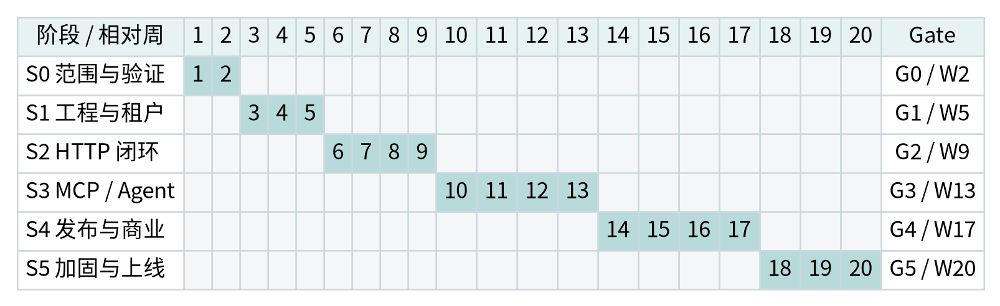

> Mender 工作副本 · 2026-09-08 从设计包 v1.1 更名整理。原设计日期为 2026-09-04；正文保留原设计建议、历史核验和待评审状态，不代表当前功能或验收结果。当前实现见[初始化报告](../engineering/initialization-report.md)，更名规则见[更名记录](../decisions/0001-project-name.md)。

# B00 实施计划的使用方式

## 0.1 目标与计划边界

本计划将《Mender 产品与系统架构设计》落实为相对周计划、任务分工、验收门禁和上线手册。20 周从团队正式启动周 W1 计算，不把文档日期 2026-09-04 当作实际开工日期。没有给定真实团队成员、预算和支付地区，因此本计划是可修改的规划基线，不是工期报价或已经确认的承诺。

建议团队为 2 名全职后端、1 名前端、1 名测试，加 0.5 名 SRE／安全支持和 0.5 名产品／项目负责人，共 5.0 个全职当量。每周按 5 个工作日、80% 有效投入计算，会议、支持和一般协作已从理论容量中扣除；另对任务工作量增加 15% 风险缓冲。二者含义不同，不能在报工时把会议重复计入实际开发任务。

基线不包含任意代码托管、自动供应商分账、多币种、完整工作流引擎或全部 MCP 可选能力。S6 的进程／容器／WASM 扩展需要新增范围、人员和独立排期，不能从 20 周剩余容量中默认认领。

本版为 v1.1：用户已确定前端 pnpm、DDD、清洁架构与依赖倒置。对应原有 20 个任务加强交付物和验收，并新增 T41–T48 及 L26–L30。因为未提供已存在的工程代码，本次按开工前设计细化处理，暂不虚构迁移人日；92 个任务、261.25 人日及 20 周仅保留为待 G0 重新校准的原估算，不代表这些约束没有实施成本。若已有代码或团队不熟悉边界检查，应在 G0 拆出迁移／学习／工具接入任务，并重新计算容量。

## 0.2 交付层级

| 交付点 | 预期时间 | 可对外表述的能力 |
| --- | --- | --- |
| G0 技术与合同基线 | W2 | 设计与 PoC 通过，不称为可用产品 |
| G1 基础控制台 | W5 | 登录、租户、目录、Key 与最小 Admin |
| G2 HTTP Alpha | W9 | 一个真实 HTTP 能力的受理、执行、预算和结果闭环 |
| G3 集成内测 | W13 | HTTP、远程 MCP、远程 Agent 三类来源与两类 MCP 分发 |
| G4 商业准备 | W17 | 插件发布、审批、回退、对账与选定支付适配验收 |
| G5 受控商业 Beta | W20 | 安全、恢复、容量、试点与支持条件通过后限量上线 |

这里的 20 周比只做界面和 HTTP 转发的原型更长，因为纳入了资金一致性、协议取消、凭据治理、回退和恢复验证。缩短工期应减少供给类型和商业范围，而不是删除租户隔离或账本验收。

## 0.3 台账是排期真源

Excel “WBS”工作表包含 92 个任务，初始状态均为“未开始”，不存在虚构的完成记录。每个任务有执行角色、计划窗口、人日、依赖、交付物、验收、需求和设计引用。修改人日、进度与状态后，总览和阶段容量自动汇总。

任务依赖分两类：跨阶段 Gate 是强制完成后开始；同阶段前后端依赖允许在合同冻结后通过 mock 并行，但最终验收必须依赖真实后端。WBS 的周窗口不是自动求解的日级关键路径，负责人需要在每周计划中完成日级资源平衡，不能把窗口内工作量简单均摊后声称已锁定工时。

# B01 路线图、依赖与阶段门禁

## 1.1 六阶段路线图

| 阶段／周窗口 | Gate | 交付结果 | 基础人日 |
| --- | --- | --- | --- |
| S0 · W1–W2 | G0 | 合同、威胁模型与三类接入可行性通过评审 | 21.25 |
| S1 · W3–W5 | G1 | 登录、租户、权限、目录与最小 Admin 可用 | 38 |
| S2 · W6–W9 | G2 | HTTP→Run→预算→结算→结果查询完整 Alpha | 55 |
| S3 · W10–W13 | G3 | 三类能力接入、固定／动态分发与授权兼容内测 | 54 |
| S4 · W14–W17 | G4 | 插件发布、回滚、审批、计费对账与支付适配验收 | 54 |
| S5 · W18–W20 | G5 | 安全、容量、灾备、试点与上线证据齐全 | 39 |

## 1.2 核心依赖链

资金与执行主链为：身份／租户 → 工具版本与价格 → 幂等 Run → 预算预留 → 持久 Worker → 计量结算 → 对账恢复。分发主链为：目录合同 → Toolset → 连接授权 → 上游 MCP → 固定／动态分发 → 客户端兼容。远程 Agent 依赖 Run、产物与回调，不应独立另造一套任务系统。

可以并行的工作包括页面原型与领域模型、OpenAPI 导入与账本、前端基于冻结合同的实现、协议测试 fixture、供应商授权申请和环境准备。不能并行绕过的工作包括未授权连接的真实调用、未实现预留的付费执行、未审核插件的生产发布。

## 1.3 Gate 决策规则

每个 Gate 包含演示、自动测试报告、未关闭风险、实际工作量和下一阶段依赖。项目负责人负责组织，技术负责人确认架构，QA 确认证据，SRE 确认环境与安全。进入真实资金阶段还需要业务／财务责任人确认。

| 结果 | 含义 | 后续处理 |
| --- | --- | --- |
| Go | 强制验收全部通过 | 冻结基线并进入下一阶段 |
| Conditional Go | 仅有非关键问题，已明确责任人和关闭期限 | 不允许豁免资金、安全、隔离与恢复门禁 |
| No-Go | 关键不变量未通过或外部条件缺失 | 停止相关范围，回到修复与复验 |

Gate 不是固定日期的仪式。前一 Gate 未通过，后续阶段可以继续不依赖该能力的工作，但不能把失败能力算成已完成。版本、测试与风险结论必须存入同一发布证据包。

## 1.4 外部依赖与降级方案

OAuth 应用审核、供应商代理／分发权限、支付供应商开通和实际试点客户需在 S0 发起。外部审核拖延时可用 BYOK 或模拟适配验证技术，但必须在产品和验收中清楚标识：模拟支付不是上线支付，匿名 MCP 测试不是 OAuth 授权完成。

支付地区或供应商到 G3 仍未确认，则 G4 只完成模拟合同与不代付试点，G5 不能开放真实充值。某类上游协议不稳定时，缩减已支持的版本与能力清单，不通过忽略错误或关闭安全校验来扩大“兼容”。

# B02 组织、容量与协作规则

## 2.1 角色责任

| 角色 | 主责 | 必须参与的评审 |
| --- | --- | --- |
| BE-A | 内核、身份、版本、执行事务、预算与账本；技术决策 | 所有 Gate，资金与数据迁移 |
| BE-B | HTTP／MCP／Agent 适配、Worker、回调、协议分发 | 协议、重试、取消和供应商合同 |
| FE | Console／Admin、路由、组件、表单与状态展示 | 关键用户流程、错误和危险操作体验 |
| QA | 验收矩阵、集成、协议、安全负向、故障和性能测试 | 每个 Gate 的证据质量 |
| SRE | CI、环境、秘密、出口、监控、备份与发布 | 安全、发布与恢复门禁 |
| PM | 范围、试点、外部审核、商业前置条件与项目节奏 | 范围变化、业务验收和 Go／No-Go |

业务负责人、财务／法务咨询不自动包含在上述研发人日中，需要项目方按真实收费地区和合同安排。不能让一名后端工程师默认承担所有监管判断和供应商商业授权。

## 2.2 人日与缓冲

| 角色／配置 | 基础人日 | 含风险缓冲 | 有效容量 | 计划负载 |
| --- | --- | --- | --- | --- |
| BE-A · 1 FTE | 57.00 | 65.55 | 80.00 | 81.9% |
| BE-B · 1 FTE | 58.00 | 66.70 | 80.00 | 83.4% |
| FE · 1 FTE | 56.00 | 64.40 | 80.00 | 80.5% |
| QA · 1 FTE | 49.00 | 56.35 | 80.00 | 70.4% |
| SRE · 0.5 FTE | 27.00 | 31.05 | 40.00 | 77.6% |
| PM · 0.5 FTE | 14.25 | 16.39 | 40.00 | 41.0% |
| 合计 | 261.25 | 300.44 | 400.00 | 75.1% |

基础工作量为 261.25 人日，15% 风险缓冲为 39.19 人日，合计约 300.44 人日；20 周有效容量为 400 人日。剩余差额用于角色峰值与不确定性，不表示可无条件追加约 100 人日新需求。Excel 按角色、阶段分别检查容量，避免用总量掩盖局部超载。

上述工作量只覆盖 WBS 中的任务，不包括长期值班、持续客户支持、正式法务工作和 S6。15% 风险缓冲是预留容量，不是自动计为已完成的工时。角色容量充足也不表示可以按总人日除人数压缩到更短时间；协议验证、外部审核和集成依赖存在先后顺序。

阶段容量表按角色分别计算，不用总团队空闲掩盖某个关键角色过载。若某角色负载超过 100%，优先调整阶段内顺序、减少范围或补足同类能力，不默认把专门工作转给没有对应技能的其他人员。

## 2.3 工作节奏与 Definition of Done

建议每周一次计划与风险复核、一次集成演示；每阶段一次正式 Gate。需求或合同变更先记录 ADR／决策单，再修改 WBS；不要只在即时消息里增加“顺便做一下”的功能。

一个任务完成至少要求代码／文档已评审，自动检查通过，相关安全与失败用例通过，合同和迁移更新，预发布可演示，验收证据可定位。设计或 PoC 任务则需要明确结论、复现步骤、失败边界和下一步，而不是以“看过文档”验收。

## 2.4 分支、合同与联调

保持主干可集成，使用短分支和 Feature Flag。公共 DTO／枚举先冻结，前端由类型化客户端或 mock 开发。每周运行跨模块集成，不把接口联调推迟到阶段最后一天。涉及账本或授权的改动至少需要另一名后端和 QA 评审。

## 2.5 工程治理是 Definition of Done 的组成部分

每个业务 PR 标记所属限界上下文、聚合／不变量、应用用例、公开合同、数据迁移及测试。修改接口先同步合同；修改状态先补充领域测试；新增跨域关系先更新 Context Map／ADR。应用层只定义所需端口，外层实现；禁止为了赶页面直接跨域写表或让 UI 操作隐式决定权限。

前端仅使用 pnpm，根工作区统一锁文件。Go／TS 依赖图、禁止导入、包导出、生成客户端漂移与到期例外均纳入阻断式 CI。架构门禁必须用故意违规 fixture 证明会失败，不能以“lint 通过”替代完整边界测试。专项规则和模板见 G07 与 engineering/。

# B03 S0：范围冻结与高风险验证｜W1–W2

## 3.1 本阶段目标

在大量编码前，验证三类来源的可接入性、MCP SDK 与目标客户端、同库预留事务、未知外部结果处理，以及前后端交互边界。首批供应商和实际部署地区不明确时，保留显式决策项，不用虚构默认值填满设计。

## 3.2 周内推进

W1 明确客户场景、商业模式和排除项，形成初版领域模型和合同；并行启动 MCP、HTTP／Agent、预算与崩溃三个 PoC。前端形成 Get Started、Catalog、Run 和 Admin 低保真；测试建立需求到 Txx 的覆盖框架；SRE 完成秘密和出口威胁模型。

W2 集中验证失败边界：头部／body 不一致、API 提交后崩溃、上游已执行但响应丢失、同余额并发预留，以及 Agent 取消不确定。汇总供应商权限、OAuth 审核和支付选择的真实外部依赖，在 G0 决定承诺的版本和能力。

## 3.3 工作包

| 任务／窗口 | 工作包与交付物 | 角色／人日 | 验收与设计 |
| --- | --- | --- | --- |
| S0-01 · W1–W1 | 冻结目标客户、首发边界与商业模式；交付：范围基线与排除项 | PM · 2 | 业务责任人确认；支付、地域、供给模式列为决策项；A01 |
| S0-02 · W1–W1 | 开展领域建模并冻结上下文候选边界；交付：统一语言、Context Map、聚合／不变量与表所有权草案 | BE-A · 2 | 区分限界上下文与部署进程；Provider／Tool／Price 各有唯一归属；评审 G01–G03；A03;A04;G01;G02;G03 |
| S0-03 · W1–W2 | 验证 MCP 新旧协议与 SDK；交付：协议 PoC 与兼容报告 | BE-B · 3 | T15／T16 覆盖选定版本；固定依赖摘要；A07 |
| S0-04 · W1–W2 | 验证 HTTP 与远程 Agent 最小调用；交付：两类适配 PoC | BE-B · 2 | 取得请求、响应、取消与费用上限证据；A06;A08 |
| S0-05 · W1–W2 | 验证预留、重复消息及崩溃恢复；交付：原子受理 PoC、失败用例和 ADR-020 | BE-A · 3 | 验证同事务 Run／预留／任务回滚；事务不包含外部调用；T47／T48 初版；A05;A11;G05 |
| S0-06 · W1–W2 | 设计控制台 IA 与关键页面低保真；交付：导航、关键状态、前端领域模块与端口草图 | FE · 3 | 消费者与 Admin 权限分离；前端按用户任务建模，不复制后端聚合；A14;G06 |
| S0-07 · W1–W2 | 定义验收矩阵与测试数据集；交付：T01–T48 初版与负向架构 fixture 计划 | QA · 3 | 每个 P0 需求有证据路径；T41–T48 定义阻断条件；A16;G07 |
| S0-08 · W1–W2 | 威胁模型与出口／凭据方案评审；交付：威胁模型与安全基线 | SRE · 2 | 隔离、SSRF、秘密、恢复风险有责任人；A10 |
| S0-09 · W1–W2 | 申请供应商授权与确认试点名单；交付：供应商依赖和试点登记 | PM · 0.75 | 至少确认首批真实能力与替代方案；A01 |
| S0-10 · W2–W2 | 举行 G0 评审并冻结合同边界；交付：G0 决议、工具链版本、上下文所有权、例外与重估记录 | PM · 0.5 | 冻结用户工程约束；签署或拒绝 ADR-020；重估架构门禁工作量；A17;G08 |

## 3.4 G0 验收与回退

增加四项 G0 放行条件：统一语言和候选 Context Map 已评审；每张写表／集成事件有所有者；pnpm／Node／Go 等精确工具链形成版本记录；ADR-020 的同库事务例外与新增治理工时已确认。DDD 方法及依赖方向属于用户约束，不再作为可随意放弃的候选方案。

必须有可复现的 PoC、三类适配的输入输出与异常合同、初版威胁模型、版本锁策略和已分派风险。资金 PoC 至少证明相同业务键不会重复结算，以及外部结果未知时不会盲目重复调用。

如果某类 Agent 缺乏可验证取消或费用上限，将其限定为固定报价或不代付试点；如果目标客户端不能使用最新协议，则明确兼容旧版而不是自称全部支持。无法形成清晰执行合同的能力不进入首发目录。

# B04 S1：工程底座与租户控制台｜W3–W5

## 4.1 本阶段目标

交付可登录、可切换 Workspace、可查看目录与管理访问凭据的基础控制台，建立独立平台 Admin 边界、CI、测试环境和数据库迁移。此阶段不是“做完所有 CRUD”，而是证明身份和数据归属从前端到 Worker 都一致。

## 4.2 每周增量

| 周次 | 后端与平台 | 前端与测试 |
| --- | --- | --- |
| W3 | API／Worker 骨架、身份迁移、OIDC 接口、目录合同 | Vite／路由／共享 UI；fixture 与 CI 初版 |
| W4 | 成员、服务身份、Key、可见性与最小 Admin API | 登录、Workspace 切换、目录与工具详情 |
| W5 | 撤销、审计、授权负向修复与环境连通 | Key、Admin 列表、错误态、T01–T04 和 G1 |

前端可基于合同与 mock 并行，但 G1 必须使用真实后端。Workspace 切换后的缓存和事件订阅是重点测试对象，不能只检查列表 URL 中是否有租户参数。

## 4.3 工作包

| 任务／窗口 | 工作包与交付物 | 角色／人日 | 验收与设计 |
| --- | --- | --- | --- |
| S1-01 · W3–W3 | 建立按上下文分层的 Go 骨架与显式装配；交付：contexts／processes／bootstrap 骨架与小端口 | BE-A · 2 | domain 不依赖框架；application 不引用 adapter；T42／T46 基础通过；A03;G04 |
| S1-02 · W3–W4 | 创建租户、成员与服务身份模型；交付：迁移与身份服务 | BE-A · 3 | T01／T02 基础隔离通过；A10;A13 |
| S1-03 · W4–W5 | 实现机器 Key 及权限策略接口；交付：Key 生命周期与 Authorizer | BE-A · 3 | T03；撤销与失败关闭路径可测试；A10 |
| S1-04 · W3–W4 | 实现登录会话与 OIDC 接口；交付：浏览器认证与会话 | BE-B · 3 | Cookie、CSRF、state／nonce 验证完成；A10 |
| S1-05 · W3–W5 | 实现 Catalog 与 Provider 读取模型；交付：Catalog 查询端口、DTO 映射与 Provider 只读投影 | BE-B · 3 | T04；Provider 主记录归 supply；PriceVersion 归 commerce；禁止跨域改表；A04;A12;G02 |
| S1-06 · W4–W5 | 实现最小平台管理 API 与审计；交付：Admin 管理入口 | BE-B · 2 | 租户角色不能访问平台 API；写操作留审计；A10;A14 |
| S1-07 · W3–W3 | 搭建 pnpm workspace、Vite 与前端领域模块；交付：console／admin、唯一 pnpm 锁、共享 UI 与端口装配 | FE · 3 | T41／T44／T46；两个入口独立构建；不使用全局 features 万能包；A14;G06 |
| S1-08 · W4–W4 | 实现登录、Workspace 与成员界面；交付：会话与切换流程 | FE · 3 | 切换后清理旧查询；过期流程可恢复；A14 |
| S1-09 · W4–W5 | 实现目录、工具详情与 API Key 页面；交付：首批消费者页面 | FE · 3 | 加载／空／错误态和权限显示齐全；A14 |
| S1-10 · W5–W5 | 实现最小 Admin 布局与工作区列表；交付：Admin 首版 | FE · 1 | 平台入口与普通控制台独立打包或独立入口；A14 |
| S1-11 · W3–W3 | 搭建集成测试数据库与 fixture；交付：数据库 fixture、Fake 端口及故意违规架构样例 | QA · 2 | 正向案例通过、错误依赖必须失败；不得只检查目录存在；A16;G07 |
| S1-12 · W4–W5 | 验证身份、目录隔离与前端状态；交付：T01–T04／T37／T41–T46 初版报告 | QA · 4 | 租户负向、前端状态和架构边界检查通过；未实现门禁不得填写通过；A16;G07 |
| S1-13 · W3–W4 | 建立 pnpm 冻结构建与架构门禁 CI；交付：版本校验、导入图检查、生成代码漂移与秘密扫描流水线 | SRE · 3 | 错误包管理器、跨域深导入、反向依赖和逾期例外阻断；记录具体工具版本；A15;G07 |
| S1-14 · W4–W5 | 配置开发／预发布环境及最小监控；交付：环境模板与健康检查 | SRE · 2 | 数据库、对象存储与访问入口有受控凭据；A15 |
| S1-15 · W5–W5 | 完成 G1 演示与范围复核；交付：G1 签署与 WBS 更新 | PM · 1 | 基础用户流程通过；pnpm 和前后端边界负向案例可复现；G1 不豁免架构门禁；B04;G08 |

## 4.4 G1 验收与回退

G1 必须在干净环境执行 pnpm 冻结安装，分别构建 Console／Admin，并展示领域层不依赖框架、应用层不引用具体适配器、跨域深导入被拒绝和前端领域模块可使用 Fake 测试。T41–T46 的基础门禁未实施时不得将 G1 记为架构通过。

验收演示使用两个 Workspace、两种角色与一个服务身份，验证可见与不可见对象、Key 创建与撤销、管理权限和审计。所有跨租户负向用例通过，Admin 与用户控制台不能互相继承超级权限。

身份或权限模型不成立时，不进入真实工具调用。可继续做只读页面和 mock，但禁止先开放全局 Key 再“后补权限”。环境秘密必须与生产隔离，开发数据不使用真实敏感账号内容。

# B05 S2：HTTP 工具与可信执行闭环｜W6–W9

## 5.1 本阶段目标

形成第一个真正的纵向产品切片：导入工具草稿 → 校验发布版本 → 创建连接 → 估价与预算预留 → 持久 Run／Worker 执行 → 计量结算 → Console 查询。只要其中任意一环依赖手工直接修改数据库，就不算闭环完成。

## 5.2 每周增量

| 周次 | 核心增量 | 本周必须能演示的结果 |
| --- | --- | --- |
| W6 | Tool／Price 版本、OpenAPI 导入、Run 合同 | 支持子集导入可诊断；版本不可覆盖 |
| W7 | 幂等、SQL 任务、HTTP Executor、预留接口 | 一个 Run 能进入队列；重复请求不会重复受理 |
| W8 | 账本、结算、凭据代理、Run Explorer | 使用测试额度完成真实 HTTP 调用和费用明细 |
| W9 | 崩溃／并发回归、待对账、上手检测、G2 | 断线／Worker 重启后仍能找到同一 Run 与正确资金状态 |

## 5.3 工作包

| 任务／窗口 | 工作包与交付物 | 角色／人日 | 验收与设计 |
| --- | --- | --- | --- |
| S2-01 · W6–W6 | 实现 ToolVersion、价格版本与绑定；交付：catalog ToolVersion 与 commerce PriceVersion 公开合同 | BE-A · 3 | T05；独立所有权，经快照绑定，不把价格版本放入 catalog 持久层；A04;G02 |
| S2-02 · W6–W7 | 实现 Run、Attempt、事件与幂等；交付：执行协调器与持久合同 | BE-A · 4 | T09／T11；请求摘要绑定全部执行影响字段；A05 |
| S2-03 · W7–W8 | 实现钱包、分录与原子预算预留；交付：commerce 聚合与 AdmissionUnitOfWork 事务适配 | BE-A · 4 | T18／T20／T47；预留、Run、任务原子；应用层无 SQL Tx；A11;G05 |
| S2-04 · W8–W9 | 实现结算、释放与结果不明处理；交付：结算与对账状态 | BE-A · 2 | T21；未知结果不得自动释放或盲重投；A11 |
| S2-05 · W6–W7 | 实现 OpenAPI 导入器与诊断；交付：支持子集导入与草稿 | BE-B · 4 | T06；外部引用默认禁用，报告不支持项；A06 |
| S2-06 · W7–W8 | 实现 HTTP Executor 与受控转换；交付：请求映射、认证注入与结果提取 | BE-B · 4 | 不允许模型覆盖 base URL 或认证头；费用数量受限；A06 |
| S2-07 · W7–W8 | 实现 SQL 任务租约与 Outbox；交付：SQL 租约、Outbox 与领域／集成事件映射 | BE-B · 3 | T10／T48；提交后投递、重复可处理；不把领域实体序列化为公共事件；A05;G05 |
| S2-08 · W8–W9 | 实现执行、报价与结果 REST API；交付：核心消费 API | BE-B · 2 | 请求／响应通过设计合同校验；不另造执行逻辑；A12 |
| S2-09 · W6–W7 | 实现导入、测试与工具版本界面；交付：发布草稿与测试页 | FE · 3 | 展示诊断、风险、费用及版本差异；A14 |
| S2-10 · W7–W8 | 实现 Run Explorer 与详情时间线；交付：Run 列表、详情与结果视图 | FE · 4 | T25；支持稳定分页和未确认状态说明；A14 |
| S2-11 · W8–W9 | 实现预算、余额与费用明细；交付：预算及账本读视图 | FE · 3 | 可区分可用、预留、结算与待对账；A14 |
| S2-12 · W8–W9 | 实现可验证的 Get Started 流程；交付：首次成功调用引导 | FE · 2 | 生成 Key、已连接和首次成功分别检测；A14 |
| S2-13 · W6–W8 | 编写 HTTP 导入与执行合同测试；交付：支持矩阵与 fixtures | QA · 3 | 关键内容类型、分页、错误与限额用例通过；A16 |
| S2-14 · W7–W9 | 实施幂等、预算及 Worker 故障注入；交付：资金／Worker 故障与 T45／T47／T48 报告 | QA · 5 | 逐写入点崩溃回滚；重复投递不重复结算；未知结果不盲重试；A16;G05;G07 |
| S2-15 · W9–W9 | 执行端到端 Alpha 验收；交付：G2 测试证据 | QA · 2 | 从导入到结算的完整路径通过；B05 |
| S2-16 · W6–W8 | 部署出口限制与 Credential Broker 基础；交付：出口策略与凭据加密配置 | SRE · 3 | 日志脱敏、目标限制和密钥访问可验证；A10 |
| S2-17 · W8–W9 | 建立 Run／资金监控及告警；交付：仪表板与告警规则 | SRE · 2 | 队列、待对账、账差与预算拒绝可检索；A15 |
| S2-18 · W8–W9 | 组织试点任务与 G2 Alpha 评审；交付：试点任务集与 G2 决议 | PM · 2 | 至少一条真实供应商闭环；模拟资金与真实资金分开；B05 |

## 5.4 特别验证的事务边界

先在事务前崩溃，确认没有 Run／预留／外部请求；再在受理提交后、Worker 领取后、上游提交后和结算前后分别终止进程。每个点都记录实际 Run 状态、预留、分录、上游标识和下一步处理。

API 不新增直接请求上游的隐藏快速路径。同步等待与异步查询都访问同一个 Run；Worker 失败恢复也不能自行绕过已批准价格和连接。并发预算测试必须验证同一个账户的热点，而不只是不同租户的独立请求。

## 5.5 G2 验收与回退

至少完成一个真实供应商的无副作用能力闭环，并用 mock 覆盖有副作用和未知结果。T05、T06、T09–T12、T18–T21、T25 通过。余额、预留和已结算金额在界面中明确区分。

账本不变量或未知结果处理失败时，不开放真实代付；保留受限测试额度或 BYOK 的不计费验证。导入不支持的 OpenAPI 特性保持草稿／诊断，不以自动忽略字段进入生产发布。

# B06 S3：MCP 与远程 Agent 集成｜W10–W13

## 6.1 本阶段目标

在已验证执行内核上增加上游 MCP、固定工具集、动态元工具、OAuth 连接、远程 Agent、产物和回调。所有入口使用同一套授权、预算、Run 与计量，不产生“MCP 不扣预算”“Agent 另存一套 Job”的旁路。

## 6.2 每周增量

| 周次 | 核心增量 | 重点风险 |
| --- | --- | --- |
| W10 | Toolset 草稿、远程 MCP 发现、OAuth 生命周期 | 工具命名、连接归属与兼容版本 |
| W11 | 固定／动态分发、产物、Agent Submit | 元工具绕过授权；大结果和回调 SSRF |
| W12 | 取消、刷新竞争、回调去重、Agent 查询 | 断线误删任务、未知取消、重复状态推进 |
| W13 | 客户端矩阵、三类能力内测、G3 | 只承诺通过实测的组合，不宣称透明兼容 |

## 6.3 工作包

| 任务／窗口 | 工作包与交付物 | 角色／人日 | 验收与设计 |
| --- | --- | --- | --- |
| S3-01 · W10–W11 | 实现 Toolset 与路由快照发布；交付：工具集、绑定与路由版本 | BE-A · 3 | T13；已有任务版本不漂移；A07 |
| S3-02 · W10–W12 | 实现 OAuth Connection 与授权范围；交付：授权、刷新、撤销与连接授权 | BE-A · 4 | T07／T08；刷新竞争使用版本比较或互斥；A10 |
| S3-03 · W11–W12 | 实现产物服务与对象级授权；交付：上传、签名读取与生命周期 | BE-A · 2 | T30；不把存储路径当作访问授权；A13 |
| S3-04 · W12–W13 | 实现受信回调、Inbox 与状态归并；交付：Webhook 去重与乱序处理 | BE-A · 3 | T28；只有验签成功事件可推进状态；A12 |
| S3-05 · W10–W11 | 实现远程 MCP Client 适配；交付：MCP 出站适配器与防腐层合同 | BE-B · 4 | T15／T16；SDK 类型停留在 adapter；application 使用本地端口；A07;G04 |
| S3-06 · W11–W12 | 实现固定工具与动态元工具分发；交付：MCP Gateway 与目标授权 | BE-B · 4 | T14／T16；两种分发都走同一内核；A07 |
| S3-07 · W11–W13 | 实现远程 Agent Adapter；交付：远程 Agent 出站适配器、状态与产物映射 | BE-B · 3 | T17；Agent／A2A 类型不进入 Run 聚合；未知状态显式拒绝或待确认；A08;G04 |
| S3-08 · W12–W13 | 实现 MCP 取消、异步启动与兼容测试钩子；交付：协议生命周期映射 | BE-B · 2 | T40；不把断线等同删除持久 Run；A07 |
| S3-09 · W10–W11 | 实现 Toolset 配置与安装体验；交付：工具集编辑、发布与连接说明 | FE · 4 | 支持版本锁定、风险和权限预览；A14 |
| S3-10 · W11–W12 | 实现 Connection 与授权状态页面；交付：BYOK／OAuth 连接管理 | FE · 3 | 不展示完整秘密；支持失效和重新授权；A14 |
| S3-11 · W12–W13 | 实现 Agent 运行与产物界面；交付：异步／取消／输入请求视图 | FE · 3 | 未知结果不得展示为成功取消；产物按需加载；A14 |
| S3-12 · W12–W13 | 补齐多入口引导及兼容状态；交付：MCP 连接检测与能力提示 | FE · 2 | 只显示已验证的客户端／版本支持；A14 |
| S3-13 · W10–W12 | 执行协议兼容与头部授权测试；交付：T13–T16／T40 报告 | QA · 4 | 覆盖新版、选定旧版、错误降级与元工具绕过；A16 |
| S3-14 · W11–W13 | 执行 OAuth、Agent、回调与产物测试；交付：T07／T08／T17／T28／T30 | QA · 4 | 重放、并发刷新、乱序回调与跨租户全通过；A16 |
| S3-15 · W13–W13 | 执行三类能力端到端内测；交付：G3 证据包 | QA · 2 | 同一用户通过三种来源完成可追踪调用；B06 |
| S3-16 · W10–W12 | 配置流式代理、超时与网络策略；交付：MCP／应用 SSE 的独立代理配置 | SRE · 3 | 不缓冲响应；协议流与应用事件重连规则分开；A15 |
| S3-17 · W12–W13 | 配置对象保留和授权回调安全；交付：对象权限和回调告警 | SRE · 2 | 删除／到期验证，回调失败可审计；A15 |
| S3-18 · W12–W13 | 完成客户端验收名单与 G3 评审；交付：兼容名单、用户反馈与 G3 决议 | PM · 2 | 不把 SDK 支持等同所有客户端支持；B06 |

## 6.4 协议验收重点

重新核验 2026-07-28 与所选 SDK 配置，并记录目标客户端版本。[S03][S08][S09] 新版与旧版分别验证头部／body、版本兼容、工具错误、取消和结果类型。协议可选能力未实现就不宣告；上游强依赖时明确拒绝。

同步 tools/call 的取消与显式 run_start 不同：同步请求断开需要停止对应请求并请求取消执行；run_start 已提交的持久任务应可通过同一幂等键找回。应用 RunEvent SSE 的游标恢复不能被误用为新版 MCP SSE 的协议恢复机制。[S04]

## 6.5 G3 验收与回退

由同一个测试 Workspace 经三类来源完成真实或明确标记的受控执行，使用固定 Toolset 和动态入口都能追踪结果、授权和费用。T07／T08、T13–T17、T28、T30、T40 通过，已支持客户端与限制清单随版本发布。

OAuth 应用审核未完成的供应商保持 unavailable 或只提供已获准 BYOK；远程 Agent 无法确认取消时显示 cancel_requested／reconciling，不显示“已停止且不收费”。有安全或兼容问题的协议组合单独关闭，不降低全平台检查规则。

# B07 S4：发布治理与商业化准备｜W14–W17

## 7.1 本阶段目标

把人工接入升级为受控发布：声明式插件清单、合同测试、审核、灰度、排空、回退、禁用；完成危险操作审批、邀请制发布者工作台、Admin 对账和选定支付适配。该阶段仍不允许公众上传任意执行代码。

## 7.2 每周增量

| 周次 | 核心增量 | 必须保存的证据 |
| --- | --- | --- |
| W14 | Manifest 验证、审批合同、支付适配开工 | 制品／权限差异、支付地区与账户确认 |
| W15 | 发布者提交、后台审核、CLI／Skill | 自审拦截、同入口权限与计量一致性 |
| W16 | 灰度、回退、退款、JIT 支持 | 旧 Run 固定版本、退款补充分录与审计 |
| W17 | 健康检查、对账、商业前置条件和 G4 | 未解释账差清单、支持责任与发布手册 |

## 7.3 工作包

| 任务／窗口 | 工作包与交付物 | 角色／人日 | 验收与设计 |
| --- | --- | --- | --- |
| S4-01 · W14–W15 | 实现插件清单校验与发布状态机；交付：supply 发布聚合、审核用例与运行时端口 | BE-A · 3 | T22；插件只能实现受控端口，不依赖内核内部包或直接改账本；A09;G02;G04 |
| S4-02 · W14–W16 | 实现危险操作审批与 JIT 管理授权；交付：审批合同、消费标记与审计 | BE-A · 3 | T24／T26；审批不由模型字段代替；A10 |
| S4-03 · W15–W17 | 实现账单、调账和退款补充分录；交付：账单聚合、退款与对账工具 | BE-A · 3 | T20／T21；不修改原分录；必须有业务依据；A11 |
| S4-04 · W15–W17 | 实现灰度、排空、回退和禁用开关；交付：路由原子切换与事故开关 | BE-A · 3 | T23；禁用与普通升级语义分离；A09 |
| S4-05 · W14–W15 | 实现供应商与平台 Admin 管理能力；交付：审核、工作区冻结与异常处理 | BE-B · 3 | T26；支持操作理由和审计导出；A14 |
| S4-06 · W14–W16 | 实现支付供应商适配与回调对账；交付：选定供应商 sandbox 集成 | BE-B · 4 | T27；地区／币种未定时仅交付模拟适配并阻断真金上线；A11 |
| S4-07 · W15–W16 | 实现 CLI 与 Skill 分发合同；交付：命令、安装说明与共享客户端合同 | BE-B · 2 | T29；不在文档或聊天中嵌入长期秘密；A07 |
| S4-08 · W16–W17 | 实现发布质量与健康检查任务；交付：Schema 差异、合成探测与质量视图 | BE-B · 3 | 变更上游不会自动覆盖当前版本；A09 |
| S4-09 · W14–W15 | 实现发布者草稿、测试与提交页面；交付：邀请制发布者工作台 | FE · 4 | T31；禁止自审与未审核发布；A14 |
| S4-10 · W15–W16 | 实现 Admin 审核、异常与 JIT 界面；交付：后台管理关键页面 | FE · 4 | T26；敏感操作需原因、确认及权限；A14 |
| S4-11 · W16–W17 | 实现账单、支付及退款状态界面；交付：财务与费用视图 | FE · 3 | 不把支付跳转成功当作到账；待对账状态可见；A14 |
| S4-12 · W17–W17 | 补齐文档、API 示例与发布引导；交付：开发者入口与文档导航 | FE · 1 | 样例不含真实密钥；失败指引完整；A14 |
| S4-13 · W14–W17 | 测试发布、回退、审批与 Admin；交付：T22–T24／T26／T31 | QA · 4 | 恶意清单、旧审批复用和越权发布被拒绝；A16 |
| S4-14 · W15–W17 | 测试支付、对账与多入口一致性；交付：T20／T21／T27／T29 | QA · 4 | 重复回调、部分退款、费用规则和权限一致；A16 |
| S4-15 · W17–W17 | 执行商业化准备回归与 G4 证据整理；交付：G4 回归报告 | QA · 2 | 未确定支付或分发授权明确列为阻断项；B07 |
| S4-16 · W14–W16 | 实现制品校验、签名与依赖扫描；交付：制品验证与权限差异检查 | SRE · 3 | 摘要不符／未批准权限不可部署；A09 |
| S4-17 · W16–W17 | 配置发布回退、备份与对账值班入口；交付：发布手册与告警分派 | SRE · 2 | 应急角色、开关和恢复脚本可演练；A15 |
| S4-18 · W14–W17 | 确认服务条款、收费与供应商清单；交付：商业前置条件与 G4 签署 | PM · 3 | 转售／数据／支付前置条件有书面依据；B07 |

## 7.4 支付与供给前置条件

支付供应商选择依赖地区、币种和账户资格，本交付包不假定任何商户账号已经可用。先验证沙盒签名回调、事件去重、金额／币种一致性、退款和日对账，再申请真实资金。用户浏览器跳转成功不能触发钱包充值。

每个公开供给要确认允许的代理、再分发、缓存和商业使用方式。没有许可依据的能力不能因为 API 调得通就进入平台代付目录。该项由业务负责人组织确认，不由插件作者填写一个布尔值即通过。

## 7.5 G4 验收与回退

T22–T24、T26、T27、T29、T31 及关键财务回归通过。任意版本的错误 Schema、未批准网络权限或摘要不符不能发布；回退不改变已开始 Run；紧急禁用可以停止新副作用并保留对账。

支付或供应商授权未确认时，G4 可以对纯技术部分作条件通过，但 G5 仅允许无真实资金或已批准的受限模式。发布者自助端可以继续邀请制，不为赶工去掉审核链。

# B08 S5：加固、演练与受控上线｜W18–W20

## 8.1 本阶段目标

不再大规模增加功能，集中处理前四阶段暴露的失败边界、容量、可访问性、迁移兼容、恢复与真实试点。目标是“能够解释并控制失败”，不是只在演示环境完成一次顺利调用。

## 8.2 每周增量

| 周次 | 核心工作 | 退出条件 |
| --- | --- | --- |
| W18 | 安全负向、负载、前端质量与缺陷修复 | 跨租户、SSRF、秘密和关键协议无阻断问题 |
| W19 | 恢复、回退、密钥轮换、未知任务对账 | 实测 RPO／RTO；恢复不重复外部操作 |
| W20 | 最终回归、Go／No-Go、金丝雀与值班交接 | 上线清单全满足，用户与责任人可追溯 |

## 8.3 工作包

| 任务／窗口 | 工作包与交付物 | 角色／人日 | 验收与设计 |
| --- | --- | --- | --- |
| S5-01 · W18–W19 | 完成后端一致性与迁移加固；交付：并发／迁移问题修复 | BE-A · 4 | T18–T21／T38 无阻断缺陷；A16 |
| S5-02 · W19–W20 | 参与恢复、账本与事故演练修复；交付：恢复对账和停机开关修复 | BE-A · 3 | 恢复窗口未知任务不会重复外部副作用；A15 |
| S5-03 · W18–W19 | 完成协议、超时及连接故障加固；交付：协议与适配器修复 | BE-B · 4 | T15／T16／T40 及故障退化通过；A07 |
| S5-04 · W19–W20 | 完成容量、重试与背压优化；交付：性能修复与资源上限 | BE-B · 3 | 20 RPS／50 RPS 目标下不破坏费用和隔离规则；A16 |
| S5-05 · W18–W19 | 完成前端质量、可访问性与反馈修复；交付：关键页面质量收敛 | FE · 5 | T25／T37；异常、取消、费用提示不误导；A14 |
| S5-06 · W19–W20 | 完成试点埋点与发布说明；交付：首次调用漏斗与发布指引 | FE · 2 | 不采集秘密；用户能找到支持与问题 Run；A14 |
| S5-07 · W18–W18 | 执行隔离、SSRF、秘密及权限安全回归；交付：T02／T08／T24／T33 安全证据 | QA · 3 | 零未关闭高危问题；例外不可豁免资金与隔离；A16 |
| S5-08 · W18–W19 | 执行稳态、突发与长任务性能测试；交付：T34 完整报告 | QA · 3 | 分开报告平台延迟与上游任务成功率；A16 |
| S5-09 · W19–W19 | 执行回退、恢复与未知任务演练；交付：T35／T38／T40 证据 | QA · 2 | 记录实测 RPO／RTO 与外部执行对账结果；A16 |
| S5-10 · W20–W20 | 执行最终回归与 Go／No-Go 核验；交付：最终功能、安全、架构门禁与例外审计报告 | QA · 2 | T01–T48 按范围执行；L26–L30 通过；无过期例外或未验证原子受理；A16;G07;G08 |
| S5-11 · W18–W19 | 执行灾备、密钥轮换和供应链演练；交付：恢复、轮换及紧急禁用记录 | SRE · 3 | RPO／RTO 实测且失败有闭环修复；A15 |
| S5-12 · W20–W20 | 执行金丝雀部署与值班交接；交付：受控上线与回滚记录 | SRE · 2 | 任一资金／隔离异常立即停止扩量；B11 |
| S5-13 · W18–W20 | 组织试点、验收签署及范围归档；交付：试点报告、G5 决议与下一阶段输入 | PM · 3 | 真实任务验收、支持责任及未交付项被明确记录；B08 |

## 8.4 性能与恢复实验

采用 A15 约定的候选负载，分别测试均匀租户和单账户热点。报告平台受理延迟、上游延迟、队列等待、成功率、重试与资金状态，不通过跳过账本事务获得好看的吞吐。

恢复演练包含数据库、对象引用、配置、密钥恢复和外部任务对账。即使数据库在 10 分钟内恢复，如果恢复窗口内的已执行外部操作不能识别，仍不得认为整体恢复通过。未知任务隔离后再逐项释放或结算。

## 8.5 G5 强制上线清单

| 编号／类别 | 放行条件 | 责任角色 | 适用性 |
| --- | --- | --- | --- |
| L01 · 范围 | 首发能力、未交付项、已支持客户端清单已签署 | PM | 强制 |
| L02 · 隔离 | 跨租户、搜索、缓存、队列与产物负向测试通过 | QA | 强制 |
| L03 · 秘密 | 密钥、OAuth token、认证头不出现在日志和制品中 | SRE | 强制 |
| L04 · 出口 | SSRF、重定向、IPv6、DNS 变化和元数据地址防护通过 | SRE | 强制 |
| L05 · 资金 | 预留、结算、退款业务键与账本守恒测试通过 | BE-A | 强制 |
| L06 · 资金 | 所有账差已解释并关闭；无未审手工余额修改 | BE-A | 强制 |
| L07 · 执行 | 未知上游结果不会盲重试或自动放款 | BE-B | 强制 |
| L08 · 执行 | Worker 崩溃、租约过期和重复回调测试通过 | QA | 强制 |
| L09 · 协议 | 选定 MCP 版本和客户端矩阵通过，未支持功能不宣称 | BE-B | 强制 |
| L10 · 协议 | 同步取消与显式异步 Run 的差异已验证 | QA | 强制 |
| L11 · 授权 | Key 撤销、OAuth 刷新竞争与 Connection 失效可处理 | BE-A | 强制 |
| L12 · 审批 | 危险动作审批不能被参数／版本变化或模型字段绕过 | QA | 强制 |
| L13 · 发布 | 制品摘要、审查、回退和紧急禁用演练通过 | SRE | 强制 |
| L14 · 迁移 | 扩展迁移及新旧 Worker 兼容通过；禁止破坏性回退 | BE-A | 强制 |
| L15 · 恢复 | 恢复演练记录真实 RPO／RTO，并对外部任务完成对账 | SRE | 强制 |
| L16 · 容量 | 稳态、突发、长任务与预算热点压测通过 | QA | 强制 |
| L17 · 观测 | SLO、待对账、队列积压、供应商故障有告警责任人 | SRE | 强制 |
| L18 · 管理 | Admin MFA／JIT／审计与最小权限启用 | SRE | 强制 |
| L19 · 前端 | 核心流程的空态、错误态、取消态和键盘路径通过 | FE | 强制 |
| L20 · 隐私 | 数据地域、保留与删除规则已确认 | PM | 强制 |
| L21 · 商业 | 供应商允许所采用的代理、转售或 BYOK 使用模式 | PM | 真实商业供给前强制 |
| L22 · 支付 | 支付供应商、币种、回调与退款 sandbox 已验收 | PM | 真实资金前强制 |
| L23 · 支持 | 事故联系、值班轮值和用户支持流程落实到人 | PM | 强制 |
| L24 · 扩量 | 金丝雀样本、暂停阈值与回退步骤获得批准 | SRE | 强制 |
| L25 · 交付 | 合同版本、依赖锁、文档、测试证据与例外清单已归档 | PM | 强制 |

## 8.6 不通过时如何处理

任意资金守恒、跨租户、凭据保护、不可逆重试或恢复门禁失败，停止上线扩量并修复；不能用项目延期压力豁免。非关键页面细节可列限时例外，但必须写清负责人和日期。商业前置条件缺失时，发布为不代付／测试内测，不误标为商业收费可用。

# B09 S6：隔离运行时与生态扩展｜独立准入

## 9.1 进入条件

只有出现至少一种无法通过声明式 HTTP、远程 MCP 或远程 Agent 合理实现的已验证需求，并且业务价值、运行成本、安全责任和维护团队已确定，才启动 S6。它不自动从 W21 开始；“W21–W26”仅可作为追加范围获批后的六周参考窗口。

S6 不要求进程、容器和 WASM 同时做完。先选一个明确场景，例如复杂签名进程插件、托管某类 MCP Server，或无网络的数据转换 WASM，再按风险逐步扩展。

## 9.2 建议工作包

| 工作包 | 主要交付 | 验收／阻断 |
| --- | --- | --- |
| S6-A 运行合同 | Runner API、能力票据、资源与取消合同 | 无数据库全权；权限由平台批准 |
| S6-B 本机进程试点 | 受限用户、RPC、日志／退出处理与 ABI 检查 | 进程 panic 不影响 API；网络权限受限 |
| S6-C 容器试点 | 独立执行池、不可变镜像、配额和出口 | 不挂宿主 socket；恶意样例和恢复通过 |
| S6-D WASM 试点 | 纯计算、有限宿主函数、时间／内存限制 | 死循环、内存膨胀与越权访问被阻断 |
| S6-E 发布与运维 | 准入、签名、灰度、回退、清理与成本监控 | 一键禁用、旧任务处理和审计完整 |
| S6-F 前端扩展 | Schema 配置，必要时独立来源隔离 UI | 不向主控制台注入任意远程 JS |

HashiCorp go-plugin 的使用局限于其文档所述的本机可靠通信语境；跨节点运行由独立服务合同处理。[S11] WASM 或容器不是自动安全证明，必须以 T32 的恶意测试结果决定是否准入。[S12][S24]

## 9.3 失败退出

隔离或成本模型未通过时保留远程托管模式，不把不可信代码搬进 API 进程。仅完成示例插件不能称为公共插件市场；开放给外部发布者之前还需要供应链审核、滥用处理、资源账单、隔离升级和事故响应能力。

# B10 跨阶段测试、证据与质量管理

## 10.1 需求到证据的链路

每个需求具有 FR／NFR 编号，WBS 引用需求与 Axx 设计，测试 Txx 引用验收不变量，Gate 保存实际证据。建议证据目录为 release/{version}/{gate}/，包含测试报告、环境规格、依赖锁、演示记录、风险例外和批准人。

Excel 中的“证据”初始为空，任务进度也为 0。执行时填入仓库、测试平台或内部文档的实际位置；不能把本文中的测试描述当作已经完成的测试结果。

## 10.2 阶段测试覆盖

| 阶段 | 重点测试 | 不允许留到最后的风险 |
| --- | --- | --- |
| S0 | 协议、账本 PoC、未知上游结果 | 不清楚取消／费用和事务合同 |
| S1 | T01–T04、T26 基础、T37 基础 | 先全权后补权限、缓存串租户 |
| S2 | T05／T06、T09–T12、T18–T21、T25 | 重复执行、超预算、结算丢失 |
| S3 | T07／T08、T13–T17、T28／T30／T40 | 元工具绕过、授权泄漏、断线语义错误 |
| S4 | T22–T24、T26／T27／T29／T31 | 未审核发布、退款错误、自审与直接改余额 |
| S5 | 全量回归，T33–T39 专项 | 安全、容量、恢复和上线责任缺失 |

## 10.3 缺陷级别

P0 缺陷包括资金错误、跨租户、凭据泄漏、不可逆操作重复、数据毁损和不能停止危险执行；立即暂停相关流量。P1 为关键流程不可用或主要协议组合失效；影响对应能力上线。P2 为可绕过且不影响安全资金的普通缺陷；可带明确关闭期限。

需求优先级 P0／P1 与缺陷严重度不是同一字段，台账中需要分别解释。发布计划不能因为某功能是 P1，就忽略其已经上线后的 P0 安全缺陷。

## 10.4 自动检查与人工评审

自动检查覆盖类型、Lint、单元、集成、Schema、迁移、依赖和秘密扫描。人工评审覆盖审批展示是否误导、供应商限制是否被准确表达、退款策略是否完整，以及未知结果是否被界面伪装成成功取消。两者互相补充。

# B11 上线步骤、回退与运行手册

## 11.1 发布准备时间线

| 时间 | 动作 | 责任与证据 |
| --- | --- | --- |
| T-7 日 | 冻结范围、试点名单、价格、兼容清单与依赖版本 | PM／BE-A，发布基线 |
| T-3 日 | 完成备份恢复、密钥轮换和回退演练 | SRE／QA，演练报告 |
| T-1 日 | 检查账差、活动未知任务、值班和供应商状态 | BE-A／PM，对账与 No-Go 项 |
| T0 | 先扩展迁移，再部署兼容版本，开启内部试点 | SRE，变更与制品摘要 |
| T+1 阶段 | 限定 Workspace 金丝雀，观察实际任务和费用 | QA／SRE，监控与问题 Run |
| 扩量后 | 复核账本、协议、队列和用户成功率 | BE-A／BE-B，复盘记录 |

“T”指经批准的上线日期；实际日历日期由项目方确认。部署迁移与应用发布不能在没有负责人和回退策略时自动一起推进。

## 11.2 金丝雀与暂停条件

建议按固定 Workspace 扩量，参考梯度为内部名单 → 5% → 20% → 50% → 100%；比例仅为候选，试点太少时应使用明确客户名单而非虚假百分比。每步需要足够样本和观察时间，并包含至少一次完整费用对账。

任何跨租户、秘密泄漏、账本不守恒、未经授权副作用或恢复风险立即暂停相关执行与真实收费。普通平台错误率或延迟超阈值时先停止扩量，比较对照组与上游故障，不把供应商短时失败误判为必须迁移全部流量。

## 11.3 回退步骤

先停止新流量扩量并冻结相关发布；确认影响版本、Toolset、Connection 与 Run；切回兼容的稳定路由／应用版本；保留已执行和待对账任务；验证数据库合同与旧 Worker 兼容；最后复核账本和任务恢复。不要删除新表、回写旧 Schema 或重放所有失败任务来“快速恢复”。

紧急禁用恶意插件可以阻断旧版本任务的后续动作，但已经发生的外部副作用仍要对账或补偿。用户沟通应准确描述受影响的调用和资金状态，不承诺无法确认的撤回。

## 11.4 运行手册

| 手册 | 触发场景 | 必须执行的步骤 |
| --- | --- | --- |
| RB01 队列积压 | 等待时长／活动任务超阈值 | 区分供应商慢与 Worker 故障；限流；核对租约；不重投未知写操作 |
| RB02 凭据泄漏 | 日志、制品或异常出口发现秘密 | 撤销、轮换、暂停连接、定位 Run、审计和通知 |
| RB03 账本差异 | 守恒／余额／供应商对账不一致 | 暂停相关收费；保全事实；查业务键；审批补充分录 |
| RB04 未知上游结果 | 提交后超时或取消无确认 | 查询上游；保持 reconciling；通知用户；人工裁决 |
| RB05 回调异常 | 重复、验签失败、乱序或投递堆积 | 检查原始签名、Inbox 与版本；隔离可疑事件；审计重放 |
| RB06 插件故障 | 新发布失败／高错误或恶意行为 | 禁用或回退路由；排空；核对旧 Run；保存制品摘要 |
| RB07 数据库恢复 | 故障恢复／回档 | 恢复依赖；核对分录和预留；隔离恢复窗口外部任务；再开放流量 |
| RB08 Admin 越权 | 异常支持访问或管理变更 | 撤销高权限会话；冻结可疑动作；审计 JIT 与审批链 |

每个手册需在实现阶段补上实际告警、仪表板、命令、联系方式和权限。本文不提供虚构的生产地址或云资源 ID。

## 11.6 v1.1 工程放行补充

L26–L30 分别检查 pnpm 冻结构建、后端依赖边界、前端模块隔离、原子事务例外与证据、架构例外到期及责任人。任何一项未执行都不是通过。Excel 新增“DDD上下文”和“工程治理”两表，状态初始为待评审或未实施。

技术负责人确认边界；FE 确认包管理与前端装配；QA 用负向 fixture 验证门禁；SRE 确认 CI、运行身份和制品证据。G5 不允许以总覆盖率或总完成率代替这些具体条件。

# B12 风险、变更与首十个工作日

## 12.1 风险登记

| 编号／概率／影响 | 风险 | 责任／触发 | 缓解措施 |
| --- | --- | --- | --- |
| R01 · 高/高 | 协议或客户端兼容差异 | BE-B；T15／T16 失败 | 指定版本矩阵；不通过则关闭对应能力 |
| R02 · 高/高 | 上游已执行但响应丢失 | BE-A；出现不确定副作用 | 幂等、上游查询、reconciling 与人工对账 |
| R03 · 中/极高 | 并发预算穿透／重复扣费 | BE-A；账本或预算不变量失败 | 数据库原子预留、唯一业务键和守恒测试 |
| R04 · 中/极高 | 跨租户访问与缓存泄漏 | QA；任一隔离用例失败 | 权限前置、复合键、RLS 防线与负向测试 |
| R05 · 高/中 | OAuth 授权审核拖期 | PM；到 G2 尚无批准 | 首周申请；BYOK 备选；只承诺已验收供应商 |
| R06 · 中/极高 | SSRF／凭据外泄 | SRE；安全测试或异常出口告警 | 出口代理、目标策略、秘密代理与日志脱敏 |
| R07 · 中/高 | 供应商不允许转售／再分发 | PM；合同／授权条款未确认 | 逐供应商书面确认；不满足则 BYOK 或下架 |
| R08 · 高/高 | 运行时范围膨胀 | PM；任意代码需求进入 P0 | S6 独立准入；首发禁止任意代码托管 |
| R09 · 中/极高 | 插件供应链污染 | SRE；制品或权限发生未审变更 | 不可变摘要、审核、签名与紧急禁用 |
| R10 · 中/高 | 支付与退款规则不明 | PM；G3 前支付方案仍未定 | 确认地区、币种、供应商与财务责任 |
| R11 · 高/高 | 超时不等于费用停止 | BE-B；上游不支持可验证上限 | 只对可上限计费工具承诺硬预算 |
| R12 · 中/中 | 人力／排期乐观 | PM；任一角色阶段负载>100% | 按角色容量和 15% 工作量缓冲排期 |
| R13 · 中/中 | 目录质量低／误选工具 | PM；真实任务成功率持续偏低 | 小样本任务集、版本说明、价格与风险透明 |
| R14 · 中/极高 | 备份可用但恢复不可用 | SRE；T35 不通过 | 带外部任务对账的恢复演练 |
| R15 · 高/高 | 大结果、长任务拖垮系统 | BE-B；对象／队列容量阈值超标 | 产物存储、并发限额、背压、超时与队列分级 |
| R16 · 中/极高 | 管理权限过大 | SRE；支持人员长期全租户访问 | 独立 Admin、MFA、JIT、双人审批与审计 |
| R17 · 中/极高 | 恢复后重复重放外部操作 | BE-A；数据库回档或恢复演练 | 恢复窗口任务先隔离对账，禁止盲重投 |
| R18 · 中/高 | 第三方数据与日志合规 | PM；敏感数据去向不明确 | 地域、保留、删除、授权范围须确认 |

风险的概率和影响是当前规划判断，团队应在每个 Gate 更新；“已有缓冲”不能替代具体缓解动作。风险一旦发生，转为有责任人的问题或阻断项，不继续以静态风险文字掩盖真实延期。

## 12.2 范围变更流程

新增需求先说明用户价值、替代方案、对数据／安全／费用的影响和工作量；技术负责人评审 ADR，QA 更新测试，PM 更新优先级与 Gate。所有变更必须指明是替换原范围、增加人力，还是调整交付日期。

不应通过“插件系统天然支持”“以后只写个适配器”来零成本接受复杂需求。每个新供应商仍有认证、计价、错误、限额、合同权限和测试成本；每种运行时仍有隔离、调度、恢复和运维成本。

## 12.3 启动后的首十个工作日

| 工作日 | 主要产出 | 验证动作 |
| --- | --- | --- |
| D1 | 目标客户、三条试点任务、排除项与人员确认 | 明确谁验收、谁批准真实资金 |
| D2 | 领域术语、Run／Money／Tool 合同初稿 | 评审身份、版本、金额精度与归属 |
| D3 | MCP 客户端／SDK PoC | 记录真实版本与首个兼容结果 |
| D4 | HTTP／Agent PoC 与上游异常合同 | 验证提交、查询、取消、费用上限 |
| D5 | 预算与幂等 PoC | 并发预留和重复结算测试 |
| D6 | 崩溃与未知上游结果实验 | 上游已执行但响应丢失不能盲重试 |
| D7 | 前端低保真与 Admin 边界 | 演示授权失败、取消未确认、待对账 |
| D8 | 威胁模型、出口与秘密方案 | 检查 SSRF、token 透传与租户路径 |
| D9 | WBS、角色容量、外部依赖清单 | 修正过载、审核等待和供应商备选 |
| D10 | G0 决议和基线归档 | 明确 Go／No-Go、例外与下一阶段输入 |

这些是团队每天应收敛的主要成果，不意味着所有角色只能做该项工作。供应商审核、CI 原型和测试 fixture 从第一周并行推进。

# B13 交付包说明与维护

## 13.1 文件清单

| 目录／文件 | 用途 | 可编辑程度 |
| --- | --- | --- |
| documents／架构设计 Word、PDF | 产品、模块、合同、安全、数据与运行架构 | Word 可修订；PDF 便于评审 |
| documents／实施计划 Word、PDF | 阶段、任务、Gate、上线和运行手册 | Word 可修订；PDF 便于分发 |
| planning／执行台账.xlsx | WBS、阶段、容量、需求、风险、ADR 与上线检查 | 可改估算、状态、进度与证据 |
| sources／Markdown | 三份文档的文本源 | 适合纳入 Git 评审 |
| contracts／ | API、Manifest、事件与示例合同 | 设计样例，不是完整服务实现 |
| diagrams／ | 架构与路线图及可编辑源 | 可随版本更新 |
| planning／project_data.json | 台账初始结构化数据 | 适合转换到项目管理系统 |

## 13.2 台账编辑规则

蓝色或浅色输入区域用于参数、估算、状态、进度和证据；汇总与容量由公式计算。进度用 0–100% 的实际比例，不能把有风险缓冲的估算当成实际已消耗人日。任务“已完成”仍需填写证据；“阻塞”应关联风险或外部依赖。

新增任务时应保持唯一 ID，补齐需求／设计引用并扩展表格和汇总公式范围。当前模板预留了扩展行，但不是自动生成无限任务的项目管理系统。调整阶段周数时同步复核 WBS 窗口和依赖，而不仅仅修改甘特图。

## 13.3 资料与事实边界

架构文档 A18 保存完整公开来源。本计划只使用其必要协议事实；工期、人日、团队配置和阶段目标均为本方案估算，需要团队确认。未包含来源的数值不是引用某个行业平均，也不代表已经做过压测。

**[S03] MCP Specification · 2026-07-28**

用途：当前协议基线；非平台内部设计来源。核验日期：2026-09-04。

https://modelcontextprotocol.io/specification/2026-07-28

**[S04] MCP · Streamable HTTP · 2026-07-28**

用途：无状态传输、请求头校验及取消语义。核验日期：2026-09-04。

https://modelcontextprotocol.io/specification/2026-07-28/basic/transports/streamable-http

**[S08] Official MCP Go SDK · README**

用途：官方 SDK、协议版本兼容矩阵。核验日期：2026-09-04。

https://github.com/modelcontextprotocol/go-sdk

**[S09] Official MCP Go SDK · Releases**

用途：v1.7.0 系列支持新协议及无状态配置条件。核验日期：2026-09-04。

https://github.com/modelcontextprotocol/go-sdk/releases

**[S11] HashiCorp · go-plugin**

用途：本机进程间 RPC 插件；不作跨网络调度系统。核验日期：2026-09-04。

https://github.com/hashicorp/go-plugin

**[S12] wazero · Runtime API**

用途：内存限制与 WithCloseOnContextDone。核验日期：2026-09-04。

https://pkg.go.dev/github.com/tetratelabs/wazero

**[S24] Kubernetes · Multi-tenancy**

用途：隔离级别与多租户安全边界。核验日期：2026-09-04。

https://kubernetes.io/docs/concepts/security/multi-tenancy/

## 13.4 计划批准页

建议由产品／业务负责人、技术负责人、测试负责人和运维负责人分别确认范围、架构、验收与上线责任。真实收费另需确认支付与财务责任。批准记录保存在实际项目系统中，本文件不预填签字或假定任何人员已经批准。

正式开工后，第一项管理动作是用实际人员和供应商条件修订容量表，第二项是执行 S0 的高风险验证。通过这些证据后再冻结时间承诺，而不是把所有未验证假设带到上线周。
