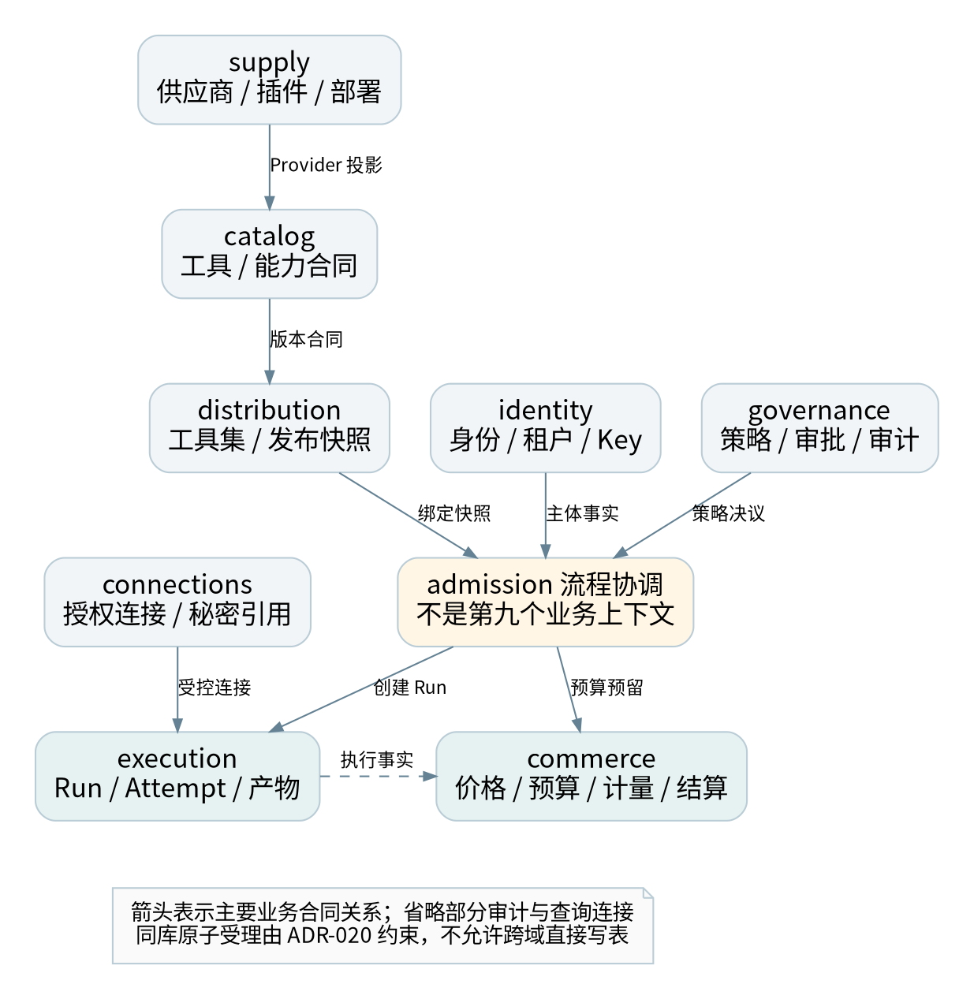
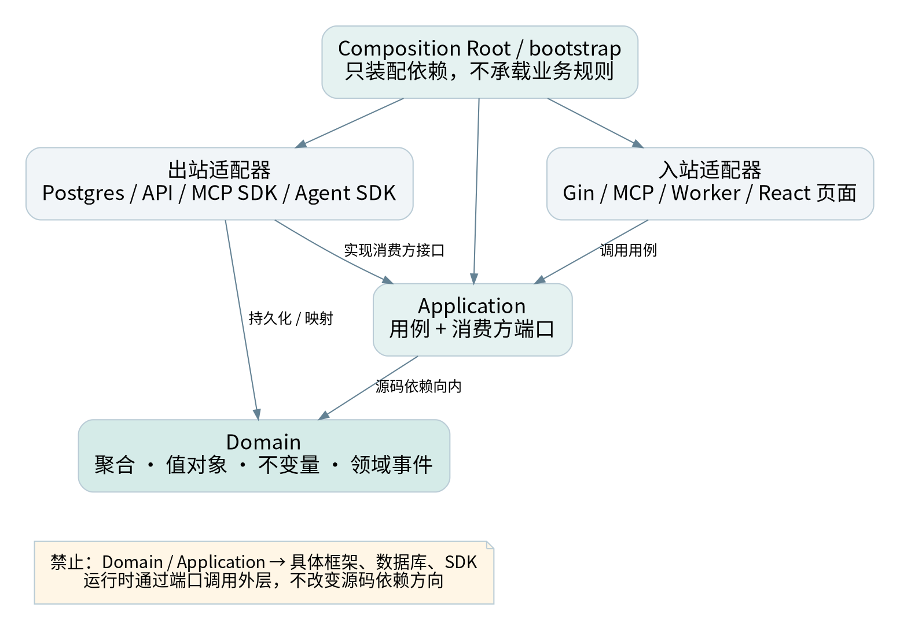

# G00 工程基线与适用范围

## 0.1 已确定约束

Mender 前端统一使用 pnpm；全工程采用 DDD 领域驱动开发、清洁架构和依赖倒置。这三项是用户确定的方向，不再作为待比较的技术选项。Go＋Gin 与 React＋Vite＋Tailwind CSS＋shadcn/ui＋React Router 保持不变。

本文件为 v1.1 专项规范，覆盖需求讨论、领域建模、代码组织、接口、数据、测试、评审、构建、发布和架构例外。它不是只约束后端的目录模板，也不要求所有 UI 组件都成为领域对象。上下文划分、精确依赖版本、事务耦合例外和工时仍须在 G0 评审确认。

本版没有取得现有业务源码，没有完成工程迁移、依赖安装或应用 CI。engineering/ 内文件是治理政策与模板，不是已接入仓库的自动执法工具。任务和测试维持未开始／未执行，避免把文档完成误认为工程完成。

## 0.2 三个概念分别解决什么

| 概念 | 本项目中的作用 | 不能被替代成什么 |
| --- | --- | --- |
| DDD | 统一语言、上下文、聚合、不变量及团队协作 | 仅有 entity／service／repository 文件夹 |
| 清洁架构 | 业务规则不依赖外部框架，源码依赖指向内层 | 固定四层目录但依然互相调用 |
| 依赖倒置 | 高层用例定义所需端口，外层实现并由装配根注入 | 为每个结构体生成同名接口，或全局服务定位器 |
| pnpm workspace | 前端依赖、包边界、脚本与锁文件一致性 | 管理 Go 模块、保证业务权限或自动消除循环依赖 |

DDD 中的上下文与聚合描述模型边界；清洁架构的依赖规则描述源码关系。本文的上下文名单、目录和门禁是项目设计，不是相关方法强制规定的唯一实现。[S30][S31]

## 0.3 文件与决策优先级

用户已确认约束 → 经批准的 ADR 与合同 → 本版专项规范 → 架构与实施计划 → 工程模板。发现矛盾必须登记并修订，不能自行选择最宽松条款。G00–G10 与 Axx／Bxx、WBS 和测试编号一起维护。

v1.1 保留 92 个任务及原人日作为待重估基线，强化其中 20 个任务；新增 6 项非功能需求、8 项测试、4 项 ADR 和 5 项上线检查。没有现有源码不等于以后迁移免费；若实际工程已存在，按 G09 独立盘点与估算。

# G01 领域发现、统一语言与工作流

## 1.1 先识别业务决策，再设计服务

从用户任务出发：发现能力、检查合同、获得授权、受理调用、执行与恢复、计量结算、发布与下架。围绕这些任务邀请产品、后端、前端、QA、供应商对接和资金责任人一起梳理，不能仅由数据库设计决定边界。

建议使用事件梳理工作坊，按时间排列业务事实，再识别命令、决策规则、外部系统与异常。方法可以是 Event Storming 或结构化流程评审；本项目不强制某个建模工具。交付物必须落到仓库中的上下文卡、术语表、状态图、不变量和测试例子，而不是只保留白板照片。

## 1.2 首批统一语言

| 术语 | 明确定义 | 必须排除的误解 |
| --- | --- | --- |
| Tool | 稳定可调用能力身份 | 不等于某个 HTTP URL 或供应商 |
| ToolVersion | 不可变能力合同 | 不等于运行容器镜像版本 |
| Provider | 供应主体，主记录属于 supply | Catalog 卡片只是其只读展示 |
| Connection | 某主体在 Workspace 内的授权连接 | 不等于平台访问 Key 或 MCP 会话 |
| Toolset | 对外分发的能力集合及绑定快照 | 不等于模型上下文中已全部加载的工具 |
| Run | 用户视角的一次逻辑执行 | 不等于某一次 HTTP 请求 |
| Attempt | 一次实际执行尝试及观测 | 不等于可以再次收取全部用户费用 |
| Reservation | 对预算／余额的有界预留 | 不等于已结算收入 |
| Settlement | 基于事实与价格快照的结算 | 不等于修改一个余额字段 |
| Deployment | 实现版本的运行位置与配置 | 不等于工具合同版本 |

“资源”应具体写成 MCP Resource、Artifact 或插件制品，避免三类对象共用一个没有边界的 Resource 实体。“状态”应指明 Run 状态、结算状态、授权状态或发布状态，不能使用一个通用枚举承载所有过程。

## 1.3 建模交付与验收

每个上下文至少提交：目标与职责、统一语言、命令与查询、聚合及不变量、持久化所有权、公共合同、领域／集成事件、安全与资金影响、失败场景、负责人以及上下游关系。

S0 的最小验证用例为“受理一笔有费用上限的工具调用”。先明确谁检查权限、谁解析版本、谁持有预算、谁创建 Run、谁保证原子提交，再写 Handler 和 SQL。成功与失败流程必须同时建模，尤其是上游已经执行但响应丢失的情形。

## 1.4 需求进入开发的条件

进入开发前，需求应关联所属上下文、一个明确用例、至少一个可验证业务规则、输入输出合同和失败结果。跨上下文需求必须补充 Context Map 变化与一致性说明。界面需求还要说明前端状态是否只是后端事实的投影，避免客户端计算变成事实来源。

简单配置、只读管理列表可以采用轻量模型和查询服务。资金、权限、执行、发布等有复杂不变量的写模型必须使用明确领域行为；不为满足形式而把所有 CRUD 都建成复杂聚合。

# G02 限界上下文、所有权与集成关系

## 2.1 八个候选上下文



| 上下文 | 聚合／主要数据 | 公共输出 | 责任角色 |
| --- | --- | --- | --- |
| identity | Workspace、成员、服务身份、API Key | 身份与授权事实 | BE-A |
| catalog | Tool、ToolVersion、能力目录投影 | ToolContract、版本快照 | BE-A |
| connections | Connection、授权状态、秘密引用 | 授权能力与受控凭据端口 | BE-A |
| distribution | Toolset、入口及发布快照 | ToolsetSnapshot、绑定解析 | BE-B |
| execution | Run、Attempt、任务、Artifact 元数据 | RunView、ExecutionOutcome | BE-A／BE-B |
| commerce | 价格、钱包、预算、预留、计量、结算 | Quote、ReservationReceipt | BE-A |
| supply | Provider、插件制品、部署、发布计划 | ProviderProfile、DeploymentDescriptor | BE-B |
| governance | PolicyRevision、Approval、审计 | PolicyDecision、审计读模型 | BE-A／SRE |

上下文是模型和协作边界，不对应八个部署进程。首发仍是 API＋Worker，可共用 PostgreSQL 实例。表名暂不要求全部改成独立数据库 schema，但所有权必须可从迁移清单追溯。

## 2.2 表与查询模型规则

每张写模型表仅有一个上下文所有者，包括迁移、索引、删除与保留策略。catalog 中的 ProviderProfile 是 supply 的投影；价格表 price_versions 属于 commerce，不因工具详情显示价格而归 catalog。前端同屏展示不构成合并领域的理由。

禁止外域直接调用本域仓储，或利用通用 DB 句柄写他域表。跨域查询优先走公开查询合同或经事件生成的只读投影；确需跨 schema 的报表查询，由独立只读角色与已登记投影承担，必须标明数据延迟和隐私边界，不能获得写权限。

一个 PostgreSQL 实例可以承载多个上下文，但数据库共享不等于持久化模型共享。代码的 internal 路径、TypeScript 别名和文件命名都不能替代实际权限与测试。

## 2.3 主要上下游关系

| 上游 → 下游 | 合同与集成模式 | 防腐要求 |
| --- | --- | --- |
| supply → catalog | ProviderProfile／版本事件；发布语言 | Catalog 不读取插件内部配置作为领域规则 |
| catalog → distribution | ToolContract 和已发布版本查询 | Toolset 仅保存引用与快照，不共享 Tool 聚合 |
| distribution → admission／execution | 固定绑定和入口策略 | 动态元工具仍对真实目标二次授权 |
| identity／governance → admission | 主体事实、策略与审批决议 | 不在领域中传入 Gin Context 或 HTTP header |
| connections → execution | ConnectionCapability／Broker 端口 | SDK token 只在外层使用，秘密不进入 Run |
| commerce ↔ admission／execution | Quote、Reserve、Settle 的专用端口 | 原子受理为批准例外；结算按业务键幂等 |
| execution → commerce／governance | 版本化执行事实与审计事件 | 不直接发送完整 Run 实体或原始秘密 |

同进程调用也通过合同和防腐层，不必先引入网络 RPC。业务依赖图允许协作，但源码导入图必须保持无环；相互业务协作可通过各自消费端口和独立适配器实现，而非互相 import application。

## 2.4 public 合同与 Shared Kernel

每个上下文可有 public 包，内容限定为稳定 DTO、枚举、错误合同、查询接口和版本化集成事件；它不能依赖本域 domain、application 或 infrastructure。内部应用用例不直接依赖他域 public，而通过本地端口，由出站防腐适配器映射。

Shared Kernel 初期只允许极少共同基础语义，例如经评审的标识封装。Tool、Run、Money 业务规则、权限模型、HTTP DTO、ORM 实体和 Repository 不放入 sharedkernel。跨团队共享模型必须有共同所有者和变更约束，不能把重复两个小值对象当作必须抽共享包的理由。

# G03 聚合、值对象、行为与查询

## 3.1 聚合边界以不变量为依据

聚合是需要共同维护一致性的对象集合，外部通过聚合根交互；不是数据库外键能连起来的所有记录。[S30] 本项目先保持小聚合，通过显式事务与流程协调处理跨聚合动作，不建立“整个 Workspace 都是一棵对象树”的模型。

| 聚合／对象 | 核心行为 | 必须成立的不变量 |
| --- | --- | --- |
| Tool／ToolVersion | 创建草稿、发布、弃用 | 发布版本不可覆盖；版本引用有效 |
| Toolset | 绑定、发布快照、切换 | 一次发布快照完整且可验证；旧 Run 不漂移 |
| Connection | 授权、刷新、撤销、失效 | 权限不超过真实授权；刷新竞争受控 |
| Run | 接受、开始、等待输入、取消、归并完成 | 非法状态不能跳转；终态归并有版本与 fencing 检查 |
| Attempt | 获取租约、续租、记录上游标识 | 旧租约不能覆盖新执行事实 |
| Wallet／Budget | 预留授权、扣减、释放 | 金额非负、币种精度一致、不得并发透支 |
| Reservation／Settlement | 预留、确认、释放、结算 | 同业务键不重复记账；不确定成本不擅自释放 |
| ReleasePlan | 校验、审核、灰度、启用、排空 | 未审核或失效制品不能进入生产绑定 |
| Approval | 提交、同意、到期、使用 | 审批绑定主体、参数、版本及金额，不可任意复用 |

Wallet 与 Budget 不是必须合并成一个大聚合。commerce 应用服务在同一受控事务内读取并更新所需行，以唯一约束、锁或版本校验共同保护并发不变量。仅靠内存方法校验不足以防止两个请求同时通过。

## 3.2 行为接口而不是通用 setter

例如 Run 不能提供给任意调用者一个 SetStatus(string)。应提供 RequestCancel、MarkWaitingInput、ConfirmSucceeded 等动作，由领域方法验证当前状态和条件。仓储只负责持久化已形成的领域状态，不重新实现一份不同的业务状态机。

Money 使用本上下文的不可变值对象或等价封装，包含金额原子单位、币种及明确精度。输入／输出 DTO 可使用精确十进制字符串，但转换在边界进行。不得让浮点 UI 展示值成为结算输入真源，也不从 JavaScript Number 的舍入值生成账本分录。

字段默认不对外开放任意修改。重建历史对象需要有明确 Rehydrate／加载路径，区别于新建时的业务动作；损坏数据应被诊断，不通过宽松构造函数隐藏。

## 3.3 仓储、领域服务和应用服务

仓储端口按聚合及实际用例需要设计，不要求每张表一个仓储，不采用全局 GenericRepository 作为跨域数据通道。本项目把被应用用例消费的仓储接口放 application/ports；只有确实被领域算法使用的抽象才属于 domain。接口归消费方的做法也符合 Go 的官方评审建议。[S32]

领域服务承载无法自然放入某个实体／值对象的纯业务规则，例如经已确定价格快照计算费用。应用服务负责授权端口、用例顺序、事务与调度；HTTP、SDK、数据库和秘密处理都在适配器。不要把领域规则全部堆进一个名为 DomainService 的万能服务。

## 3.4 读写分离的最低实现

首发采用轻量 CQRS：写路径通过用例和领域模型，查询路径通过只读 Query Port 返回场景 DTO。可以共用数据库与部署，不要求引入事件溯源或独立读库。后台列表无需加载完整 Run 聚合及所有 Attempt。

领域事件表达本域已经发生的事实；集成事件是对外合同，由应用／出站映射后写入 Outbox。两者生命周期和版本策略不同。使用领域事件不等于采用 Event Sourcing，首发事实状态仍以业务数据库为准。

# G04 Go 清洁架构、依赖倒置与装配

## 4.1 源码依赖方向



| 所在层 | 可以依赖 | 不可以依赖 |
| --- | --- | --- |
| domain | 本域纯类型、必要纯标准库、极小 Shared Kernel | application、public DTO、Gin、SQL、SDK、配置、系统 I/O |
| application | 本域 domain、消费方端口、纯输入输出 | adapters、bootstrap、他域内部包、具体存储／网络实现 |
| public | 标准基础类型和稳定发布合同 | 本域实体、ORM、Gin／MCP SDK 类型 |
| inbound adapter | 本域应用入口和外部协议框架 | 直接调用仓储跳过用例；直接操纵聚合状态 |
| outbound adapter | 本域端口／模型、外部库、他域 public | 他域内部仓储、领域实体或应用实现 |
| bootstrap | 所有需要装配的具体构造器 | 业务定价、状态转换和授权裁决 |

源码依赖向内是清洁架构的核心；运行时可以从应用端口调用外层数据库实现，两者不矛盾。[S31] 这里约定的 adapters/inbound 与 adapters/outbound 是同一外层的两类适配器，不强制 inbound 先 import outbound。

## 4.2 按上下文纵向组织

```text
internal/contexts/execution/
  domain/
    run.go
    attempt.go
    events.go
    errors.go
  application/
    command/start_run.go
    command/cancel_run.go
    query/get_run.go
    ports/run_repository.go
    ports/tool_executor.go
  adapters/
    inbound/httpapi/
    inbound/mcp/
    inbound/worker/
    outbound/postgres/
    outbound/mcpclient/
    outbound/agentclient/
  public/
    run_view.go
    events_v1.go
```

命名以业务能力为主，不再把所有领域实体扔进 internal/domain、所有业务逻辑放 internal/services。Go internal 只能帮助约束一定范围的包可见性，项目内部跨上下文规则仍由依赖图门禁补足。

## 4.3 端口定义与注入

下面是应用端口的设计示意，不是完整实现。端口仅包含消费方需要的方法；多方法事务语义必须另行说明。

```go
// execution/application/ports
// Request and Outcome are local application contracts.
type ToolExecutor interface {
    Execute(ctx context.Context, req ExecuteRequest) (Outcome, error)
}

type Clock interface {
    Now() time.Time
}
```

真实 HTTP／MCP／Agent 适配器实现 ToolExecutor，测试使用 Fake；应用代码既不构造 http.Client，也不 import 某个供应商 SDK。Clock 接口位于消费方，领域动作通常接收明确时间值，不在领域方法内读系统时钟。允许使用 time.Time 类型不等于允许执行 time.Now。

依赖由构造函数注入。返回具体适配器实例，通过 Go 的结构化接口满足端口；不要求每个具体类型配一个“同名接口”。不得用空接口 map、包级可变全局、反射容器或 ServiceLocator 隐藏实际依赖。[S32]

## 4.4 Composition Root 的职责

cmd/api 与 cmd/worker 只负责配置入口、生命周期及调用 bootstrap；bootstrap 构造连接池、时钟、仓储、用例、协议适配器和 Router，并明确关闭顺序。数据库、消息、秘密代理等失败时的启动策略在这里绑定，但业务权限和费用规则仍由对应上下文决定。

不同进程可以组装不同外层实现，但共享领域与应用代码。测试可以构建内存 Fake 装配，不需要启动 Gin、Redis、数据库或浏览器就验证核心规则。

## 4.5 DTO、实体和存储模型分离

HTTP JSON DTO、MCP SDK 参数、SQL／ORM 数据结构、领域对象和 UI ViewModel 各自有边界。允许映射代码显式重复少量字段，以避免把外部结构的变化扩散到业务内核。自动生成的 API 类型放外层；类型是 type-only import 也仍然构成源码依赖。

领域错误保持稳定业务语义，HTTP／MCP 错误码映射在入站层；应用层可以返回用例失败分类，但不返回 gin.H、http.Response 或 SDK 的原始协议错误。秘密、trace baggage 和请求对象不存入领域对象。

# G05 事务、事件与受控跨上下文协调

## 5.1 默认规则与明确例外

默认一个上下文拥有自己的写模型，通过公共合同与集成事件协作。一次事务通常围绕一个聚合，必要时在本上下文内显式协调多个聚合；不把这一经验法则误写成任何跨聚合事务都违法。

Mender 保留 v1.0 的关键不变量：付费调用受理时，预算预留、Run、任务与 Outbox 必须原子提交。它涉及 execution 和 commerce，因此是一项需要批准的同库耦合，记录于 ADR-020，而非伪称完全自治。首次拆库之前必须重新设计，不能直接把数据库连接换成远程 RPC。

## 5.2 应用层只认识事务端口

```text
Admission use case
  → 校验主体、绑定、参数与授权
  → 构造固定版本的受理请求
  → AdmissionUnitOfWork.Within(scope)
       scope.ReserveCredits(...)
       scope.CreateRun(...)
       scope.EnqueueExecution(...)
       scope.AppendIntegrationEvent(...)
  → 确认提交
  → 返回 Run ID
```

应用层的 scope 是一组消费方定义的能力端口，不是 SQL 事务或通用 Repository 集合。它不能接收任意 SQL，也不能暴露他域实体。scope 的方法仅对本次受理有效，不能保存到全局变量或逃逸到异步 goroutine。

## 5.3 基础设施如何共用一个事务

admission 的出站事务适配器打开 PostgreSQL 事务，调用由 bootstrap 注入的“事务作用域工厂”。工厂在该事务上构造 execution 自有仓储和 commerce 自有仓储及其服务，再通过本地适配器形成 AdmissionScope。SQL Tx 只出现在这些外层装配和持久化实现中。

每个上下文只访问自己的表，admission 适配器不直接写 commerce 的余额表。事务回调返回错误则回滚；提交错误不能向调用者报告成功。锁顺序、隔离级别、唯一约束和乐观版本在持久化合同中明确，T47 必须验证实际数据库，而非只用 Fake。

在取得行锁后重新检查受影响的预算／余额与幂等状态，不能依赖事务之前的读值。授权、价格和绑定 revision 按所选安全模型验证；存在时间检查与使用差异时，明确可接受窗口或在事务内复核本地 revision。

## 5.4 网络和消息的边界

事务内禁止调用上游工具、刷新远程 OAuth、向外部消息服务发布消息或等待人工审批。供应商费用估计必须来自已固定合同或事务外有时效的报价；事务只接纳可验证的快照。

领域对象产生本地事件，由应用层映射为版本化集成事件，并与业务状态一同写入 Outbox。独立投递器提交后发送，消费者以 event_id 或业务键去重。不能把“发布领域事件”理解成在聚合方法里直接调用 Kafka、Redis 或 HTTP Webhook。

## 5.5 拆分后的退出方案

如需拆库／拆服务，先设计有状态协调：受理意图、限时预留、Run 创建、执行许可与过期释放。只有持久 Run 和有效预留均已确认时才允许执行。通信丢失时通过幂等命令、状态查询和补偿恢复，不声称网络调用具备单库原子性。

这一演进需要明确失败状态、预留过期竞争、取消语义、重新授权和对账机制，并执行新的故障矩阵。未通过前保留同库协调，不为架构形式牺牲资金约束。

# G06 前端领域模块与 pnpm 工作区

## 6.1 工作区根与工具链

整个仓库可以是 Monorepo，但 pnpm 只管理前端 JavaScript／TypeScript 包；Go 由 go.mod／go.sum 管理。根目录维护 private package.json、pnpm-workspace.yaml 和单一 pnpm-lock.yaml。内部包依赖使用 workspace:，避免本地包缺失时意外解析为注册表同名包。[S26]

```yaml
# 仓库根 pnpm-workspace.yaml；须用最终选择的 pnpm 验证
packages:
  - 'frontend/apps/*'
  - 'frontend/packages/*'
sharedWorkspaceLockfile: true
```

根 package.json 的 packageManager 固定经 G0 验证的 pnpm 精确版本，Node 与 Go 同样记录在工具链清单。不能只写 latest，也不在本文件中随意替团队指定一个未经验证的补丁版本。pnpm 的配置和运行时声明随主版本变化，选择后应核对对应版本文档并通过干净安装。[S28][S29]

## 6.2 包划分与依赖方向

| 包／目录 | 职责 | 依赖规则 |
| --- | --- | --- |
| apps/console | 消费者与邀请制发布者入口 | 只能消费公开包入口，不依赖 admin |
| apps/admin | 平台运营入口 | 不依赖 console 页面或私有状态 |
| packages/ui | shadcn 组件、设计 token | 不依赖任何业务模块或 API 客户端 |
| packages/api-client | 传输客户端与生成 DTO | 仅由外层 infrastructure 消费 |
| packages/config | TypeScript／lint 配置 | 不包含运行时业务代码 |
| 命名明确的共享领域包 | 确实重复且稳定的前端用例 | 有负责人、public exports 和独立测试 |

不创建一个可随意放入所有业务的 packages/features。应用内部先按执行、工具发现、连接、分发、费用等用户任务组织 modules，出现真实共享需求再抽包，避免为了 DDD 建立几十个空 workspace 包。

## 6.3 单个前端模块分层

```text
modules/execution/
  domain/           # Run 展示状态的纯规则；非后端权威状态机
  application/      # start/cancel/load 等用例与 RunGateway 端口
  infrastructure/   # 生成 API DTO → 本地模型、防腐与错误映射
  presentation/     # React 页面、hooks、Query、表单
  index.ts          # 公开入口；内部子路径不对外暴露
```

源码依赖为 presentation → application → domain、infrastructure → application／domain；app 负责把真实 infrastructure 实现注入 presentation／用例。React Context 可以承担表现层的依赖传递，但不成为领域服务定位器。

后端领域模型是业务事实来源；前端 domain 只包含本地交互规则、展示推导、输入校验和用例需要的投影。创建费用、授权和成功状态必须以服务器结果为准。前端展示“可取消”不能保证上游任务一定取消成功。

## 6.4 React Query 与 Router 的位置

TanStack Query 的 hook、缓存失效与乐观交互放 presentation 的适配代码；HTTP 映射放 infrastructure。application 不 import QueryClient，也不直接调用 fetch。Router loader 可以调用已装配的用例，不能把路由对象塞进 domain。

查询键必须包含 Workspace 和必要身份／过滤条件，切换 Workspace 时取消旧请求、隔离缓存及事件订阅。不能因为纯领域模块没有权限依赖就省略后端授权。跨模块使用公开入口；禁止通过相对路径、别名、re-export 或 type-only 绕过。

## 6.5 日常命令与构建约定

以下为仓库实现相应 scripts 后的目标命令，不表示本交付包已有应用可构建。

```sh
pnpm install --frozen-lockfile
pnpm --filter @mender/console dev
pnpm --filter @mender/admin dev
pnpm --filter @mender/console build
pnpm --filter @mender/admin build
pnpm -r run lint
pnpm -r run typecheck
pnpm -r run test
pnpm exec eslint .
```

冻结安装在锁文件缺失或与清单不一致时应失败，而不是 CI 自动修复并悄悄提交新依赖。[S27] 根脚本检查必要 workspace 和必需脚本是否存在，不用 --if-present 吞掉遗漏。前端共享包如需要预编译，根 build 脚本按已验证依赖拓扑构建，不能假定单包构建自动处理所有前置产物。

需要临时执行 CLI 时使用固定版本的 pnpm dlx，日常开发工具优先声明为 devDependency 并使用 pnpm exec。shadcn 生成组件的命令也使用 pnpm；产生的源码仍需审查和测试，不因来自生成器而绕过门禁。

## 6.6 锁文件与供应链政策

禁止提交 package-lock.json、npm-shrinkwrap.json、yarn.lock、bun.lock 或 bun.lockb；禁止子项目各自生成第二份 pnpm 锁。迁移旧工程时先评估旧锁与依赖图，再由 pnpm 生成并审查新锁，不直接删除后宣称结果等价。

审查生产依赖、peerDependencies、生命周期脚本及工具版本；按所选 pnpm 版本配置脚本准入，不把 allow-all 当默认。安装缓存不是可复现构建保证，CI 必须能从干净环境验证。包 exports、声明依赖和解析后的 import 图一起检查；TypeScript Project References 可帮助组织编译，但不是访问控制。[S34]

# G07 CI、评审与架构适应性测试

## 7.1 质量门禁顺序

| 门禁 | 执行内容 | 失败时处理 |
| --- | --- | --- |
| Q0 工具链 | 版本、pnpm、锁文件、工作区与脚本清单 | 立即阻断；不自动更换工具 |
| Q1 静态边界 | Go／TS 依赖方向、深导入、循环、公开出口 | 修复或提交有时效的例外 |
| Q2 内层质量 | 领域不变量、应用用例、Fake 端口和纯编译 | 不允许以 E2E 成功替代 |
| Q3 合同与存储 | DTO／事件兼容、仓储、真实事务与映射 | 有破坏性变更则升级合同 |
| Q4 安全与隔离 | 租户、SSRF、秘密、审批、供应链 | 关键问题不可豁免 |
| Q5 集成与发布 | 两前端入口、API／Worker、恢复及回退 | Gate 不通过不得开放相关能力 |

与运行平台绑定的命令在 S1 实现并固定版本。本交付包给出规则和验收方案，没有虚构已经运行的业务流水线。

## 7.2 后端检查的具体要求

使用 Go AST／包依赖图识别包归属和导入边，覆盖所有受支持构建标签、生成代码与测试代码；测试中的正当装配例外单独限定路径，不能整体忽略所有 _test.go。domain 禁止框架、数据库、网络和配置依赖；application 禁止具体 adapter；跨域只能通过出站适配器和公开合同。

仅检查 import 不能证明纯度。time.Now、环境变量、文件、全局可变状态和间接 I/O 需要符号级检查或受控评审；动态 SQL 的归属需要仓储合同、数据库角色和负向集成测试。不要把一个 grep 脚本标成“DDD 完整校验”。

## 7.3 前端检查的具体要求

规则应解析最终模块路径，而非只匹配字符串前缀。必须覆盖 import、export from、相对路径、别名、静态动态导入与 type-only import。非字面量动态导入只允许在批准的装配／插件边界，不能成为绕过方式。

ESLint 的 no-restricted-imports 可承担基础限制，但整个包图、循环和路径归一化仍需独立工具或规则。具体 ESLint 扩展／依赖图工具在 S0–S1 选择并固定，用 T44 的绕行样例验证，不能仅凭工具名称声称已保证边界。[S35]

## 7.4 必须保留的负向 fixture

| 编号 | 故意违规案例 | 预期 |
| --- | --- | --- |
| F01 | 使用 npm／Yarn／Bun 或提交第二锁文件 | 工具链门禁失败 |
| F02 | domain 引入 Gin／SQL／供应商 SDK | Go 边界检查失败 |
| F03 | application new 具体 PostgresRepository | 依赖检查或审查失败 |
| F04 | execution 直接引用 commerce/domain | 跨上下文检查失败 |
| F05 | catalog adapter 写 commerce 的表 | 仓储／数据库负向测试失败 |
| F06 | 前端 domain 引入 React 或 api-client DTO | TS 边界检查失败 |
| F07 | 相对路径、re-export、type-only 深导入 | 归一化模块检查失败 |
| F08 | 内部包用注册表范围而非 workspace: | 工作区政策检查失败 |
| F09 | 原子受理第 N 个写入失败 | 所有写入回滚，无可执行孤儿任务 |
| F10 | 领域事件在事务提交前直接发送 | 事件合同／提交顺序测试失败 |
| F11 | 逾期 ADR 例外仍保留在白名单 | 治理门禁失败 |
| F12 | Console 构建依赖 Admin 私有页面 | 前端入口边界检查失败 |

这些是待实施 fixture 规格，不是随包已经通过的测试。T41–T48 的正式执行报告需记录工具版本、提交 SHA、环境、输入与失败输出。

## 7.5 PR 和责任人

PR 模板要求填写所属上下文、变更用例、不变量、公共合同、表／迁移、测试、依赖图与风险。对跨域关系、钱、权限、插件出口和例外的改动，至少由相关上下文负责人及 QA 评审；实际姓名或团队句柄在 G0 填入，不虚构 CODEOWNERS 用户。

应用同一套治理于人写代码、生成代码及 AI 辅助代码。生成器输出需要标记来源及重新生成方法；不能以自动生成作为穿透领域边界或跳过依赖审查的理由。

# G08 阶段实施与任务衔接

## 8.1 保留任务编号，强化已有交付

| 阶段 | 重点任务 | 增强交付 | Gate |
| --- | --- | --- | --- |
| S0 | S0-02／05／06／07／10 | 统一语言、Context Map、事务 ADR、前端边界、T41–T48 及重估 | G0 冻结方法与可执行规则 |
| S1 | S1-01／05／07／11／12／13／15 | 上下文骨架、pnpm 工作区、注入与静态负向 fixture | G1 展示故意违规会失败 |
| S2 | S2-01／03／07／14 | 价格所有权、原子受理、事件映射及崩溃验证 | G2 通过 T45／T47／T48 |
| S3 | S3-05／07 | MCP／Agent 防腐层，SDK 类型不进入内层 | G3 三类能力遵守同一端口 |
| S4 | S4-01 | 发布聚合、插件边界与供应链合同 | G4 插件不能引用内核内部包 |
| S5 | S5-10 | 完整架构报告、例外到期和 L26–L30 | G5 没有未执行的强制门禁 |

本表对应 20 个被强化的原任务，没有把原计划剩余容量自动兑换为新增开发承诺。负责人应根据实际工具、现有代码和经验，在 G0 更新每项人日；必要时拆新任务。Excel“WBS”仍是执行时的任务真源，“工程治理”是门禁跟踪表，不与 WBS 重复计算人日。

## 8.2 第一条纵向切片

建议按“Run 查询＋受控取消”做工程模式样板：execution 的纯领域状态 → 应用查询／取消端口 → 内存 Fake 测试 → HTTP 入站＋存储出站 → 前端 RunGateway → 用例 → React 页面。随后用真实事务实现付费启动链路。

样板验收不仅看页面可用，还要替换适配器、删除数据库环境验证纯单元测试、故意加入反向依赖验证 CI 失败。样板通过后复制模式，而不是复制一个高度抽象的空框架到八个上下文。

## 8.3 工时和范围管理

原估算为 261.25 人日、含 15% 缓冲约 300.44 人日、20 周；v1.1 仅保留这些数值待 G0 校准，不断言新增规则没有成本。实际新增或迁移工作须回填 WBS、人日、依赖和 Gate，不能仅登记治理表，也不能降低资金、安全与架构测试来压缩工期。

# G09 既有工程迁移与架构例外

## 9.1 有代码时先盘点，不先批量移动文件

先收集 package.json、所有锁文件、Go 模块、导入图、数据库表及迁移、公共 API、核心状态机、测试与构建。记录实际 npm／Yarn／pnpm 使用情况、隐藏全局状态、跨模块 SQL 和 SDK 泄漏。当前对话未提供这些代码，因此不能断言迁移规模或给出已完成结果。

迁移按纵向用例推进：冻结外部合同 → 引入应用端口 → 用防腐层包住旧实现 → 建立领域测试 → 迁移一个聚合／用例 → 切换装配 → 删除旧入口。新旧代码共存必须有截止时间和回退点，不能一次性重写全部系统。

## 9.2 pnpm 迁移顺序

核对已使用工具及脚本 → 确认 workspace 包名与路径 → 选定精确 pnpm／Node → 在独立分支生成锁 → 比较依赖图与安装脚本 → 分别构建两前端入口 → 执行测试 → 移除其他锁并开启强制门禁。保留可回退提交，不把旧锁删除当作完成。

迁移脚本、Dockerfile、CI、README、shadcn 命令和依赖机器人都要同步。不要用版本范围写死在多个配置位置；版本真源应明确，其他配置从真源读取或在 CI 检查一致性。

## 9.3 例外登记

例外记录包含 ID、违反的规则、精确包／表／调用边、业务原因、影响、安全与资金保证、负责人、批准记录、截止时间和退出步骤。白名单必须限定具体路径与边，不接受“暂时允许所有 application 引用 infrastructure”。

用户已经确定 pnpm 和依赖向内的方向，架构例外不是私自更换技术栈的入口。涉及身份、资金、租户隔离和秘密边界不能只用一个 ADR 编号豁免。ADR-020 同库事务是待评审的显式耦合，依然必须满足内层不认识 SQL 和跨域所有权。

## 9.4 架构演进的触发条件

当团队所有权、负载、隔离需求、数据地域或发布节奏出现实证变化时，才考虑拆服务、独立库或复杂运行时。上下文数量不是绩效指标，层数和接口数量也不是设计质量指标。每次演进应明确解决的问题、测量依据、迁移代价及可恢复方案。

# G10 交付、来源与变更记录

## 10.1 v1.1 交付内容

本专项规范与两份修订主文档、更新 Excel／JSON、七张图及 engineering/ 模板共同组成 v1.1。源码目录、政策 YAML、CI 命令和 PR 模板用于实施准备；未附完整业务应用、真实锁文件或生产配置。

engineering/architecture-policy.yaml 为机器可读政策清单，当前没有与业务仓库的 Go／TS 检查器连接；它不能仅凭存在就保护代码。模板中的版本、负责人和证据由团队填写，不能将占位符带入上线配置。

## 10.2 新增来源

来源支持方法和工具事实；本项目边界、流程、阈值与排期属于设计建议。S01–S25 沿用 v1.0，新增 S26–S35 于 2026-09-04 核验。pnpm、TypeScript、ESLint 的可变版本在 G0 再锁定验证。

| 编号 | 一手来源 | 用途 |
| --- | --- | --- |
| S26 | pnpm Workspace | workspace: 与共享锁文件 |
| S27 | pnpm install | 冻结安装行为 |
| S28 | pnpm package.json | 包管理器与运行时声明 |
| S29 | pnpm Settings | 配置位置及版本敏感项 |
| S30 | DDD Community Glossary | 领域与建模术语 |
| S31 | Robert C. Martin：The Clean Architecture | 内向依赖规则 |
| S32 | Go Code Review Comments：Interfaces | 消费方小接口 |
| S33 | Microsoft：Infrastructure Persistence Layer | 持久化与领域分离参考 |
| S34 | TypeScript：Project References | 多包编译组织 |
| S35 | ESLint：no-restricted-imports | 导入限制基础 |

完整 URL 见主文档 A18 和 Excel“来源说明”。本文件没有对 Monid 的内部 DDD 实践作推断，也没有以其用户面板为工程架构证据。

## 10.3 变更摘要

将全局技术层与 modules 混合的目录替换为按上下文纵向切分；将前端全局 features 包替换为任务模块和受控共享包；固定 pnpm；明确端口归消费方、public 合同与防腐层；补齐跨域原子事务的受控装配；把所有新增约束映射到任务、测试、ADR 与 Gate。

文档级修订和结构校验完成不等于系统验收。G0–G5 的状态只有在实际团队执行、记录证据并确认后才能更新。
